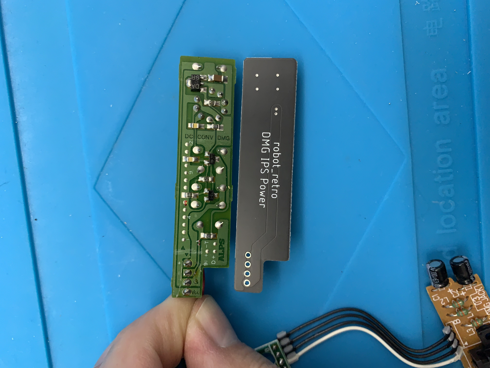

+++
title = "Retro Classic: OG Gameboy"
date = "2022-10-10"
[taxonomies]
tags = ["hardware"]
+++

As I'm digging up my old boxes of things I need to dump out sooner or later, I found this classic gem. The original Nintendo Gameboy from 1991. At this point of time, this must have been sitting in a dark box for at least 20+ years. Thankfully, I have respected the sedimental value of the device by removing the batteries before long term storage to avoid battery corrosion. However, the glue that holds the display cover has dried and doesn't hold the plastic bezel anymore. 

As I'm popping in 4x AA batteries and feeling the weight of the device has made me wonder how did I held this monstrosity for such long hours as a kid. The Gameboy powers up without issues but the LCD display is showing missing lines of pixels, more than I can originally recall when I last used it.

No biggie. We didn't have Google 30 years ago and now we do. A quick search shows that it's a connection issue so if applying heat to the LCD ribbon cable and the LCD screen, it should resolve the missing pixels. Time to crack open the time capsule.

In comparison to modern day EE designs, this is visually minimal and pleasing to the eyes. The amount of dust inside is not bad at all considering the time of assembly until today. Hey look, a factory worker left a fingerprint on the copper shielding.

Time to strip the foam pad from the display that connects the ribbon cable and LCD screen and clean the residue.

If you take a look closely at the ribbon cable, you can see the vertical connections. These are the connections that will require reflow using low heat settings at around 280 celcius. Before I do that, here is a picture of what the display looks like without the reflow.

Applying low heat is essential as anything higher than 300 celcius will burn the ribbon cable and will render the display useless. There are alternative solutions if this does happen which I will be showing later. For now, using my TS100 soldering iron, gently glide the hotend where the missing pixels are located. This will require patience as the heating and cooling process will take some time.

After 10 minutes of gentle work, all the missing pixels are showing up again and the Gameboy is reassembled for old school nostalgia.

However, this project isn't completed. I still remember vividly as a kid that finding a good spot with lighting was essential for playing experience. As you can see, the LCD display is not backlit like how the later Gameboy Light models were. Knowing that I will most likely keep this device forever due to sentimental reasons, I'm going to give it a second life by modifying the screen using a modern IPS display.

The IPS display kit includes the controller board, ribbon cable, glass bezel instead of the original plastic, and a plastic display jig. What I've added extra is replacing the old DC power regulator with an IPS supported version to support the extra milliamps required for the IPS display, and flash cart. More importantly, avoiding strain on the main components to keep this device alive in original condition as much as possible.

Before I start the modifications, I spent the extra time cleaning the shell, glue residue, and gunk build up over the past 30 years. Using a combination of isopropal alcohol 99%, dish liquid, wooden chopsticks, q-tips, tooth brush, elbow grease, and patience.

In case you were wondering, I did not proceed with the process called "Retro Brightening" as my Gameboy had been stored in a box. The shell has been protected against UV rays to prevent yellowing or discoloring of the shell. Retro Brightening is a chemical process to restore the original shell color and spray UV protection to slow down the process of discoloration. I may do this in the future if I ever decide on restoring my SNES just to experience the process.

Now that the case and parts are dry and clean, time to install the modifications. Here is a before and after modification of the DC regulator board. I love how the new board is much simplier than the 30 year old schematic.

Two screw posts snipped and cutting 1 mm of plastic around the display area as the IPS display has a larger screen real estate. Using a modeling knife and an object like a PCB board as a straight cutting guide to score the shell.

Using a pair of flush cutters, snip the corners. Using a pair of flat pliers, bend back and forth the plastic that needs to be removed, it will become weak and cleanly snap off. Finally, use a filer to smooth the rough edges.

Apply the double side sticky tape included in the kit and do not remove the padding adhesive facing the display. Install the IPS display and connect the ribbon cables.

The hard part is completed. Desolder the speaker connected on the old board and solder to the new controller board.

Place the buttons and membranes back into the front shell and install the controller board. Make sure not to over tighten the screws as the buttons won't be responsive.

Carefully connect the two halves of the shell back together while connecting the ribbon cable. Install the new glass bezel and voila! Enjoy the new bright and crispy IPS display and color changing features. My old man eyes are thanking me.

