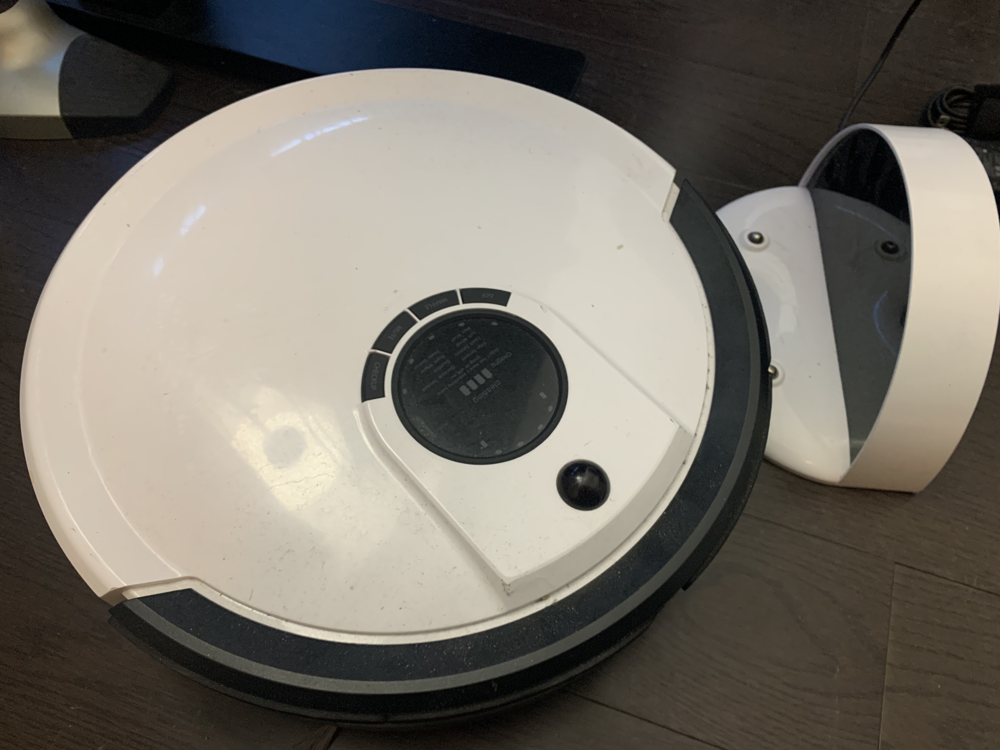
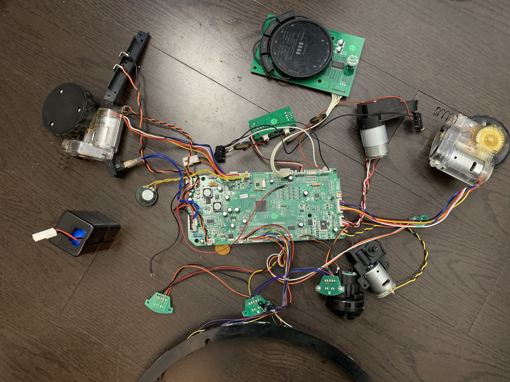
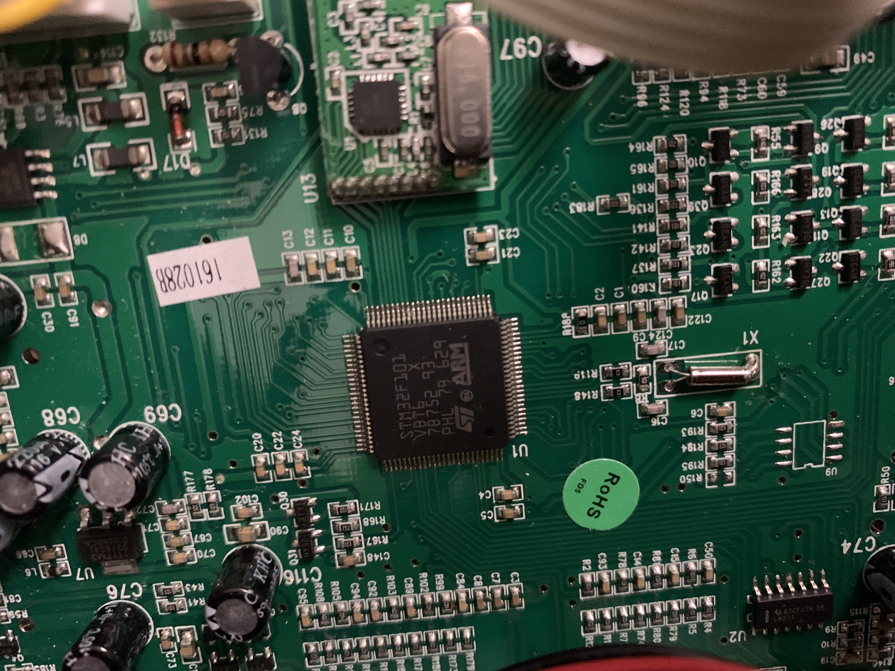
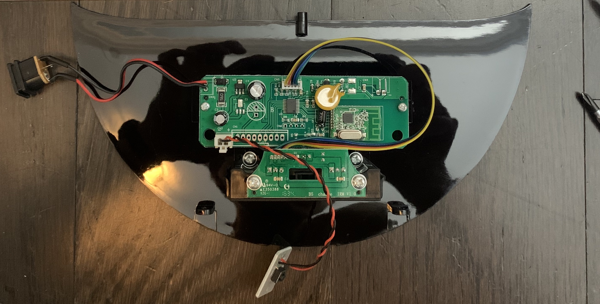
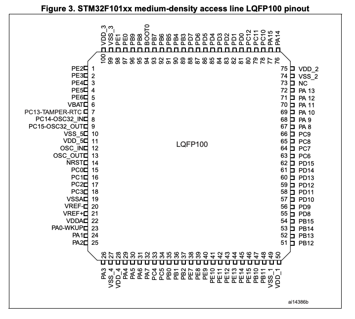
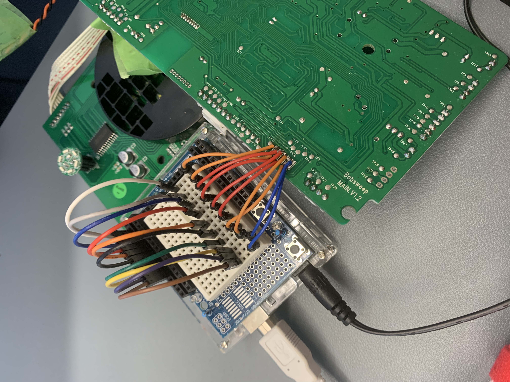
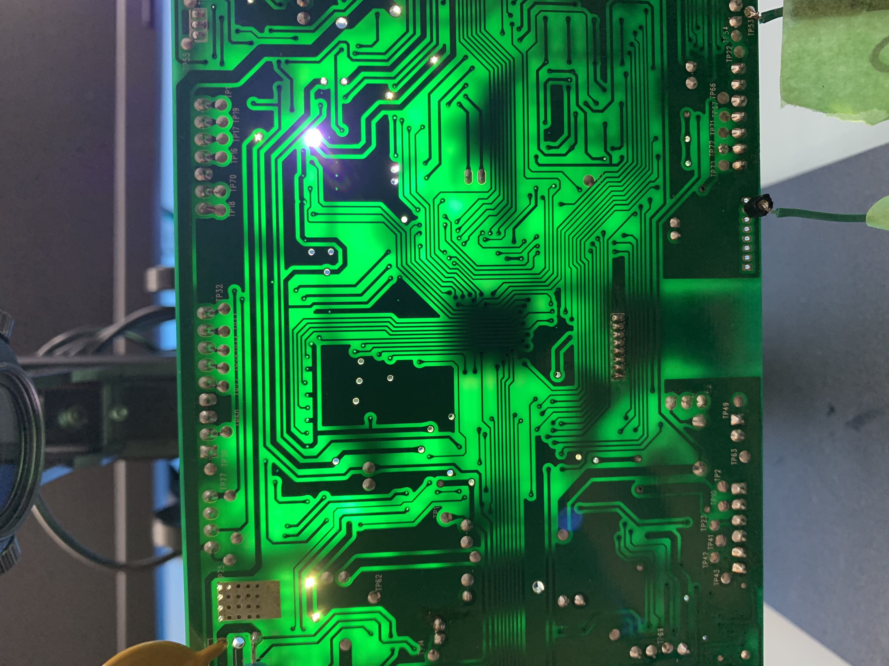
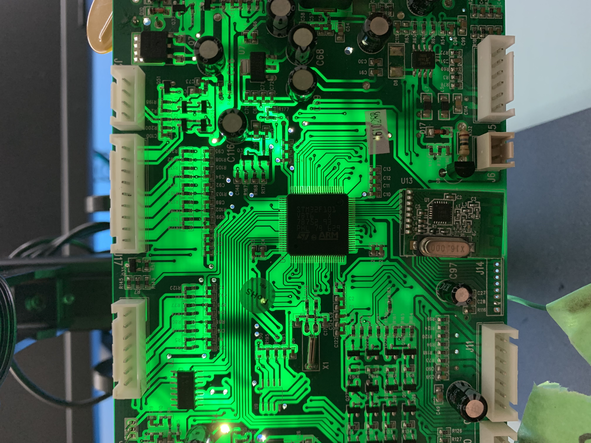
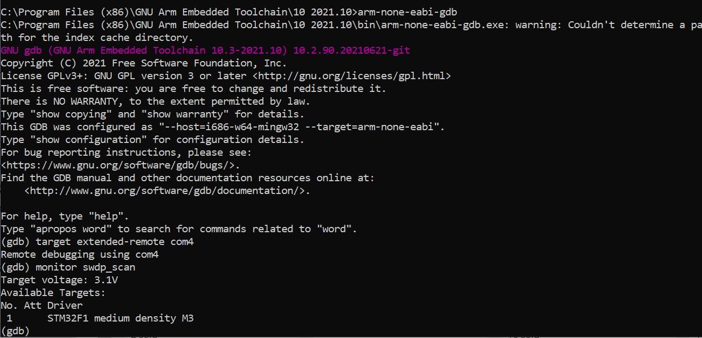
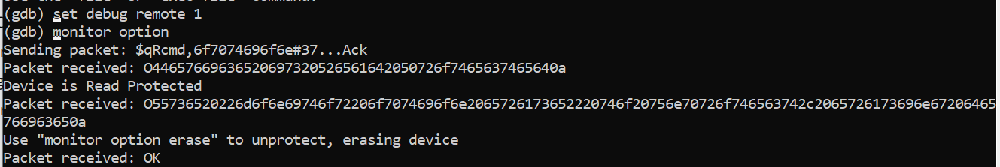

+++
title = "Dumpster Diving: Robot Vacuum"
date = 2022-12-26
[taxonomies]
tags = ["hardware"]
+++

Another day, another holiday season dumpster dive. My dear neighbours dumped a working Bobsweep robot vacuum cleaner made in 2016 and it didn't look too shabby.

A quick test of the robot vacuum had a runtime of about 5 minutes hence why the owners most likely donated the device rather than dumping it. Rather than investing into a new battery and other replacing consumable parts, this would be a great IOT exercise of inspecting the internal components to see if it's possible to dumping the flash memory of this device and extract the dumped firmware for potential endpoints and misconfiguration.

There are two methods to go about dumping the firmware from hardware devices. The first option is looking for a firmware on the internet would be the easiest route, but manufacture does not offer raw bin files. Second option would have been installing the mobile application and sync the robot vacuum with a device while intercepting the network traffic using man-in-the-middle attacks. However, the potential issue is the firmware update must be available for the robot vacuum and/or finding an activity to trigger the action, these may or may not exist. I do have previous experience with those methods, so I wanted to try something new and learn more about: reading directly from on-chip flash using serial wire debugging port and fault injection to bypass read protection mechanism.

Let's break open the device and understand the lay of the land.

A breakout view of all the parts dismantled from the plastic housing. Many wires and separate modules that make up this robot vacuum: DC motors to operate the wheels and duster, dust bin sensors, speaker for alerts, infrared for wall and edge detection, and switches for bump detection.

A STM32F101VBT6 ARM microcontroller is used to control and operate this device. It is common these days to see ARM microcontrollers powering internet of things devices. My initial glance was looking for accessible test access ports or vias. I took note that on the upper right corner there is an open port that resembles a 10-pin JTAG connector to interface with the board.

The charging base is interesting. I took note of it using the same wireless module on the robot vacuum. The datasheet mentions an SPI interface which would need further technical investigation on what this would entail.

Now equipped with better clarity of the internal components and entry points, it's time to test to see if the open port is a JTAG interface. By manually probing the traces of the microcontroller pinouts using the datasheet found online.

The pinouts that are of interest is 21 (VREF), 72 (SWIO), 76 (SWCLK), and 53 (GND). These are the ports required for serial wire debugging access. As a frame of reference, the datasheet provides a reference table to determine which pinout belong to which main function.

After going through trial and error of determining if the mysterious open port is a JTAG, it's worth experimenting a [DIY JTAG enumerator](https://github.com/cyphunk/JTAGenum) using an Ardunio I have laying around. How it works is by assigning pins to the GPIO of the Arduino, it will enumerate the possible JTAG combinations to determine the correct pinouts to interface with the board.

However, this process can be fincky as crosstalk between unshielded wires is a possibility. There are built-in features to determine which pair of wires are causing crosstalk, but it was not necessary for this processs as it was eventually discovered that this port was not a JTAG port, shucks. Hope is not lost yet, back to tracing the pins on the board from the microcontroller datasheet. It's hard to see where the traces lead between both sides of the board with a naked eye. The poor man's way to identify traces on a board is a high-powered light shining behind the board, mark the vias, and touch points (labelled as TP). 

As you can see, the traces can now be traced to touch points for the pinouts of interest and solder pin headers for accessibility. The next part of the magic is using a hardware debugger tool called [Black Magic Debug](https://black-magic.org/). What's fancy about this debugger is it implements their own GDB server if you are familiar using GDB as your debugging tool. Not only that, GDB has scripting capabilities to automate your needs. The BMD kit provides an SWD breakout board of which you connect the identified touch point pinouts.

With all the connected cables to the BMD, interfacing with the board can now be achieved.

However, when attempting to read the on-chip memory of the microcontroller, the read protection mechanism has been enabled by the manufacture. Shucks and kudos to the hardware development team following security best practices in their production units. 

That's it for now. This post will continue later when the second half of the story about trials and tribulation with fault injections is completed.
