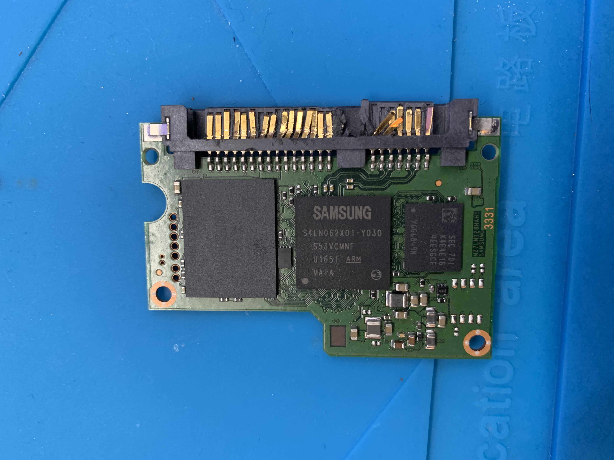
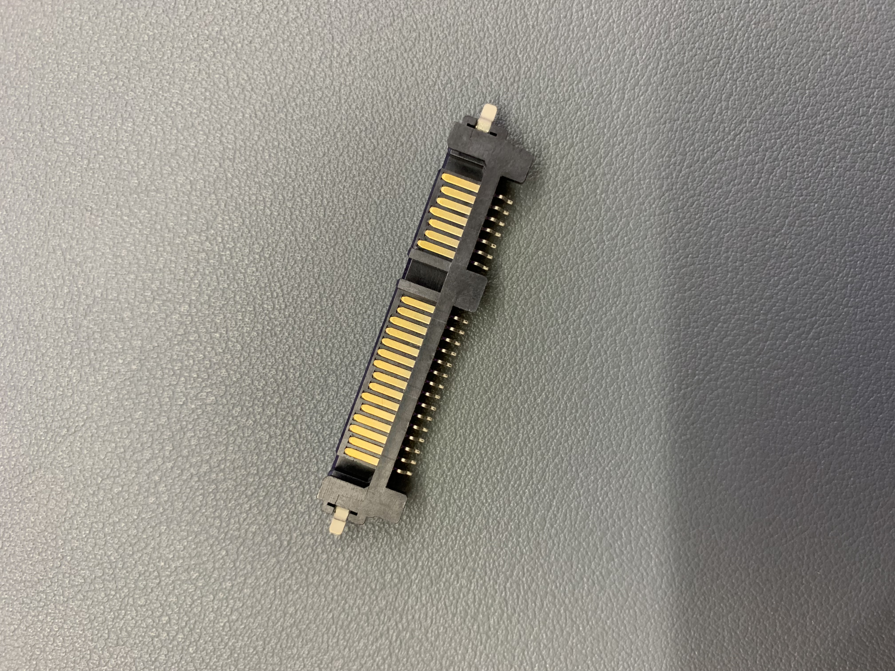
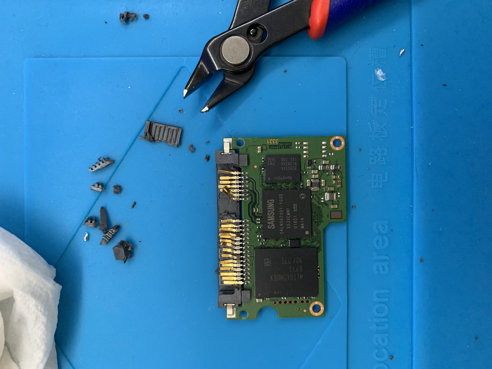
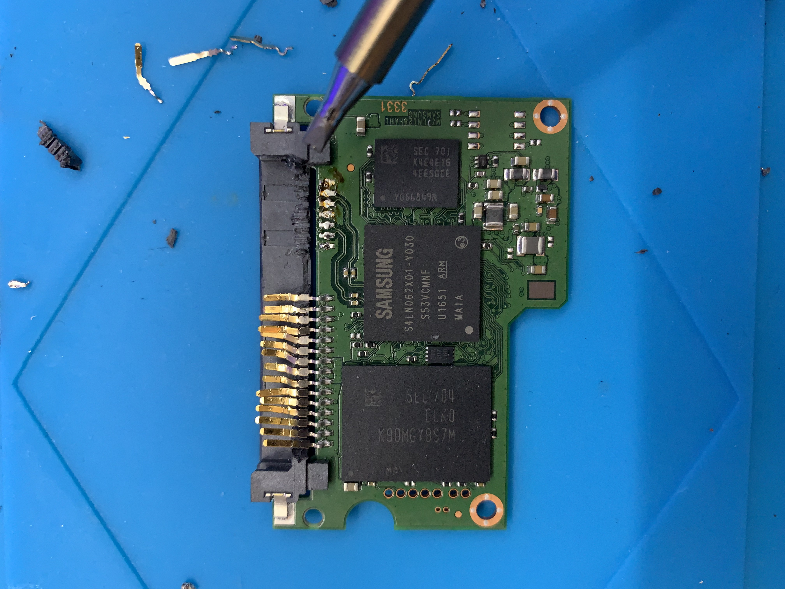
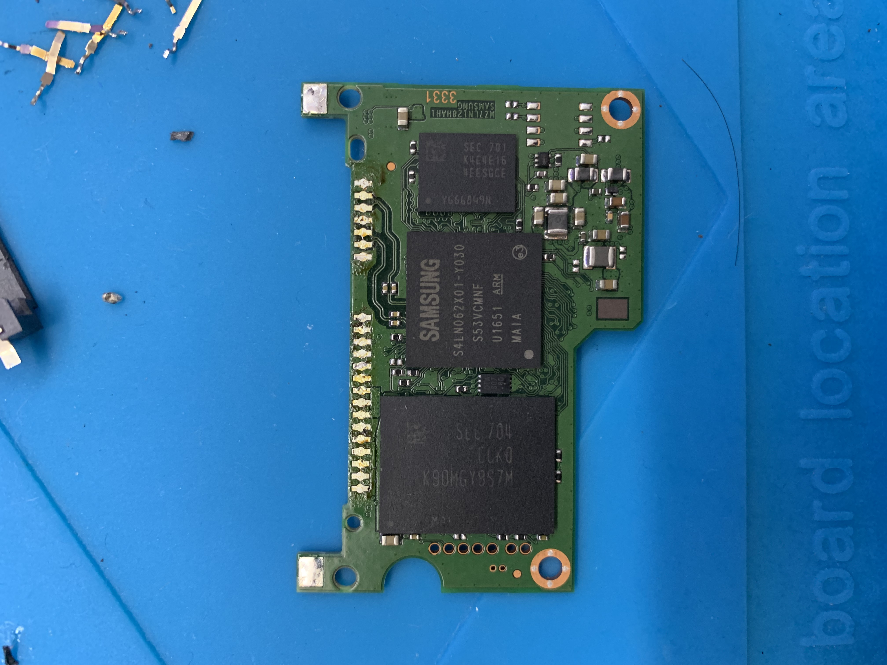
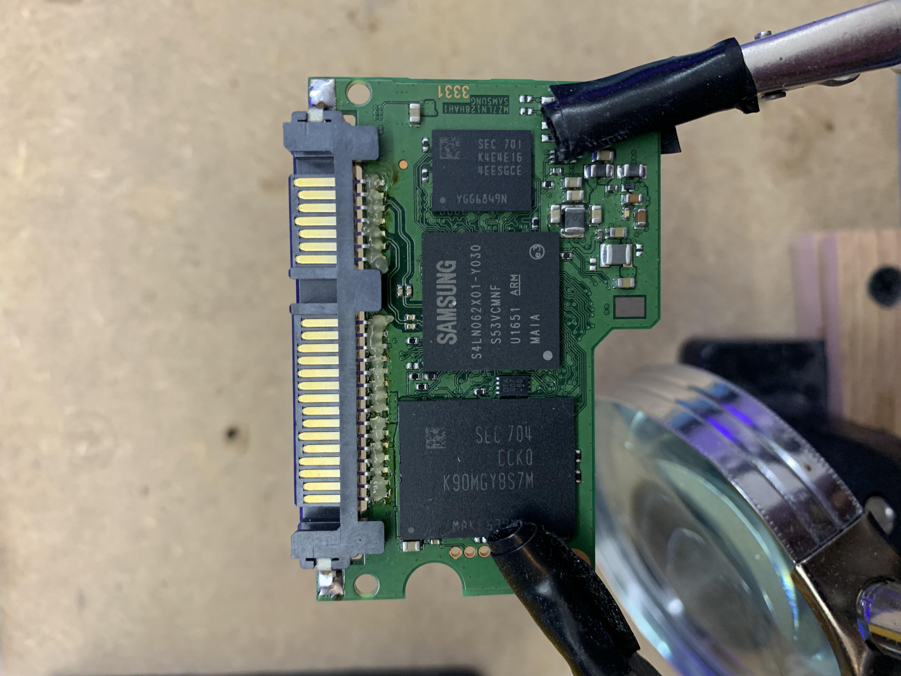
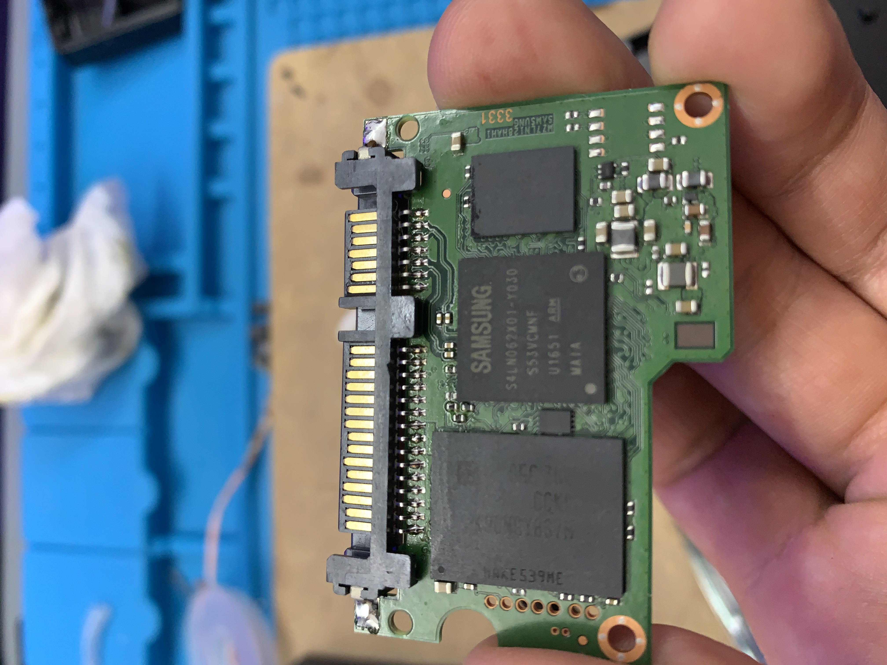

+++
title = "Dumpster Diving: SSD"
date = 2022-10-22
[taxonomies]
tags = ["hardware"]
+++

As we all know, we should be recycling more often than not and recycling electronics is not an exception. On my usual morning walks with my dog, someone dumped a full tower sized gaming PC with some hardware damaged with reckless intent. Nothing seemed salvagable and the parts were somewhat dated in the 2016 technology era of things. However, the SSD/HDD were still up for grabs and it appears that the owner intentionally "keyed" the SATA ports in an attempt to destroy the data from being read. This unlucky soul did not realize that I live in the same building as them :D

For the sake of curosity, I wanted to know if this drive has been encrypted or not, due to the fact that this person keyed the drive, they may not be savvy enough to understand encryption features.

Six dollars worth of spare parts were purchased from Aliexpress and made sure it had the right fitting as there are several different variations due to the PCB mounting holes. After waiting for a pain staking 4 weeks, the parts has arrived. On with the tutorial!

To make life easier, using a pair of flush cutters to snip away the damaged SATA port module would allow removing the pins separately rather than a whole module. Keep in mind, this isn't the way that most people would approach desoldering this component. Most experienced users would desolder the pins right away.

Next, desoldering each of the pins using a clean soldering iron. This also includes the two grounding pads located on the left and right side of the SATA module.

Each of the desoldered pin pads will need to be cleaned or else bad soldering joints may occur. Using a soldering braid wick will fix this up in a jiffy.

Time to slot in the new SATA module and solder the left and right grounding pads first for proper data pin alignment. Use plenty of flux on the data pins for the solder to flow and adhere to the PCB pads.

The final result of the soldering joints should be shiny and not dull. A dull look usually means a cold soldering joint which is bad. If all is well, put it back together and boot it up on a separate virtual machine or an isolated machine for testing purposes. 

As I'm not surprised, the drive is not encrypted. It can be mounted as NTFS and files are readable. The sensitive details that were found on this drive won't be shared for obvious reasons. My curiosity has been satiated and reached to a conclusion. Don't worry, I'll follow best practices and ethics to ensure that data is wiped and destroyed.

This is a lesson for everyone: sanitize the data stored in electronics and physically destroy the electronics in an unrecoverable fashion. On a related note, those smart light bulbs that people throw out regularly can still store wifi passwords in plaintext and can be extracted using a logic analyzer. I'm waiting for one to show up in the recycling bin for demonstration purposes. That's a sneak peak post to write about in the future!
