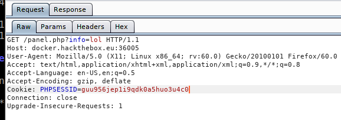
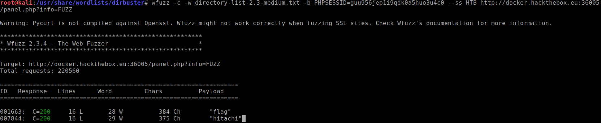

+++
title = "Cartographer"
date = 2019-06-17
[taxonomies]
tags = ["hackthebox"]
+++

1.  "Some underground hackers are developing a new command and control server. Can you break in and see what they are up to?"

    This challenge was finding out if you can bypass the login screen. At first, I thought the hint was Cartography so I thought that “oh, maybe I take the .png image and decode the message using steganography tools.” Nope, this was the first mistake. I should have not focused so much time on doing the hard stuff first when I should have tried the lower hanging fruit such as SQL injection attacks.

    To bypass the login screen, it was a matter of trying out SQL injection attack. I used the [SQL injection cheat sheet](https://pentestlab.blog/2012/12/24/sql-injection-authentication-bypass-cheat-sheet/) and if you insert:

    ```
    admin' or '1'='1
    ```

    on the login page, it will bypass the login form.

    After logging in, there isn't much to look at besides a page that says under construction. In the URL, I noticed a strange `?info=` parameter.

    `http://docker.hackthebox.eu:36005/panel.php?info=lol`

2.  Playing around with it, invalid parameters show `page not found` error. I wonder if I could fuzz the URL and see if there are possible pages that can be found using a word list.

    `wfuzz` is the tool of choice of what I need to do. First, we need to grab the cookie and pass onto `wfuzz` so it can produce the results correctly. If you don't do this, it will only give you false positive results. Using `burpsuite`, we can grab the cookie:

    

    Now we pass this cookie information to the `wfuzz` command.

    

    `Protip`{: .info }

    The `–ss` switch is for displaying only pages that contains the flag.

    Navigating to the URL will show us the HTB flag.