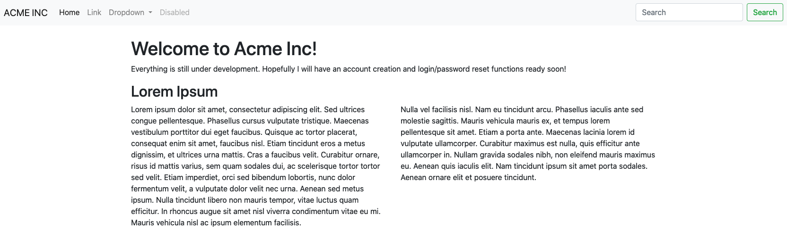
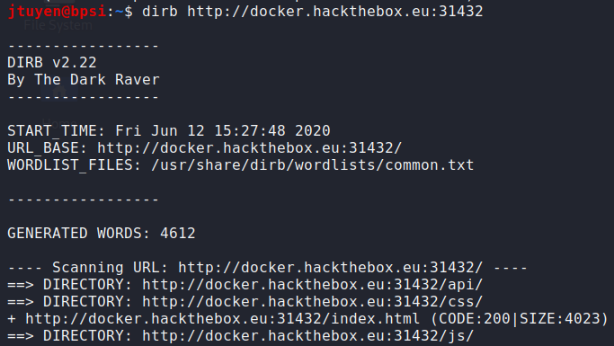
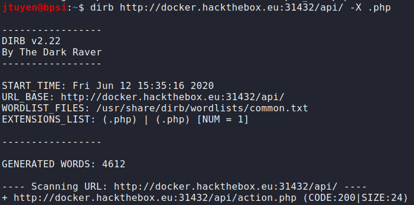
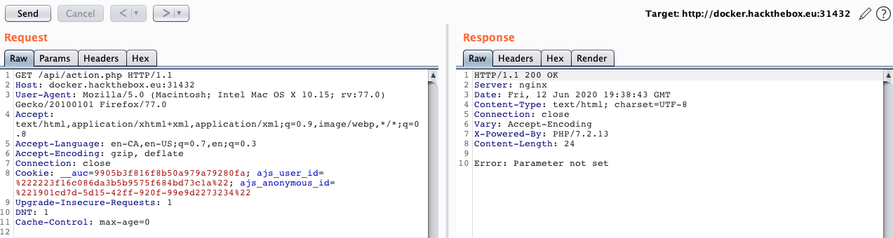
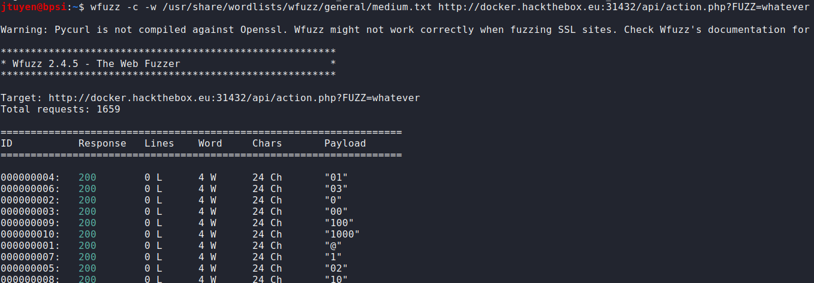
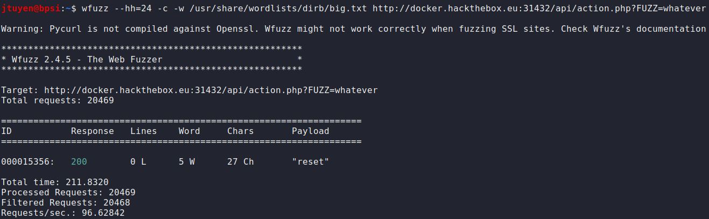
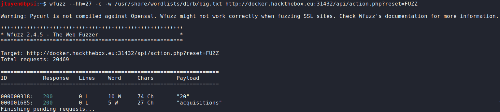
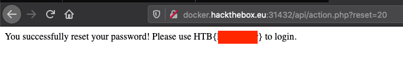

+++
title = "Fuzzy"
date = 2020-06-12
[taxonomies]
tags = ["hackthebox"]
+++

1.	The challenge: "We have gained access to some infrastructure which we believe is connected to the internal network of our target. We need you to help obtain the administrator password for the website they are currently developing."

	
	
2.	The links don't lead to anywhere. Judging from the text in the site, there is some sort of reset function hidden somewhere. I'm going to use `dirb` to fuzz a possible directory.
	 
	

	`/api` directory has been discovered.
	
3.	The `/api` directory doesn't seem to load anything. I'm going to continue fuzzing the `/api` directory for possible files.

	
	
	Bingo. `/api/action.php` file has been discovered. Although, navigating to the URL leads to a text "Error: Parameter not set". I guess this is a fuzzing challenge. FYI, I was using `burpsuite` the whole time hence why in my last command, I knew to add php as the extension to look for because of the server response header.
	
	
	
4.	Using `wfuzz` this time to see if I could fuzz the parameter name because I tried all the commonly used parameters used in most web apps.

	
	
	I didn't seem to get any hits, well I'm not even sure if I did because the screen kept on scrolling. After reading the `wfuzz` documentation, there is a way to hide results that is based on the number characters shown on screen. If the character deviates from the preset, it will highlight the result. Judging from the results, I need to filter out 24 character responses. Let's try this again.
	
	
	
	Parameter has been found. Although, now I'm running into an ID not matching issue. Time to fuzz some more. This time I'm going to filter out 27 character long responses.
	
	
	
	Bingo. We can now capture the flag.
	
	