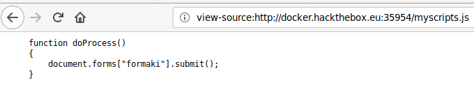
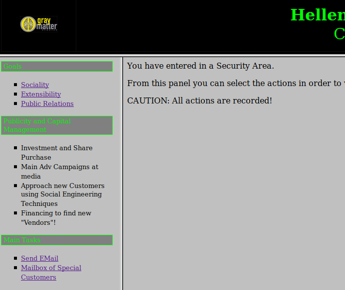
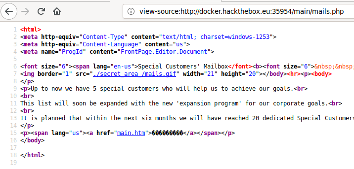
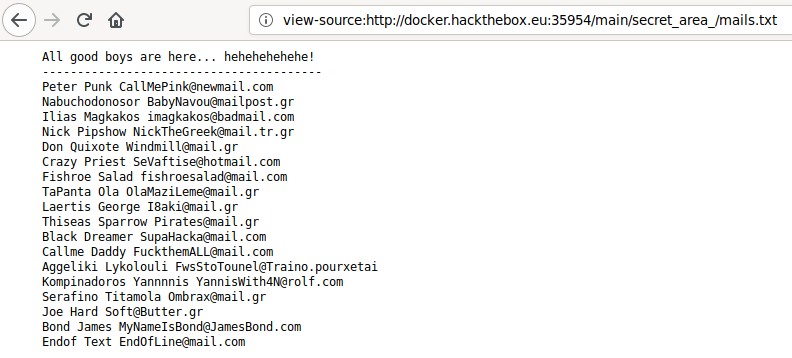
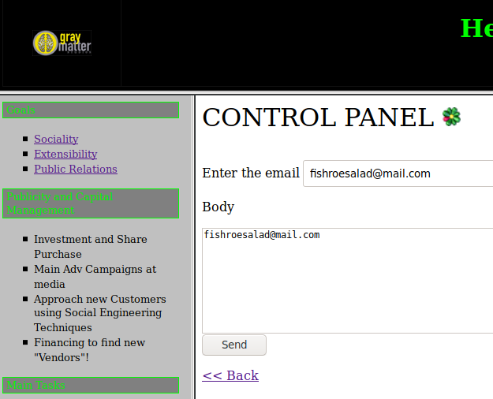
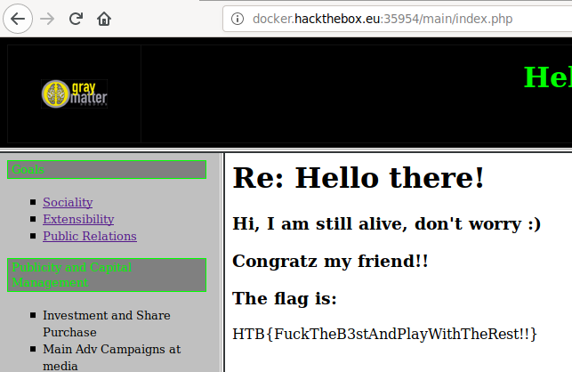

+++
title = "HDC"
date = 2019-07-03
[taxonomies]
tags = ["hackthebox"]
+++

1.  On the main page, it shows a simple login form. The first thing I did is browse around the source code and see if there are any hidden username and passwords. There are two js files, `jquery-3.2.1.js` and `myscripts.js` that I looked into.

    

    `myscripts.js` has a function named `doProcess()` which handles the submission I would imagine. Let's take a look at what this function does in `jquery-3.2.1.js` file.

    [htb-hdc-jquery.png](htb-hdc-jquery.png)

    ```
    {var form=document.createElement("form");	form.setAttribute("method","post");	form.setAttribute("action","main/index.php");	form.setAttribute("target","view");	var hiddenField=document.createElement("input");	hiddenField.setAttribute("type","hidden");	hiddenField.setAttribute("name","name1");	hiddenField.setAttribute("value","TXlMaXR0bGU");	var hiddenField2=document.createElement("input");	hiddenField2.setAttribute("type","hidden");	hiddenField2.setAttribute("name","name2");	hiddenField2.setAttribute("value","cDB3bmll");	form.appendChild(hiddenField2);		form.appendChild(hiddenField);	form.appendChild(hiddenField2);	document.body.appendChild(form);			window.open('','view');	form.submit();}
    ```

    Oh look, there is a `hiddenField` attribute set for username and password. This must be the ticket to log into the login page.

2.  After logging, it shows that this platform is used for "Central Greece Station". Whatever that means, it sounds important.. I think. Browsing around the displayed links, most are junk except two places that seems suspect.

    

    This security area seems like a good place to dig around. Let's take a look at the source code.

    

3.  Poking around, I eventually landed on a link that leads to a directory called `secret_area_`. Seems juicy, let's take a look at what's inside.

    

    A list of email addresses, I wonder what it can be possibly used for? Oh, there was a strange mail form that can be used to submit these email addresses, I guess we try it out?

    

    Going through the first half of the list, we finally landed upon the root flag. 

    