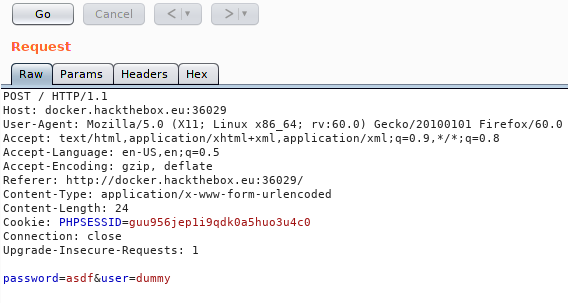
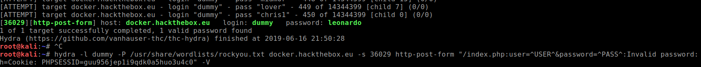
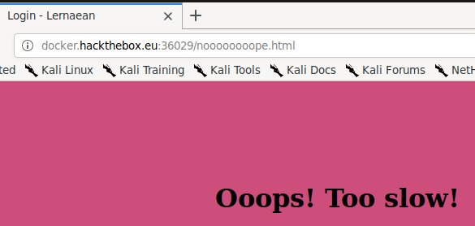
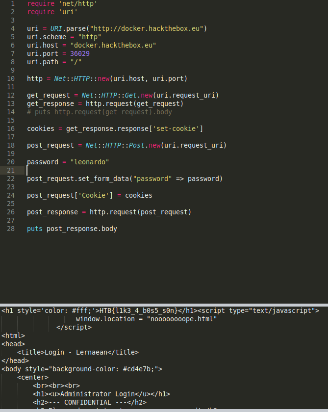

+++
title = "Lernaean"
date = 2019-06-17
[taxonomies]
tags = ["hackthebox"]
+++

1.  "Your target is not very good with computers. Try and guess their password to see if they may be hiding anything!"

    This challenge wasn't too bad. The parts that I struggled with was getting the right syntax for hydra and putting together a post request script in Ruby which I've partially borrowed from Emdee five for life - Web challenge.

    To start off with this challenge, it was a simple textbox that you need to input a password. To brute force the password, `hydra` and `rockyou.txt` was used for this task.

    We need to grab the cookie first and pass onto hydra.

    

    ```
    hydra -l dummy -P /usr/share/wordlists/rockyou.txt docker.hackthebox.eu -s 36029 http-post-form "/index.php:user=^USER^&password=^PASS^:Invalid password:h=Cookie: PHPSESSID=guu956jep1i9qdk0a5huo3u4c0" -V
    ```

2.  I struggled with hydra because I thought that the first part of the ternary required /index.php or something because it kept rejecting "/" as a parameter. I used dirbuster to find out if `index.php` is the correct page to be using. Now that I think of it, why did I use dirbuster just for that purpose.

    The other part is the 3rd parameter of the ternary: "Invalid password". I did not know that this field had to match the output of the result. All the tutorials that I've read online doesn't really mention about this field. If I entered some other text, the results will show all as matching passwords.

    

    As you can now see, the password is "leonardo". Upon inputting this password into the field, it redirects to a new page and tells us that we're too slow.

    

    I took a look at the source page for possible flags but I didn't see any.

3.  At this point, I figured maybe it's a false password that led me to a wrong path. I removed the password from `rockyou.txt` and continued with brute forcing the password and see if it leads me anywhere. After an hour, I gave up and started to write my POST script.

    ```
    require 'net/http'
    require 'uri'
    
    uri = URI.parse("http://docker.hackthebox.eu")
    uri.scheme = "http"
    uri.host = "docker.hackthebox.eu"
    uri.port = 36029
    uri.path = "/"
    
    http = Net::HTTP::new(uri.host, uri.port)
    
    get_request = Net::HTTP::Get.new(uri.request_uri)
    get_response = http.request(get_request)
    # puts http.request(get_request).body
    
    cookies = get_response.response['set-cookie']
    
    post_request = Net::HTTP::Post.new(uri.request_uri)
    
    password = "leonardo"
    
    post_request.set_form_data("password" => password)
    
    post_request['Cookie'] = cookies
    
    post_response = http.request(post_request)
    
    puts post_response.body
    ```

    Running the script will show the HTB flag.

    

    `Protip`{: .info }

    Useful link: [https://www.hempstutorials.co.uk/brute-forcing-passwords-with-thc-hydra/](https://www.hempstutorials.co.uk/brute-forcing-passwords-with-thc-hydra/)