+++
title = "Monteverde"
date = 2020-03-28
[taxonomies]
tags = ["hackthebox"]
+++

1.	My usual `nmap` scan is being blocked. Must be that the machine's firewall is blocking the requests.

	```
	jtuyen@bpsi:~/Documents/hackthebox/monteverde$ nmap -sC -sV -oA nmap monteverde
	Starting Nmap 7.80 ( https://nmap.org ) at 2020-03-21 10:03 EDT
	Note: Host seems down. If it is really up, but blocking our ping probes, try -Pn
	Nmap done: 1 IP address (0 hosts up) scanned in 3.38 seconds
	```
	
	Using the `-Pn` switch, I discovered the open ports without sending pings to the machine and validates my hypothesis about a possible firewall.

	```
	jtuyen@bpsi:~/Documents/hackthebox/monteverde$ nmap -Pn 10.10.10.172
	Starting Nmap 7.80 ( https://nmap.org ) at 2020-03-21 10:04 EDT
	Nmap scan report for monteverde (10.10.10.172)
	Host is up (0.037s latency).
	Not shown: 989 filtered ports
	PORT     STATE SERVICE\
	53/tcp   open  domain
	88/tcp   open  kerberos-sec
	135/tcp  open  msrpc
	139/tcp  open  netbios-ssn
	389/tcp  open  ldap
	445/tcp  open  microsoft-ds
	464/tcp  open  kpasswd5
	593/tcp  open  http-rpc-epmap
	636/tcp  open  ldapssl
	3268/tcp open  globalcatLDAP
	3269/tcp open  globalcatLDAPssl
	Nmap done: 1 IP address (1 host up) scanned in 5.62 seconds
	```

	I scanned the UDP ports as well while I am at it.
	
	```
	jtuyen@bpsi:~/Documents/hackthebox/monteverde$ sudo nmap monteverde -p- -sU
	Starting Nmap 7.80 ( https://nmap.org ) at 2020-03-21 10:15 EDT
	Nmap scan report for monteverde (10.10.10.172)
	Host is up (0.029s latency).
	Not shown: 65532 open|filtered ports
	PORT    STATE SERVICE
	53/udp  open  domain
	123/udp open  ntp
	389/udp open  ldap
	
	Nmap done: 1 IP address (1 host up) scanned in 144.19 seconds
	```
	
	After playing around with the `nmap` switches, I found that `-f` will bypass the firewall restrictions.
	
	```
	jtuyen@bpsi:~/Documents/hackthebox/monteverde$ sudo nmap -sC -sV monteverde -f
	Starting Nmap 7.80 ( https://nmap.org ) at 2020-03-21 10:25 EDT
	Nmap scan report for monteverde (10.10.10.172)
	Host is up (0.028s latency).
	Not shown: 989 filtered ports
	PORT     STATE SERVICE       VERSION
	53/tcp   open  domain?
	| fingerprint-strings: 
	|   DNSVersionBindReqTCP: 
	|     version
	|_    bind
	88/tcp   open  kerberos-sec  Microsoft Windows Kerberos (server time: 2020-03-21 13:35:55Z)
	135/tcp  open  msrpc         Microsoft Windows RPC
	139/tcp  open  netbios-ssn   Microsoft Windows netbios-ssn
	389/tcp  open  ldap          Microsoft Windows Active Directory LDAP (Domain: MEGABANK.LOCAL0., Site: Default-First-Site-Name)
	445/tcp  open  microsoft-ds?
	464/tcp  open  kpasswd5?
	593/tcp  open  ncacn_http    Microsoft Windows RPC over HTTP 1.0
	636/tcp  open  tcpwrapped
	3268/tcp open  ldap          Microsoft Windows Active Directory LDAP (Domain: MEGABANK.LOCAL0., Site: Default-First-Site-Name)
	3269/tcp open  tcpwrapped
	1 service unrecognized despite returning data. If you know the service/version, please submit the following fingerprint at https://nmap.org/cgi-bin/submit.cgi?new-service :
	SF-Port53-TCP:V=7.80%I=7%D=3/21%Time=5E7623F3%P=x86_64-pc-linux-gnu%r(DNSV
	SF:ersionBindReqTCP,20,"\0\x1e\0\x06\x81\x04\0\x01\0\0\0\0\0\0\x07version\
	SF:x04bind\0\0\x10\0\x03");
	Service Info: OS: Windows; CPE: cpe:/o:microsoft:windows
	
	Host script results:
	|_clock-skew: -49m54s
	| smb2-security-mode: 
	|   2.02: 
	|_    Message signing enabled and required
	| smb2-time: 
	|   date: 2020-03-21T13:38:31
	|_  start_date: N/A
	
	Service detection performed. Please report any incorrect results at https://nmap.org/submit/ .
	Nmap done: 1 IP address (1 host up) scanned in 333.92 seconds
	```
	
2.	I noticed there was a SMB share so I decided to try and use `smbmap` to mount the share for hints. Access is denied.

	```
	jtuyen@bpsi:~/Documents/hackthebox/monteverde$ smbmap -H monteverde
	[+] Finding open SMB ports....
	[+] User SMB session established on monteverde...
	[+] IP: monteverde:445  Name: unknown                                           
	        Disk                                                    Permissions     Comment
	        ----                                                    -----------     -------
	[!] Access Denied
	```

3.	I did a quick `dig` command to quickly enumerate the DNS service for possible hints. None found.

	```
	jtuyen@bpsi:~/Documents/hackthebox/monteverde$ dig 172.0.0.10.in-addr.arpa PTR @10.10.10.172
	
	; <<>> DiG 9.11.14-3-Debian <<>> 172.0.0.10.in-addr.arpa PTR @10.10.10.172
	;; global options: +cmd
	;; Got answer:
	;; ->>HEADER<<- opcode: QUERY, status: SERVFAIL, id: 53395
	;; flags: qr rd ra; QUERY: 1, ANSWER: 0, AUTHORITY: 0, ADDITIONAL: 1
	
	;; OPT PSEUDOSECTION:
	; EDNS: version: 0, flags:; udp: 4000
	;; QUESTION SECTION:
	;172.0.0.10.in-addr.arpa.       IN      PTR
	
	;; Query time: 2345 msec
	;; SERVER: 10.10.10.172#53(10.10.10.172)
	;; WHEN: Sat Mar 21 10:42:37 EDT 2020
	;; MSG SIZE  rcvd: 52
	```

4.	In the `nmap` results, I noticed the LDAP port is open and provided a domain name result. I enumerated the service using `ldapsearch`.

	```
	ldapsearch -h monteverde -p 389 -x -b "DC=MEGABANK,DC=LOCAL" -W
	```

5.	Next, I used `enum4linux` to see if there are any hints. I found couple of service accounts and user accounts that will be useful to continue the enumeration process.

	```
	 =========================== 
	|    Users on monteverde    |
	 =========================== 
	Use of uninitialized value $global_workgroup in concatenation (.) or string at ./enum4linux.pl line 866.
	index: 0xfb6 RID: 0x450 acb: 0x00000210 Account: AAD_987d7f2f57d2       Name: AAD_987d7f2f57d2  Desc: Service account for the Synchronization Service with installation identifier 05c97990-7587-4a3d-b312-309adfc172d9 running on computer MONTEVERDE.
	index: 0xfd0 RID: 0xa35 acb: 0x00000210 Account: dgalanos       Name: Dimitris Galanos  Desc: (null)
	index: 0xedb RID: 0x1f5 acb: 0x00000215 Account: Guest  Name: (null)    Desc: Built-in account for guest access to the computer/domain
	index: 0xfc3 RID: 0x641 acb: 0x00000210 Account: mhope  Name: Mike Hope Desc: (null)
	index: 0xfd1 RID: 0xa36 acb: 0x00000210 Account: roleary        Name: Ray O'Leary       Desc: (null)
	index: 0xfc5 RID: 0xa2a acb: 0x00000210 Account: SABatchJobs    Name: SABatchJobs       Desc: (null)
	index: 0xfd2 RID: 0xa37 acb: 0x00000210 Account: smorgan        Name: Sally Morgan      Desc: (null)
	index: 0xfc6 RID: 0xa2b acb: 0x00000210 Account: svc-ata        Name: svc-ata   Desc: (null)
	index: 0xfc7 RID: 0xa2c acb: 0x00000210 Account: svc-bexec      Name: svc-bexec Desc: (null)
	index: 0xfc8 RID: 0xa2d acb: 0x00000210 Account: svc-netapp     Name: svc-netapp        Desc: (null)
	```

6.	I tried the low hanging fruit of seeing if the users are susceptible to ASREPRoast using the user account information found in the previous step. No accounts were found to be vulnerable.

	```
	(impacket) jtuyen@bpsi:~/Tools/Windows/impacket/examples$ ./GetNPUsers.py -dc-ip 10.10.10.172 MEGABANK/DGalanos
	Impacket v0.9.21.dev1+20200225.153700.afe746d2 - Copyright 2020 SecureAuth Corporation
	
	Password:
	[*] Cannot authenticate DGalanos, getting its TGT
	[-] User DGalanos doesn't have UF_DONT_REQUIRE_PREAUTH set
	(impacket) jtuyen@bpsi:~/Tools/Windows/impacket/examples$ ./GetNPUsers.py -dc-ip 10.10.10.172 MEGABANK/roleary
	Impacket v0.9.21.dev1+20200225.153700.afe746d2 - Copyright 2020 SecureAuth Corporation
	
	Password:
	[*] Cannot authenticate roleary, getting its TGT
	[-] User roleary doesn't have UF_DONT_REQUIRE_PREAUTH set
	(impacket) jtuyen@bpsi:~/Tools/Windows/impacket/examples$ ./GetNPUsers.py -dc-ip 10.10.10.172 MEGABANK/smorgan
	Impacket v0.9.21.dev1+20200225.153700.afe746d2 - Copyright 2020 SecureAuth Corporation
	
	Password:
	[*] Cannot authenticate smorgan, getting its TGT
	[-] User smorgan doesn't have UF_DONT_REQUIRE_PREAUTH set
	```

7.	Running low on the number of enumerations, I've resorted to brute forcing the SMB accounts. After numerous attempts of brute forcing various accounts, I found one that works: `MEGABANK\SABatchJobs:SABatchJobs`

	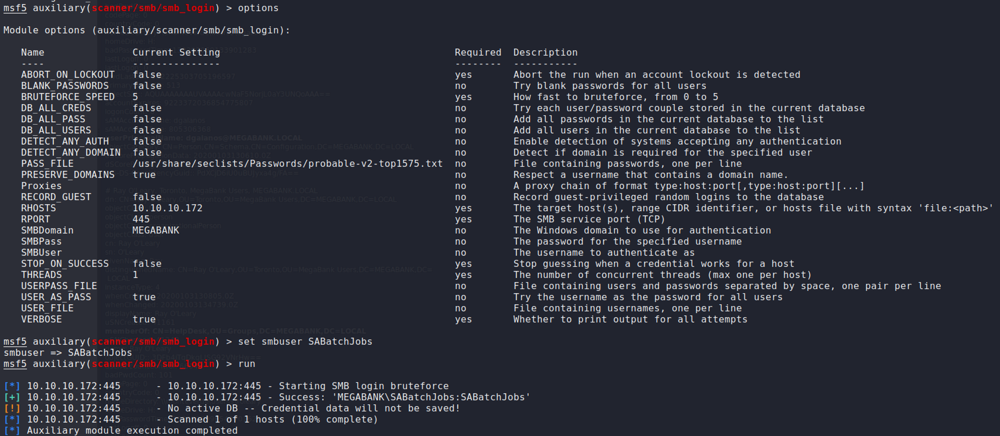

8.	I re-ran `smbmap` again using the new credentials and found a listing of files and folders.

	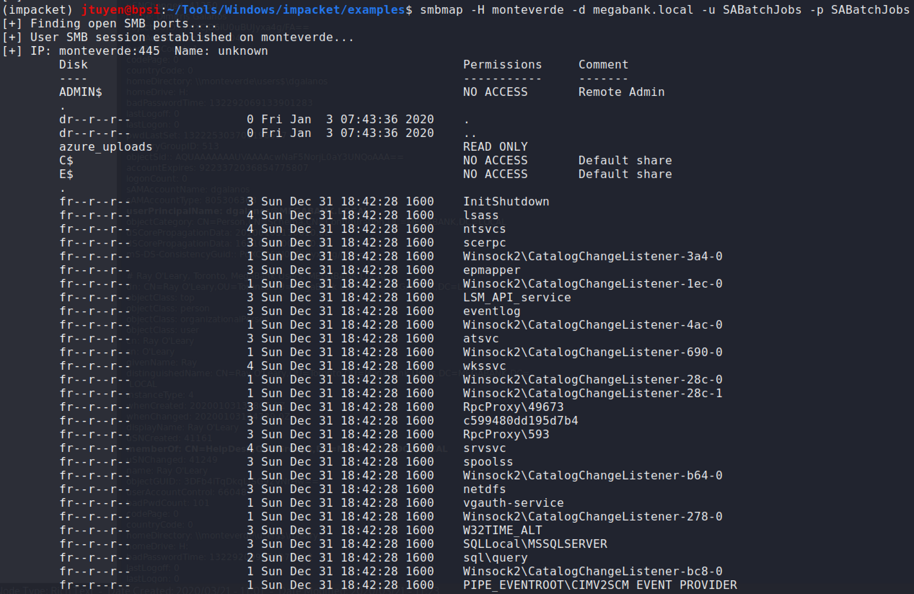

9.	Used `smbclient` to enumerate what is inside users folders and an `azure.xml` item stood out. Upon reading the file, it contained a password which I'm not sure what can be used for yet.

	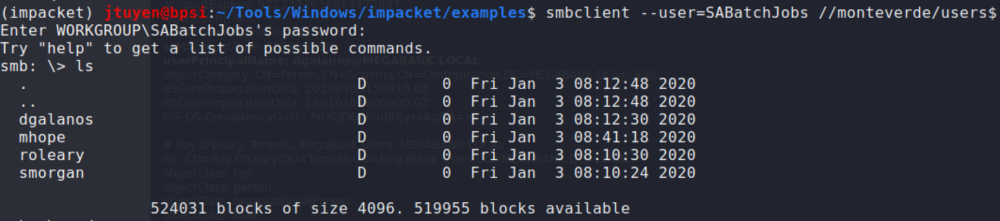
	
	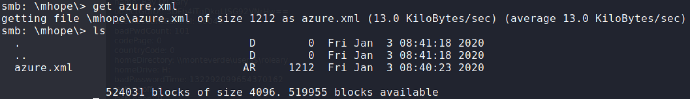
	
	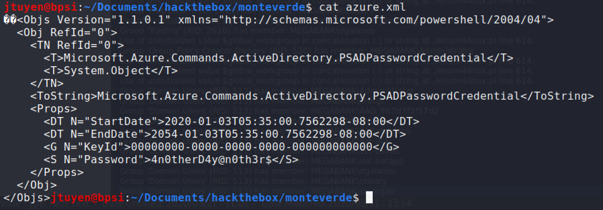
	
	Logon credentials has been found: `mhope:4n0therD4y@n0th3r$`
	
	I tested the credentials to verify samba access.
	
	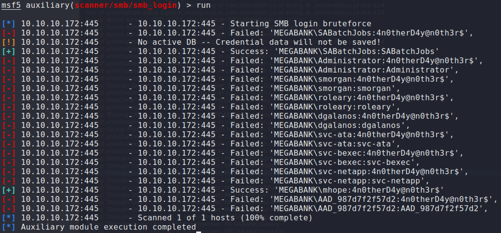

10.	After being stuck on the problem for a while, I went back to do `nmap` scan again on all ports because I couldn't find any other way to gain remote access using the password that I've found. One step that I forgot to perform in the beginning was to scan all 65535 TCP ports to make sure I have it all covered. I found additional open ports but most notably is port 5985.

	```
	jtuyen@bpsi:~/Documents/hackthebox/monteverde$ sudo nmap -p- -f monteverde
	[sudo] password for jtuyen: 
	Starting Nmap 7.80 ( https://nmap.org ) at 2020-03-21 13:40 EDT
	Stats: 0:00:41 elapsed; 0 hosts completed (1 up), 1 undergoing SYN Stealth Scan
	SYN Stealth Scan Timing: About 2.68% done; ETC: 14:06 (0:24:51 remaining)
	Stats: 0:02:29 elapsed; 0 hosts completed (1 up), 1 undergoing SYN Stealth Scan
	SYN Stealth Scan Timing: About 28.55% done; ETC: 13:49 (0:06:13 remaining)
	Nmap scan report for monteverde (10.10.10.172)
	Host is up (0.035s latency).
	Not shown: 65516 filtered ports
	PORT      STATE SERVICE
	53/tcp    open  domain
	88/tcp    open  kerberos-sec
	135/tcp   open  msrpc
	139/tcp   open  netbios-ssn
	389/tcp   open  ldap
	445/tcp   open  microsoft-ds
	464/tcp   open  kpasswd5
	593/tcp   open  http-rpc-epmap
	636/tcp   open  ldapssl
	3268/tcp  open  globalcatLDAP
	3269/tcp  open  globalcatLDAPssl
	5985/tcp  open  wsman
	9389/tcp  open  adws
	49667/tcp open  unknown
	49673/tcp open  unknown
	49674/tcp open  unknown
	49675/tcp open  unknown
	49706/tcp open  unknown
	49778/tcp open  unknown
	
	Nmap done: 1 IP address (1 host up) scanned in 445.93 seconds
	```

11. I used `evil-winrm` to gain remote access on port 5985 and the user flag has been obtained.

	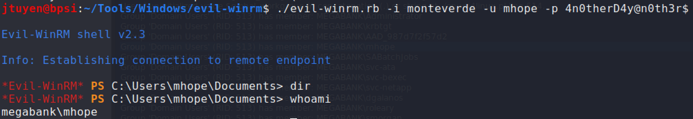
	
	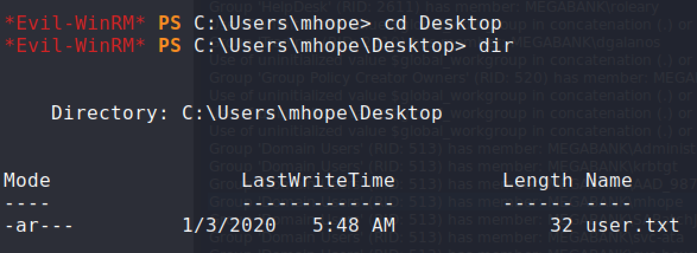

### Privilege Escalation

1.	After digging around looking for clues inside the system, I found a hidden Azure directory.

	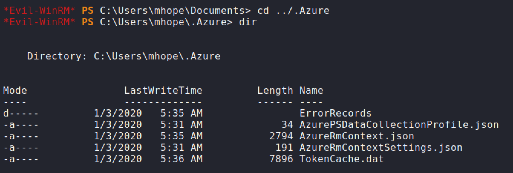

	After spending some time Googling what possible abuse and exploits can be performed. I stumbled on this link that could be useful for my future penetration tests in the real world: [https://www.lares.com/hunting-azure-admins-for-vertical-escalation/](https://www.lares.com/hunting-azure-admins-for-vertical-escalation/). The gist of the article is about compromising a workstation that contains access to Azure resources by using the cached token for authentication.

	I decided to try and take a stab and see if it was possible.
	
	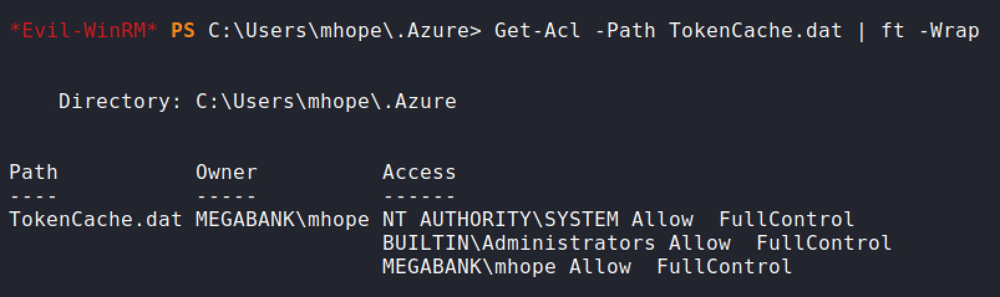
	
	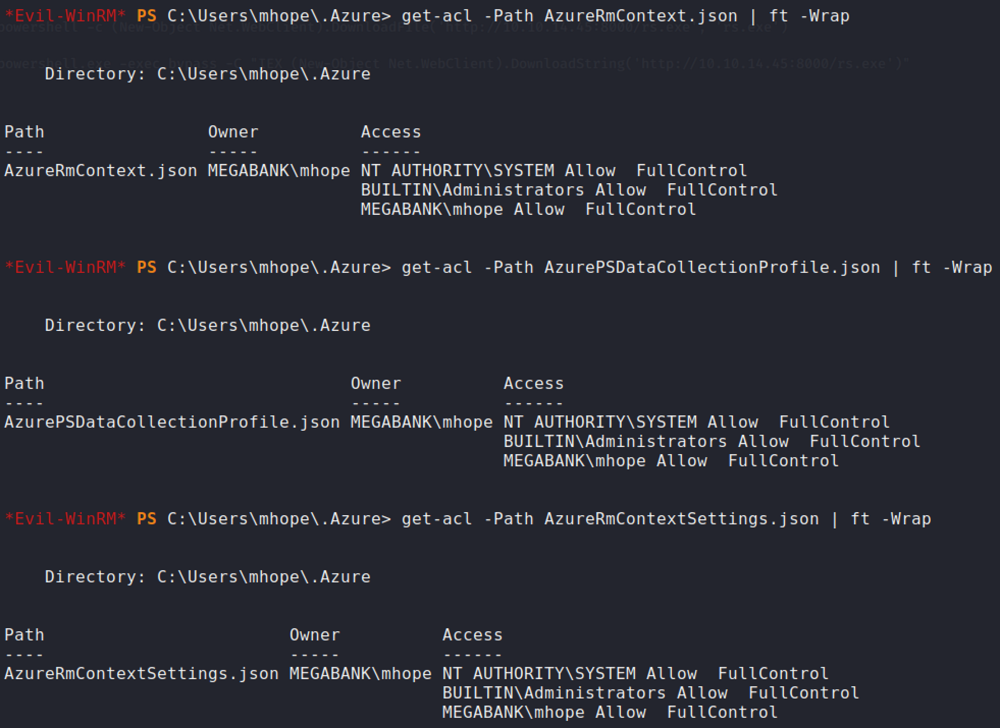

	Let's try and download the `TokenCache.dat` and inspect what is inside.
	
	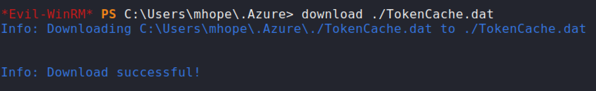
	
	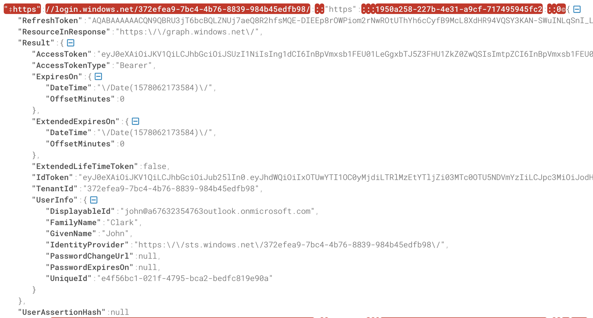
	
	The token file looks interesting and valid? I'm not sure yet.

	The next enumeration commands shows if the user has installed `Az` modules used for connecting to Azure resources and the connection history log file.
	
	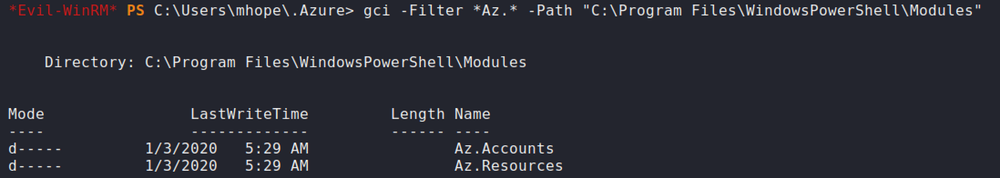
	
	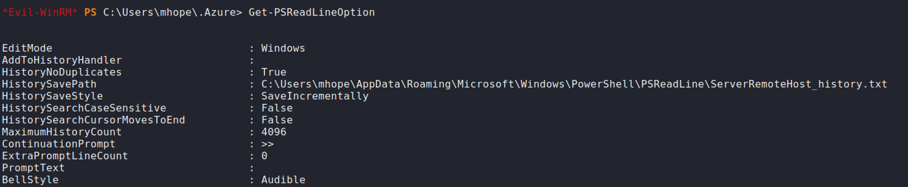
	
	Looks like it has been connected to Azure at some point of time.
	
	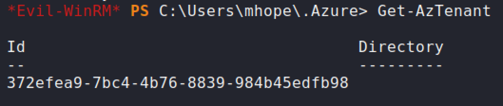
	
	It doesn't look too hopeful at the moment to be exploiting a real Azure environment.
	
	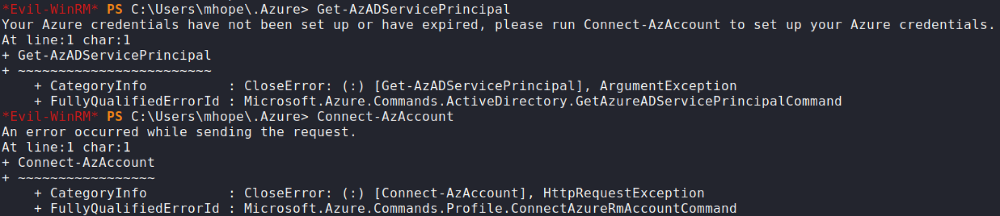

2.	Token cache data is empty hence why you can't connect to Azure. At least I learned something about the process of Azure enumeration.

	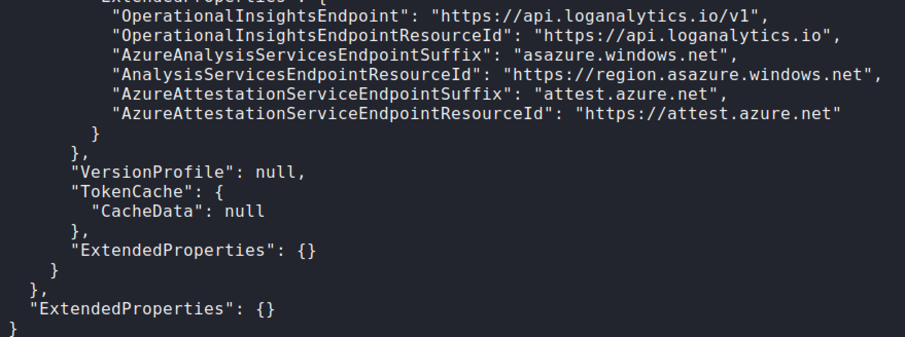

3.	Moving on, I was Googling for other ways to exploit Azure AD Sync and I came upon this [script](https://blog.xpnsec.com/azuread-connect-for-redteam/)

	The script didn't work because it couldn't find the LocalDB database. I figure it was some sort of enumeration of MSSQL table database but I couldn't find a good way to do it. I should find out more about this later.

4.	After googling some more, I came upon another [script](https://vbscrub.video.blog/2020/01/14/azure-ad-connect-database-exploit-priv-esc/) that was related and has the ability to enumerate all databases.

	```
	cd "C:\Program Files\Microsoft Azure AD Sync\Bin"
	```
	
	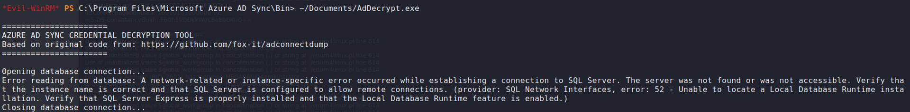
	
	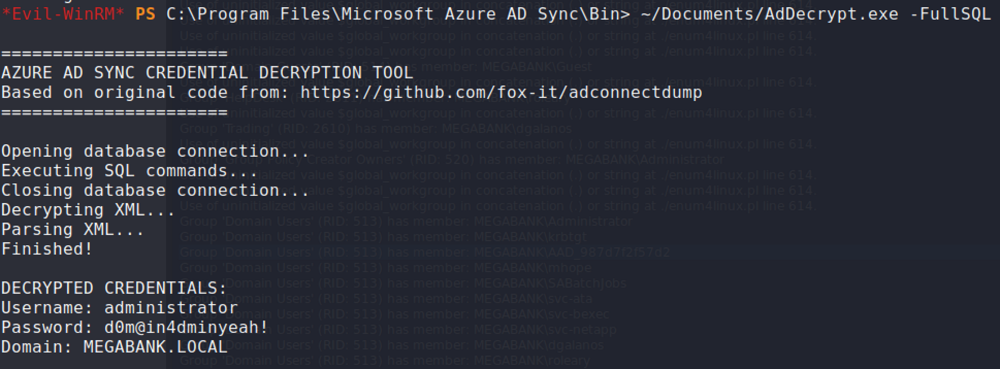
	
5.	Using the discovered Administrator credential, using `evil-winrm` again, I was able to obtain the `root.txt` flag.
	
	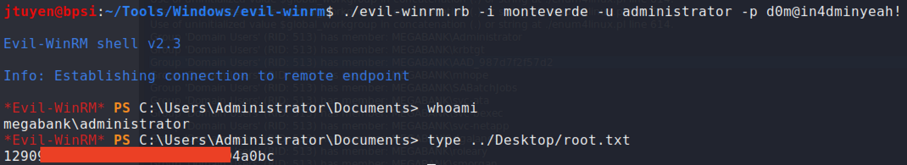
