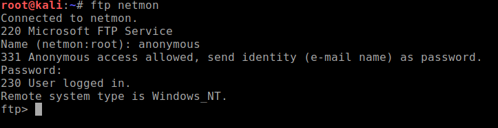
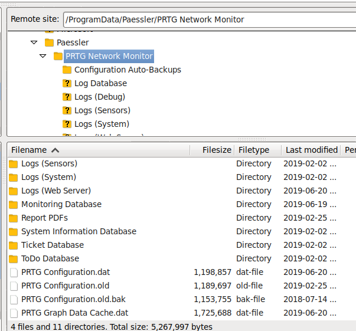
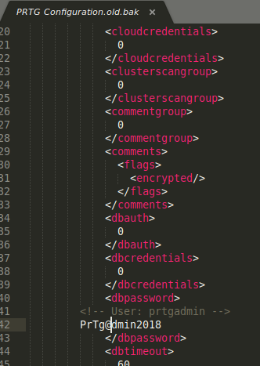
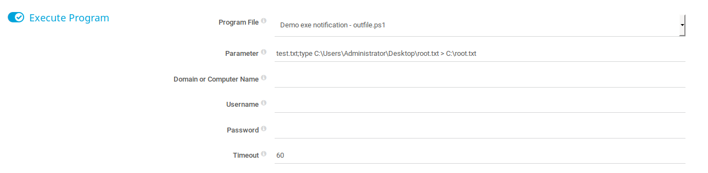
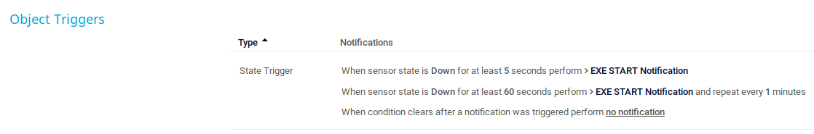
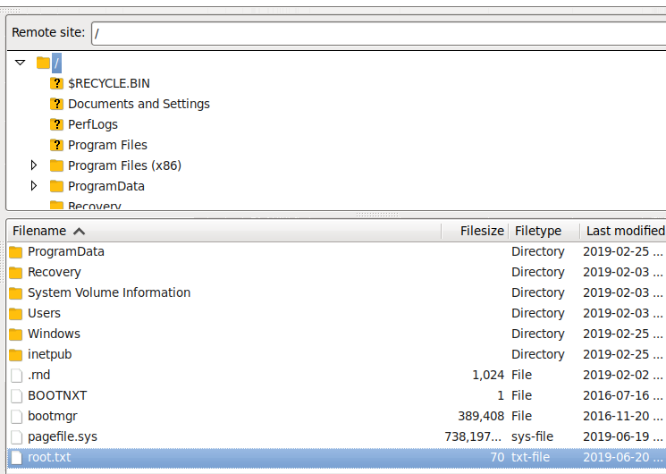

+++
title = "Netmon"
date = 2019-06-21
[taxonomies]
tags = ["hackthebox"]
+++

1. Nmap scans show FTP is open on port 21 with allowed anonymous access. Looking through the directories, I found the `user.txt` flag, that was way too easy.

	

2. Nmap scans show Netmon is running a web server on port 80. The web server is hosting a web application called PRTG which is a network monitoring software. The version 18.1.37.13946 can be found below. Looking through exploit-db, there is no vulnerable exploits to be found.

	Trying to figure out how to bypass the login, I've proceeded with brute forcing the login using `hydra` but no luck.

	I started to dig through what else was on the system using FTP. I would find a hidden folder for PRTG located in:

	```
	C:\ProgramData\Paessler|PRTG Network Monitor
	```

	Inside this folder, there are old backup files and configuration files.

	

	Roaming through the configuration files, I found something that was notable. The configuration files contain passwords even if it was encrypted. I started to dig through all the configuration files that I could find and there was only 1 file that showed an unencrypted password.

	

	Username `prtgadmin` and password `PrTg@dmin2018`. I tried logging in with these credentials and it didn't work. Not sure what to do next, so I got a hint from someone in Discord and they said try using the `PrTg@dmin2019` instead. Wow, it worked and something I would have never guessed. Enumerating passwords is something I will take note of next time.

3. Once I'm logged in, I started to play around with PRTG as I never used this platform before. It was kind of confusing where everything is and how it works. After a while, I had a hunch that I had to create a sensor or something to trigger a script of some sort. I googled for possible code execution and I stumbled upon this site: ```https://www.codewatch.org/blog/?p=453```

	It's smooth sailing from here following his instructions and modifying parts as my own. How it works is creating an EXE notification object that triggers the `Demo - Outfile.ps1`. Why `Outfile.ps1`? `Outfile.ps1` doesn't sanitize the parameter being passed to it so you can append your own code for execution.

	```shell
	if ($Args.Count -eq 0) {
	 
	  #No Arguments. Filename must be specified.
	 
	  exit 1;
	 }elseif ($Args.Count -eq 1){
	 
	 
	  $Path = split-path $Args[0];
	 
	  if (Test-Path $Path)    
	  {
	    $Text = Get-Date;
	    $Text | out-File $Args[0]; # This is where it doesn't sanitize the parameter being passed to it
	    exit 0;
	 
	  }else
	  {
	    # Directory does not exist.
	    exit 2;
	  }
	}
	```

4. Make a EXE notification with the parameters to read and output the flag to `C:\root.txt`

	

5. Now you need to assign this notification object to an existing sensor. You can choose any sensor at this point and modify it's notification setting to execute your EXE notification. I chose a sensor that was failing and assigned with these settings:

	

	All you do now is watch and wait for the root flag file to be generated at `C:\`

	
