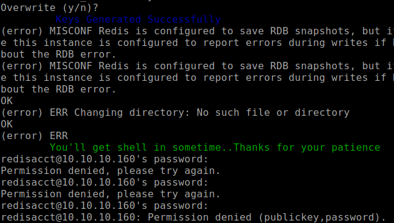
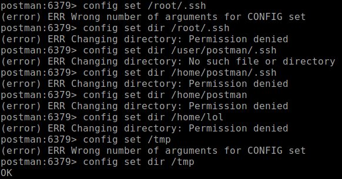
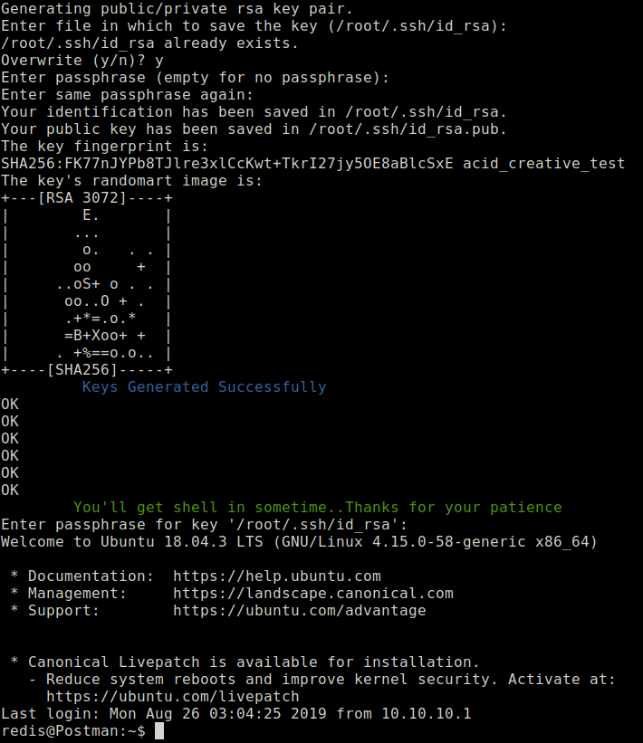
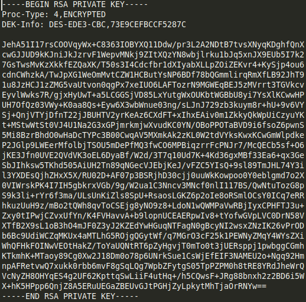
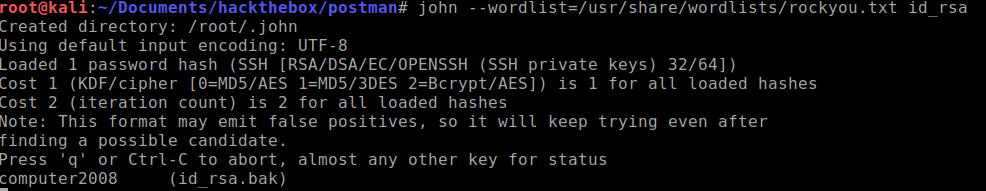
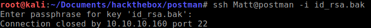
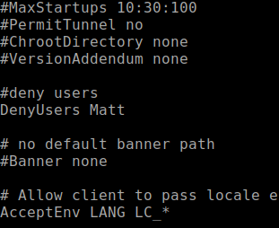
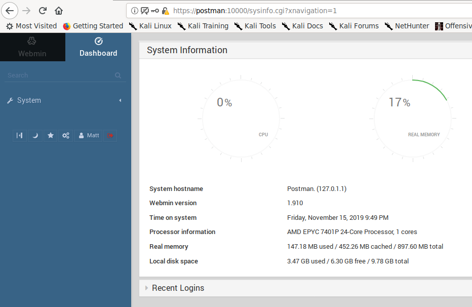
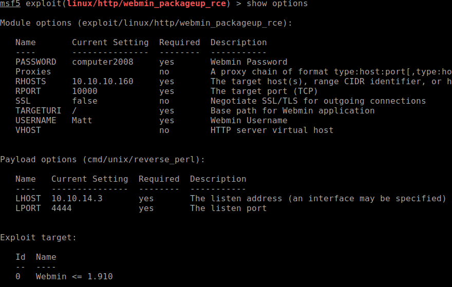
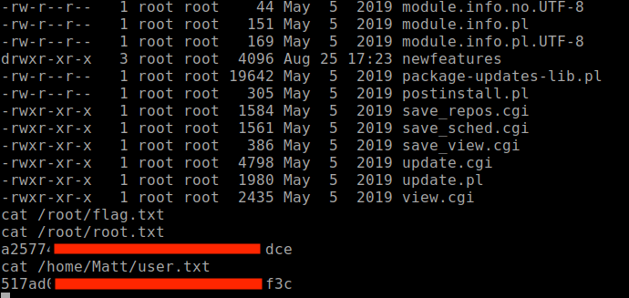

+++
title = "Postman"
date = 2020-03-14
[taxonomies]
tags = ["hackthebox"]
+++

1. `nmap` scans show ports 22, 80, 6379 (redis), and 10000 (webmin) are open.

2. Port 80 shows a web page that doesn't show much information besides a basic page with static code.

    

3. Moving onto the next port 6379. It's the default port that Redis service uses. Redis is a popular NoSQL database that operates using key and value store. To interface with Redis service, I will need to install `redis-tools` for the CLI tool.

4. Once `redis-tools` has been installed, time to interface with the redis server.

    ```
    redis-cli -h 10.10.10.160
    ```

    Checking to see if there are any useful keys value pairs with sensitive information but none was to be found. I figured at this point it's probably some server side exploit to be found. Time to start Googling.

5. I found a couple of exploits on Github that creates a Redis rouge server to run a MODULE command but I couldn't get it working. After manually debugging the code, I finally realize the server doesn't allow MODULE command to be executed. Time to move onto a simpler exploit.

6. This [Redis Server Exploit script](https://github.com/Avinash-acid/Redis-Server-Exploit) will fit the job. What this script does is it will manipulate the redis configuration value to upload a public key. It will create a private key on your local machine and append the new key to the redis configuration value using `redis-cli`.

    Here is the [blog post](https://maxchadwick.xyz/blog/ssrf-exploits-against-redis) that will go through in detail on how it works.

    The only problem with this script is I need to know the the name of a user on the server. We need this information so we could set the Redis’ dir to that user’s .ssh/ directory and set the `dbfilename` to authorized_keys. This is what happens if you run the script when don't know what the username is:

    

    Notice how it says "ERR changing directory: no such file or directory". I need to find a writable location that the redis server has access. This is a trial and error process of figuring out what possible locations I could save my files.

    

    After Googling where redis server stores the database files (/var/lib/redis), I've managed to succeed with finding write access. We just need to modify our script with the new path.

    ```
    cmd4 = cmd1 + ' config set dir' + " /var/lib/"+username+"/.ssh/"
    ```

7. When you execute the modified script, you should be able to get a low privilege shell as redis user.

    

8. Lurking around, running my linux enumeration scripts, checking to see what this system is about. I found this id_rsa.bak file stored at /opt. Obviously seems like a private key waiting to be cracked.

    

9. After Googling around on how to crack a private key, I will have to first convert the key to a format that John The Ripper tool will understand.

    ```
    /usr/share/john/ssh2john.py id_rsa.bak > id_rsa
    ```

10. Time to begin cracking the extracted key using rockyou.txt wordlist.

    

11. Now that we have the password, I'll try and login using the unmodified key.

    

    Access denied. I took a look into /etc/ssh/sshd_config and shows that the user Matt is denied access.

    

12. Not too sure what to do next here, I figured maybe I should try the username and password for the Webmin control panel located on port 10000.

    

13. Now that I'm logged in, the control panel functionality seems limited. No where to execute commands or create cronjobs. I figured webmin has to be exploited.

    I found this Webmin 1.90 exploit for metasploit: [link](https://www.exploit-db.com/exploits/46984)

    

    This module will get you root permissions and easily obtain the user and root flag at the same time.

    