+++
title = "Sauna"
date = 2020-03-16
[taxonomies]
tags = ["hackthebox"]
+++

1.	`nmap` scans show ports 80, 135, 53, and 389 are opened.

2.	I started with enumerating the SMB shares and see if anything would show up. Unfortunately, there wasn't any accessible shares.

	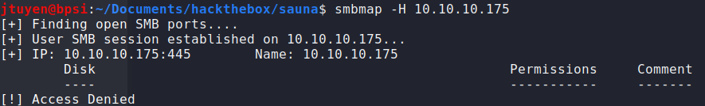

3.  Next service to be enumerated is DNS and see if I could get any zone transfers by guessing or PTR records. Again, there wasn't any DNS records that can be found.

	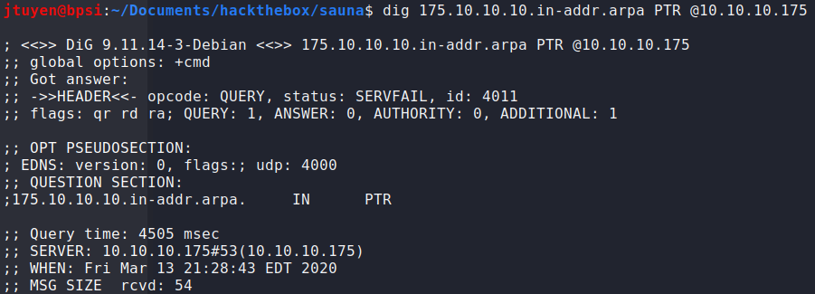

4.	Next service to be enumerated is LDAP using `ldapsearch`. I did find up finding a username "Hugo Smith". I tried guessing the password to see if I would login but no luck.

	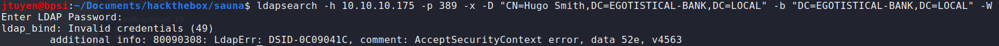

5.	Next, I would proceed with the HTTP service. I found it was hosting a banking site called Egotistical Bank. Running `gobuster` in the background, I started to inspect the site code and eventually I found this page that could be in use for enumerating possible usernames.

	
	
6.	I started to compile a list of possible usernames that most companies would use such as:
	- hsmith
	- hugos
	- hugosmith

7.	I used a tool called `kerbrute` python script to help enumerate the list of users that I created to validate the possible usernames. As you can see, it validated the user `hsmith`. Eventually I created the other possible users listed on the website and enumerated again. The second user found was `fsmith`.
	
	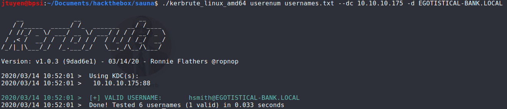

8.	Using the Impacket script, `GetNPUsers.py`, I used `fsmith` username and see if the ASREPRoast attack would work on this account. This attack looks for users without required Kerberos pre-authentication. The python script tries to harvest the non-preauth AS_REP responses for brute forcing. As you can see, an AS_REP response has been acquired.

	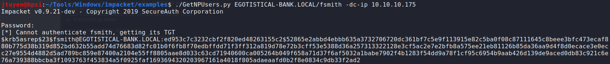

9.	Using `hashcat`, I saved the AS_REP response hash to a file and proceeded to deploy brute force attack. The hash has been cracked.

	```
	hashcat -m 18200 -a 0 ~/Documents/hackthebox/sauna/fsmith.txt /usr/share/wordlists/rockyou.txt --force
	```

	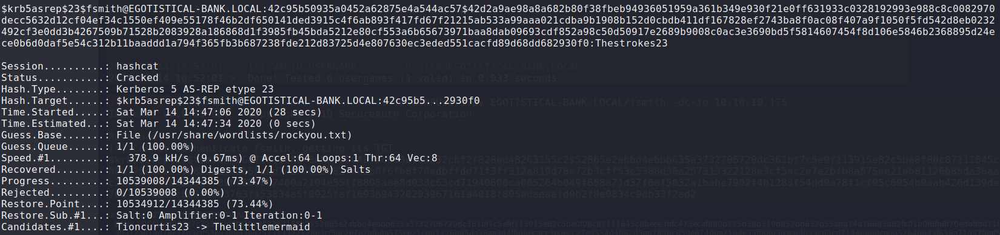

10.	With this new username and password, the next logical step is trying to connect using WinRM using `evil-winrm`. Once connected, I was able to obtain user.txt flag.

	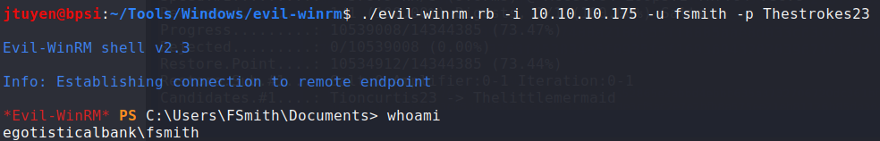

### Privilege Escalation

1.	I began enumerating the Windows machines using `Winpeas`. It immediately found AutoLogon credentials in the registry for `svc_loanmgr`. You can also find this registry manually using a command. Using this newly found username and password, I used `evil-winrm` to login.

	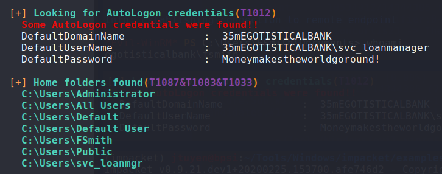
	
	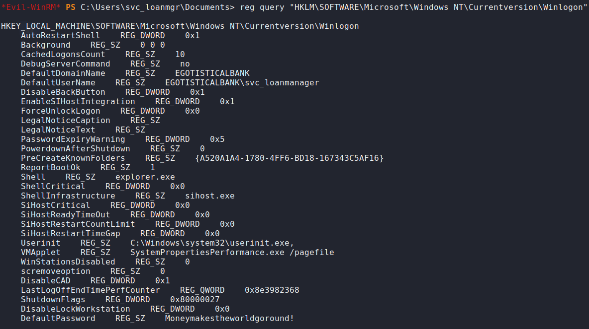
	
2.	Enumerating the system even further didn't find anything too obvious so tried to get the TGT ticket of other possible accounts but I ran into clock skew errors.

	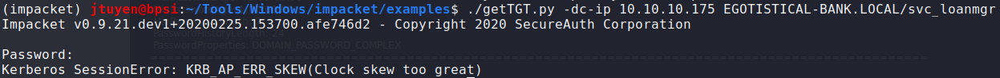

3.	I had to remove `ntp` command from my system because it was conflicting with `timesyncd`.

	```
	apt purge ntp
	```
	
	Once `ntp` has been removed, I reconfigured my `timesyncd.conf` file to sync with Sauna.
	
	```
	sudo vim /etc/systemd/timesyncd.conf
	
	sudo systemctl restart systemd-timesyncd
	```
	
	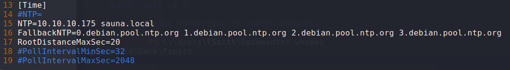
	
	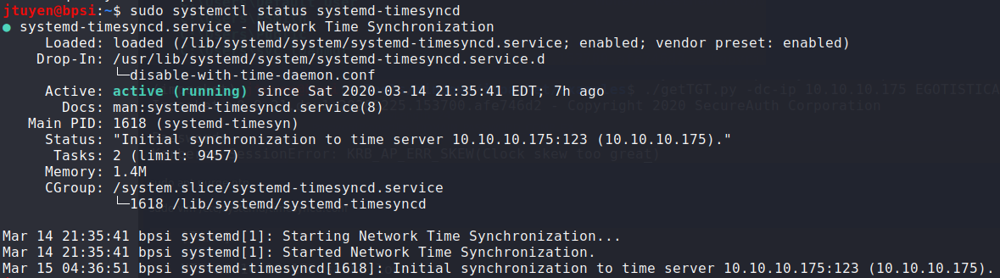
	
4.	Once the clock skew errors has been resolved, I used `GetUserSPNs.py` script to deploy Kerberoasting attack and see if I could obtain any TGS tickets from other users. How kerberoasting attack work is attempting to harvest TGS tickets for services that run on behalf of user accounts in the AD, not computer accounts. As you can see, `hsmith` TGS ticket has been obtained.

	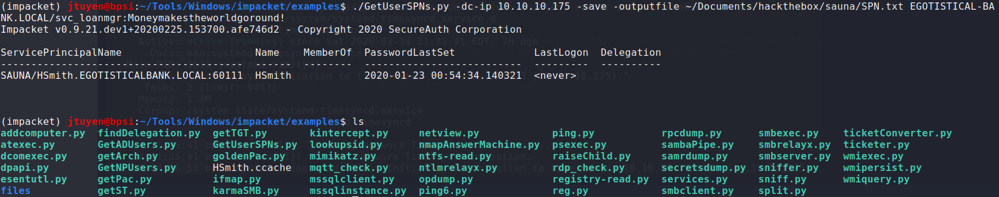
	
	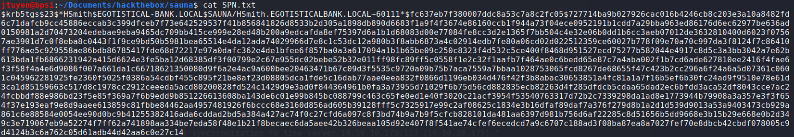

5.	I sent the TGS ticket to `hashcat` for brute forcing. The hash has been cracked and had the same password as `fsmith`.

	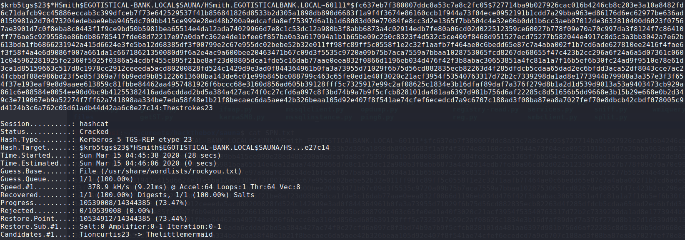

6.	After spending some time poking around using the `hsmith` credentials and enumerate services with it, I didn't find anything special about the account.

	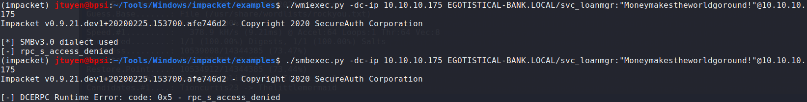
	
7.	After digging further, I decided to see if I can dump the Administrator password using `secretsdump.py`. I got lucky. I sent the hash to `hashcat` and I was unable to crack the hash using `rockyou.txt`.

	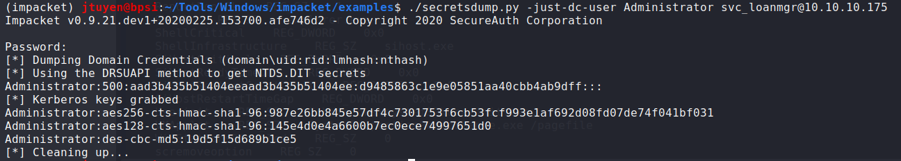
	
	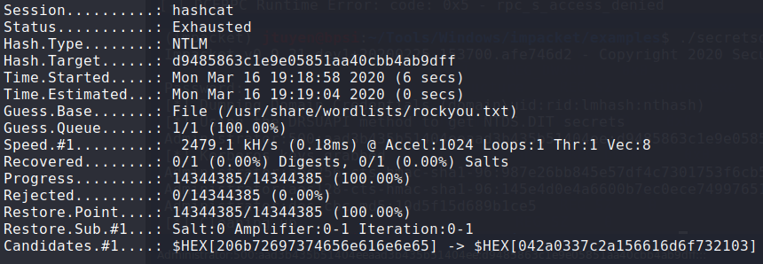

8.	Eventually, I was able to login as Administrator using `evil-winrm` using pass-the-hash technique. The root flag has been obtained.

	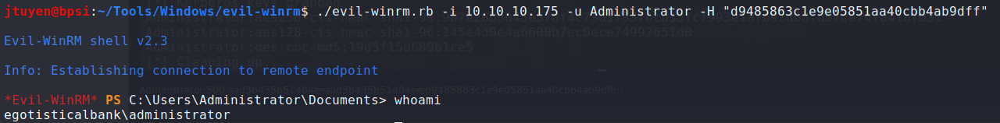


