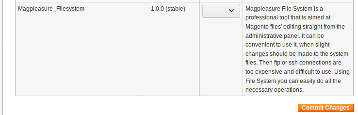
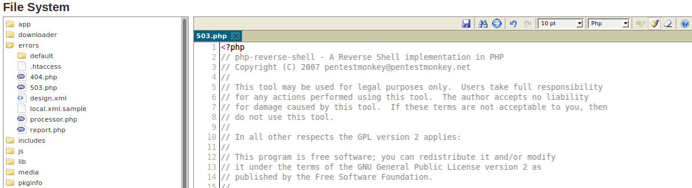
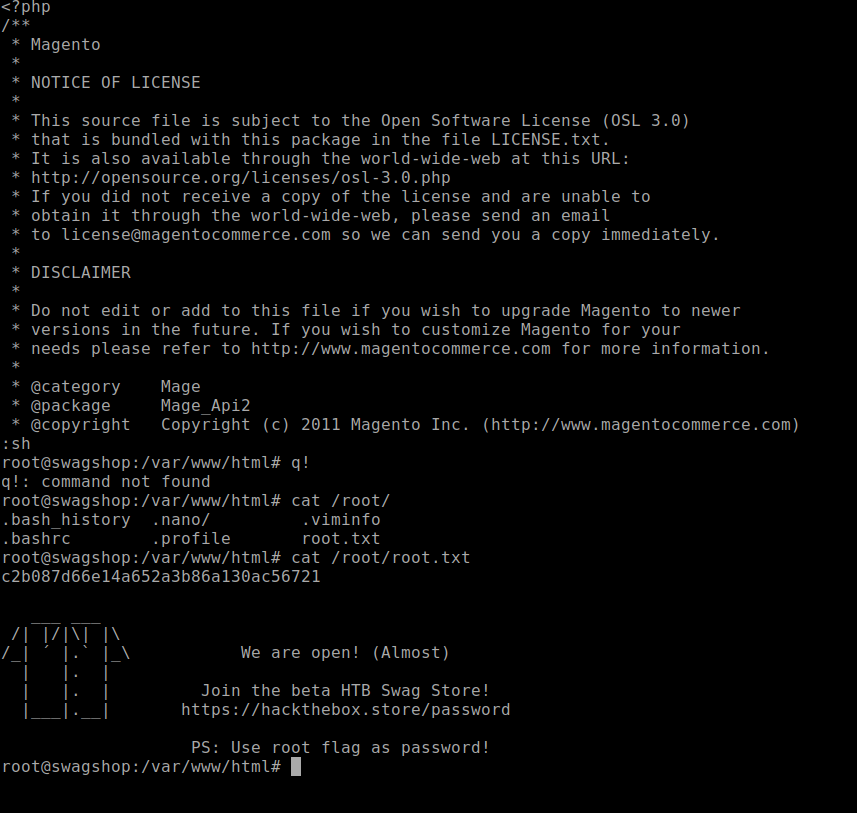

+++
title = "Swagshop"
date = 2019-09-28
[taxonomies]
tags = ["hackthebox"]
+++

1. Initial scans show swagshop is hosting a web server on port 80. Upon investigation, it's running Magento version 1.9x after digging deep into the xml files and cross referencing using Google.

	Source file: [http://10.10.10.140/skin/frontend/default/default/css/styles.css](http://10.10.10.140/skin/frontend/default/default/css/styles.css)

	Version confirmation: [https://magento.stackexchange.com/questions/60476/determine-magento-version-without-access-to-code-base](https://magento.stackexchange.com/questions/60476/determine-magento-version-without-access-to-code-base)

2. I used `dirbuster` to dig into what other possible folders are accessible. `dirbuster` showed a number of accessible folders and the two that stood out was:

	[http://swagshop/downloader/](http://swagshop/downloader/) - Magento Downloader

	[http://swagshop/index.php/admin](http://swagshop/index.php/admin) - Magento Admin Portal

	I didn't have much experience with Magento so I found the Downloader first. Brute forcing the username and password didn't produce any results as I believe it banned my IP during my attempt.

3. One thing I learned from the `dirbuster` results was that index.php can be searched as well using `dirbuster`. I received this hint through the HTB discord chat and I did not realize you can do this. I thought these two links are the same but it's not:

	[http://swagshop/](http://swagshop/)

	[http://swagshop/index.php](http://swagshop/index.php)

	You will see next how this information is important.

4. I started to search for possible Magento exploits on exploits-db. There are a lot of exploits to read through but most seem to be targeting version 2.0+. In addition, my mistake during my search on exploit-db was searching only verified exploits. I began to realize that unverified exploits also add to the missing pieces of this swagshop puzzle.

	[https://www.exploit-db.com/exploits/37977](https://www.exploit-db.com/exploits/37977)

	Pay attention to the index.php in the target variable. Without this part, you cannot exploit Magento. I was struggling with this part as mentioned above. It was an oversight on my end.

5. Once the script has been executed, it will create Magento admin credentials of `forme:forme`.

6. Now I needed to find a way to edit files just like how you would on a Wordpress site. A quick Google search shows you can install plugins. This is great because now you can install a File Manager type plugin and make our life easier.

	[https://pluginarchive.com/magento/magpleasure_filesystem](https://pluginarchive.com/magento/magpleasure_filesystem)

	Download and install the plugin using the Magento Downloader control panel.

	

7. Once activated, use the Magento Admin control panel and navigate to:

	```
	System > Filesystem > IDE
	```

	Modify the `errors/503.php` with your own PHP reverse shell code and save the file.

	

8. Start netcat to catch reverse shell:

	```shell
	nc -nvlp 4444
	```

9. Use firefox and navigate to [http://10.10.10.140/errors/503.php](http://10.10.10.140/errors/503.php) and a reverse shell has been established. Obtain user flag.

### Privilege Escalation

1. After enumerating the machine using `LinEnum` script, I noticed the sudoers file has been misconfigured:

	```shell
	User www-data may run the following commands on swagshop:
    (root) NOPASSWD: /usr/bin/vi /var/www/html/*
    ```

2. This means sudo vi will work in /var/www/html folder and you will obtain root flag.

	```shell
	sudo vi /var/www/html/api.php
	
	:sh
	```

	