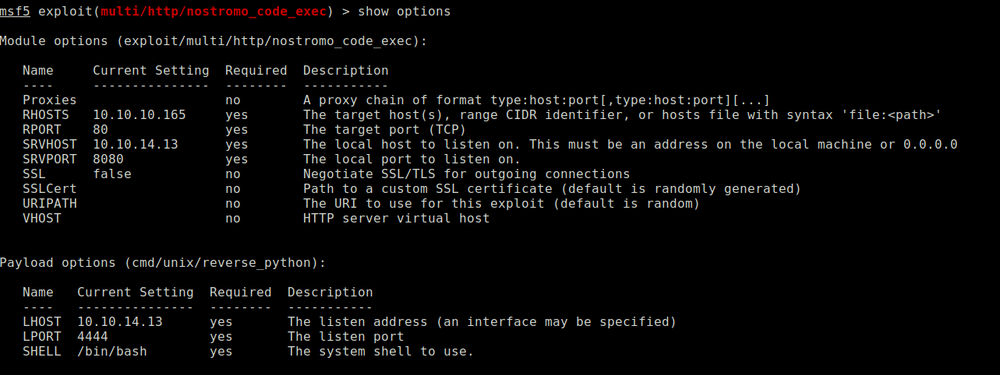
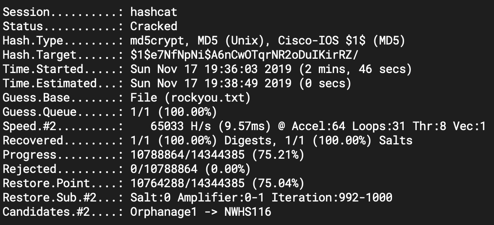
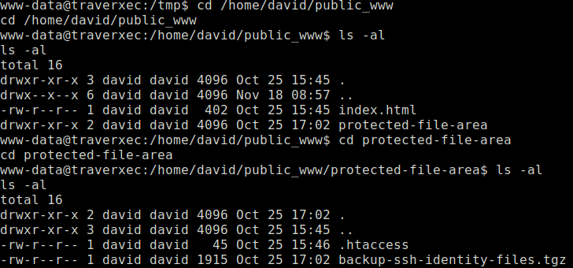
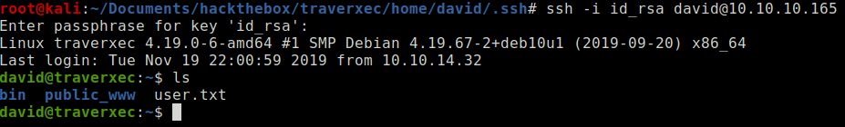
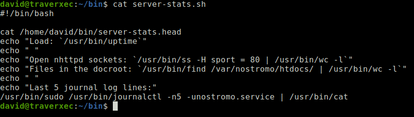
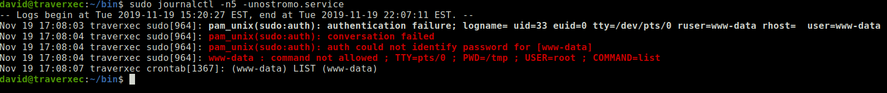
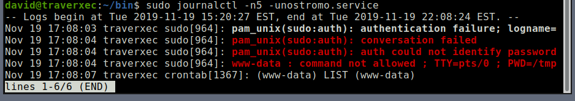
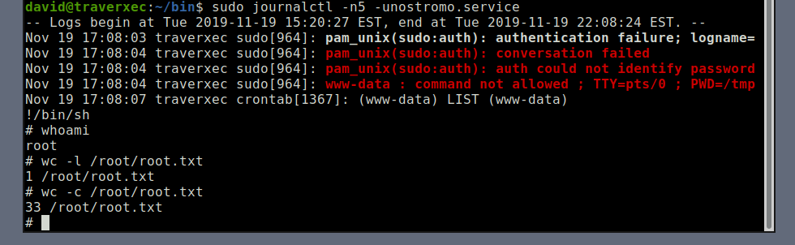

+++
title = "Traverxec"
date = 2019-06-21
[taxonomies]
tags = ["hackthebox"]
+++

1. `nmap` scans show port 22 and 80 is opened. Port 80 displays a basic bootstrap template and nothing stands out in the source code when inspected. After checking out the `nmap` results in detail, I noticed the HTTP server header displays `nostromo 1.9.6`.

2. After researching what nostromo server is about, it's a lightweight http server. Searching for existing exploits show it's vulnerable to a [directory traversal remote code execution](https://www.exploit-db.com/exploits/47573).

3. Run Metasploit and execute the vulnerability. If you see nothing on your screen, wait a few seconds for a session to establish.

	

4. Use `python` to create an interactive shell.

	```python
	python -c "import pty;pty.spawn('/bin/sh')"
	```

5. After enumerating the machine using `linenum` and `linuxprivchecker` scripts, I found an `.htaccess` file hidden away at `/var/nostromo/conf/`

	The file contains an md5 hash for the user david: `$1$e7NfNpNi$A6nCwOTqrNR2oDuIKirRZ/`

6. Cracking the hash using `hastcat` and rockyou wordlist.

	`hashcat -m 500 -a 0 -o output.txt hashes.txt rockyou.txt`

	

	The password that was cracked is: Nowonly4me

7. Using the cracked credentials, I tried logging into SSH but no luck. I believe it probably uses an SSH key.

8. Enumerating the machine further, the `nhttpd.conf` file seems kind of odd, especially these lines:

	```
	# HOMEDIRS [OPTIONAL]
	
	homedirs	/home
	homedirs_public		public_www
	```

	According to the [man page](https://www.gsp.com/cgi-bin/man.cgi?section=8&topic=nhttpd) of nostromo server, it mentions that the homedir is another way to access the user's home directory by using `~username` as part of the URL. When trying to navigate to this url: http://traverxec/~david, it leads to an image saying access denied.
	
	Instead, I navigated to the user's home directory instead:
	
	```
	/home/david/public_www/
	```
	
	
	
	Nice and this explains why I got the image when navigating via URL. Time to investigate what is inside this directory. I have found a directory inside that contains a backup of SSH keys. This must be our way in using SSH.
	
9. First, I've tried using the private SSH key as is but it's protected by a password. I will need to convert the SSH key into a format that `john` can understand.

	```
	/usr/share/john/ssh2john.py id_rsa > id_rsa_john
	```

10. Use `john` to crack the hash.

	```
	john --wordlist=/usr/share/wordlists/rockyou.txt id_rsa_john --format=SSH
	```

	The cracked password is hunter.

11. Login using the SSH private key and obtain user flag.

	```
	ssh -i id_rsa_john david@traverxec
	```

	

12. A quick enumeration shows a script located in David's home directory.

	
	
	This command seems interesting:
	
	
	
	Seeing how `sudo` is being used for the `journalctl` command, I'm wondering if there is a way to [escalate my privilege](https://gtfobins.github.io/gtfobins/journalctl/).
	
	After playing around on how this command works, eventually I caught onto what the gtfobin's link mentioned:
	
	```
	This invokes the default pager, which is likely to be **less**, other functions may apply.
	```
	
	When you run the command and minimize the window, it will trigger the `less` pager function.
	
	
	
	Thus, if a `less` pager function is triggered, you can escalate your privileges using [this method](https://gtfobins.github.io/gtfobins/less/). Root flag has been obtained.
	
	
