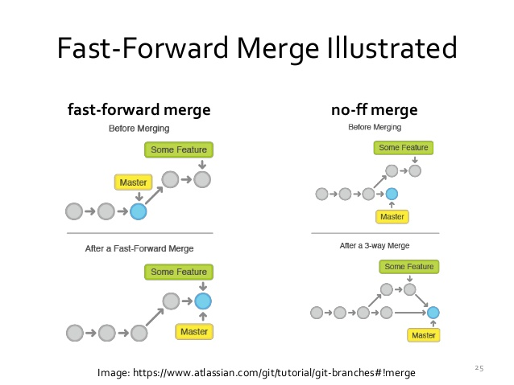

+++
title = "Git Tutorial"
date = 2019-12-27
[taxonomies]
tags = ["tutorial"]
+++

[https://www.lynda.com/Git-tutorials/Git-Essential-Training](https://www.lynda.com/Git-tutorials/Git-Essential-Training)

### 0: Introduction

### 1: What is Git

### 2: Installing Git

```
git help log
```

### 3: Getting Started

* Most often accessed
	
	```
	.git/config
	```

* Add every change that's been made

	```
	git add .
	```

* Add commit message after adding the changes

	```
	git commit -m
	```

* Tips when writing commit messages:

	* Add shorthand codes such as "Bugfix:" or "[css,js]" or "#8128 - "
	
	* Be clear and descriptive

* Show log of previous commits

	```
	git log
	```

* Show log number 1

	```
	git log -n 1
	```

* Show commit log since specific date

	```
	git log --since=2012-06-14
	```

	```
	git log --unit=2012-05-14
	```

* Search commit messages by name

	```
	git log --author="jtuyen"
	```

* Search commit messages by search term

	```
	git log --grep="javascript"
	```

### 4: Concepts and Architecture

* Two-tree (old) vs three-tree structure (git)

	* Two-tree: Working - Repository

	* Three-tree: Working - Staging Index - Repository

* When you `git add .`, it will add all files from the Working to Staging Index. When you `git commit`, it will push changes to the Repository.

* When you git commit, it will generate a checksum(SHA-1) for each changed set. Data integrity.

```
commit 998d834391ae434cbd41e402b61a5c38cd226b43 (HEAD -> master)
Author: jtuyen <john.tuyen@gmail.com>
Date:   Thu Dec 27 09:48:16 2018 -0500
HEAD pointer - It's job is to reference commits in the Repository, not the Working or Staging Index. Last state of Repository, what was last checked out. The HEAD always moves to the tip of the current branch. 5c15e3(Master) -> 38e73d -> a614b5(HEAD)
```

* This command shows where the HEAD pointer is currently positioned.

	```
	cat .git/HEAD
	```

* This command shows the SHA1 where the HEAD pointer is currently positioned.

	```
	cat .git/refs/heads/master
	```

### 5: Making changes to files

* Show the current git status of the repository. It will show the current branch, what files has been added, and what files hasn't been committed yet.

	```
	git status
	```

* Show the difference between files in Working vs HEAD

	```
	git diff

	git diff firstfile.txt
	```

* Show the difference between files in Staging Index vs Repository

	```
	git diff --staged
	```

* `git` will remove the file from the directory and from it's Staging Index. If you manually remove a file via Finder, you will still have to remove the file from the git repository. The advantage of having it in your git repository is that you can still copy the file back from repository to Working Index.

	```
	git rm firstfile.txt
	```

* The takeaway lesson is letting git to handle the moving/renaming/deletion of files instead of your OS commands.

### 6: Git and real projects

* This will show diff in a side-by-side instead of two separate lines f - forward b - backward + S - This will fold the lines

	```
	git diff --color-words contact.html
	```

* This is an easy way to add everything in a directory

	```
	git add tours/
	```

* The takeaway lesson is pay attention to the git status and make sure before committing, the files added is related to the message. I know I have ran into issues before where I lumped all my files into one big commit and it's all unrelated changes to each other.

### 7: Undoing Changes

* This command restores the file from repository to working tree. As part of best practices, -- indicates current branch

	```
	git checkout -- index.html
	```

* Unstaging files. This is a way to unstage a file after accidently running git add . command. You don't want to lump unnecessary files into a commit that isn't related.

	```
	git reset HEAD index.html
	```

* Amending commits. This command is a way to make changes to the last commit (HEAD position). You will have to execute git add first before amending.

	```
	git commit --amend -m "Commit message"
	```

* Retrieving old versions. This command will checkout a specific file based on the SHA1 revision in git log. When executed, it will store the file in Staging Index so you can run git diff --staged to see the changes between Staging Index vs HEAD.

	```
	git checkout <SHA1> -- index.html
	```

* Scary command. This repositions where the HEAD position should start recording. Cassette tape analogy. Be careful when running these commands as git log won't show commits depending on HEAD position.

`--soft` - Safest option. Reposition HEAD. Does not change Staging Index or Working directory

`--mixed` - Default option. Changes Staging Index to match Repository

`--hard` - Scariest option. Use this option when everything seems to be completely wrong. Changes Working and Staging Index to match Repository

```
git reset
```

* Removing untracked files. This command will remove untracked files as a dry-run.

	```
	git clean -n
	```

* This command will delete the untracked file even in Working and Staging Index

	```
	git clean -f
	```

### 8: Ignoring files

* Supports basic RegEx. If you add `*.php` and `!index.php`, it means that all .php files will be ignored except for index.php

	```
	.gitignore
	```

* What to ignore: compiled source code, packages and compressed files, logs and databases, OS generated files (.DS_Store), user-uploaded assets (images, videos, PDF)

* This command affects all .gitignore files globally, not repository specific.

	```
	git config --global core.excludesfiles ~/.gitignore_global
	```

* Ignore tracked files. This command untracks and removes the file from the Working Index. It does not remove from Working or Repository.

	```
	git rm --cached index.html
	```

* To track empty directories, create a `.gitkeep` file inside the empty directory. Git will not track empty directories by default.

### 9: Navigating Commit Tree

* tree-ish - Means something that references part of the tree. Tree-ish is a reference to a commit (SHA1)

parent commit - `HEAD^, acf87503^, master^, HEAD~1, HEAD~`

grandparent commit - `HEAD^^, acf87503^^, master^^, HEAD~2`

great-grandparent commit - `HEAD^^^, acf87503^^^, master^^^, HEAD~3`

```
git ls-tree <tree-ish>
```

* Most commonly used
	
	```
	git log --oneline
	```

* Show the last 3 commits

	```
	git log --oneline -3
	```

* Show commit log 3 days ago git log --since="2.days"

	```
	git log --until="3 days ago" - 
	```

* Show all commit logs between two SHA hashes

	```
	git log 2907a32..acf8750 --oneline
	```

* Show all logs from SHA1 going forward (..) that affects index.html and show changes (-p)

	```
	git log -p 2907a32.. index.html
	```

* Show all stats and summary of commit log. A good high level view of what is most frequently changed.

	```
	git log --stat --summary
	```

* Show log as a graph. Great way to visualize branches.

	```
	git log --graph
	```

* Nice combo

	```
	git log --oneline --graph --all --decorate
	```

* Show changes in a commit log
	
	```
	git show <tree-ish>
	```

* Show changes at HEAD position

	```
	git show --format=oneline HEAD
	```

```
git diff <SHA1>..<SHA1> --oneline
```

* Compare two commits and ignore whitespace changes
	```
	git diff -w <SHA1>..<tree-ish>
	```

### 10: Branching

* Diagram of how git branching looks like and where the HEAD position moves when branched: Git Branching


* Find which branch you are currently working on
	
	```
	git branch
	```

* Switch to specific branch

	```
	git checkout <branch>
	```

* Create and switch to new branch

	```
	git checkout -b <branch>
	```

* One thing to note, if you make a change to a file without committing and you try to switch a branch, git may throw an error saying by switching branches. It will indicate that by checking out a different branch, the file you made a change in Working will be discarded. The reason behind this is because switching branches mirrors what is in the Repository into your Working. Three ways to resolve this issue:

	* Switch to branch and discard changes

	* Commit changes to current branch

	* Stash the changes

* Show changes between two branches

	```
	git diff <branch name>..<branch name>
	```

* Show current branch and the branch ancestors of what the current branch also contains.

	```
	git branch --merged
	```

* Rename branch name

	```
	git branch -m <branch>
	```

* Delete branch
	
	```
	git branch -d <branch>
	```
* Delete branch forcefully
	
	```
	git branch -D <branch>
	```

### 11: Merging Branches

* Merge specific branch into current branch
	
	```
	git merge <branch>
	```

When merging, the current branch is the receiving branch.

Fast-forward merge vs true merge. FF merge is when the master branch hasn't diverged into a branch that has been making changes ahead of master branch. True merge (no-ff) is when it creates a new commit on current branch with merging branch as a new starting point. It does not remove the merging branch.



```
git merge --no-ff branch
```

```
git merge --ff-only branch
```

Git merge conflicts. Git will indicate that there is a merging conflict and advises to resolve conflicts before committing. `git status` will show you which file is causing the issue and if you edit the file, it will have sections where the conflicts begin and end.

* Resolving git conflicts:

	1. Abort merge

	2. Resolve the conflict manually

	3. Use a merge tool (learn to do this manually first)

* Abort the merge

	```
	git merge --abort
	```
* Use this command to show changes when resolving merging conflict issues

	```
	git show <tree-ish>
	```

* Great way to take a look at the branches in terminal. Use this when resolving conflicts.

	```
	git log --oneline --graph --all --decorate
	```

* Show various tools you can use to troubleshoot conflict issues.

	```
	git mergetool
	```

* Strategies to reduce conflicts:

	1. Keep lines short. It will be easier for git to indicate where the conflict between two files are rather than a chunk of paragraph

	2. Keep commits small and focused.

	3. Beware stray edits to whitespaces (spaces, tabs, line returns)
	
	4. Merge often. May not be practical but the longer you wait, the chances of running into conflicts become greater
	
	5. Track changes to master


### 12: Stashing Changes

* Stash file from Working

	```
	git stash save "message"
	```

* Show stashed files
	
	```
	git stash list
	```

* Show diff of stashed file

	```
	git stash show -p {stash ref}
	```

Remember, stashing doesn't care what branch you are currently on or which branch you stashed it from. Stash when executed copies the file(s) to the Working tree.

* Copy stashed file to Working tree and do not leave a copy in stash. Commonly used rather than git stash apply

	```
	git stash pop
	```

* Copy stashed file to Working tree

	```
	git stash apply
	```

* Delete stashed item

	```
	git stash drop {stash ref}
	```
* Clears out all stashed items

	```
	git stash clear
	```

### 13: Remotes

* The best practice with syncing with a remote branch while minimizing conflicts with other collaborators is to fetch the changes from remote repository first before committing your own changes to the remote repository.

	1. You made changes on your local computer and waiting to push changes to remote repository

	2. Fetch the new changes from remote repository. If you take a look at the gif below, origin/master is a local copy of the remote repository

	3. Merge your awaiting changes to the branch that you just fetched to remote repository


* You can have multiple remote repositories per project.

	```
	git remote add <alias (origin)> <git url>.git
	```

*  Remove remote alias
	
	```
	git remote rm <alias>
	```

* Push branch to remote repository. The -u switch enables git to keep tracking the files which is what you want usually.

	```
	git push -u <alias> <branch>
	```

* Show local/remote branches
	
	```
	git branch -a
	```

* Use this command when you forgot to use `git push -u` to track a branch. This modifies the .git/config file

	```
	git branch --set-upstream <non tracking> <alias(origin)/non tracking>
	```

* No need to add tracking branch name for this command if you initially used `git push -u` to track the branch

	```
	git push
	```

* This fetches the latest changes from remote repository and updates the local origin/master copy on your machine. Important reminder is that your origin/master does not reflect the changes of master. Git manages origin/master.

	```
	git fetch
	```

* Guidelines for fetching:

	1. Fetch before you work

	2. Fetch before you push

	3. Fetch often

* `git pull` = `git fetch` + `git merge` - Convenient command but you should remember that `git pull` is a cominbation of these two commands. This way you know how to troubleshoot what is wrong in the fetch and merge process.

* Checkout and track non-tracking branch from origin then switch to that branch

	```
	git checkout -b <non tracking branch> <origin/non tracking branch>
	```

* Pushing to an updated remote branch:

	1. Fetch first

	2. Merge changes

	3. Push changes

* Delete branch from remote repository
	
	```
	git push origin --delete <remote branch>
	```

* [Collaboration video example](https://youtu.be/bRuHFZkaifM)


