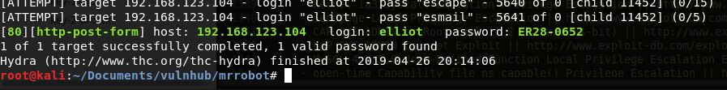
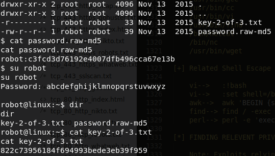
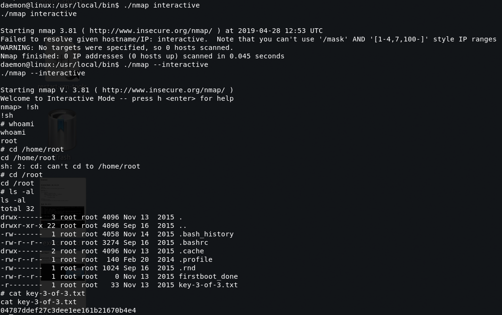

+++
title = "Mr. Robot"
date = 2019-05-10
[taxonomies]
tags = ["vulnhub"]
+++

1. `Robots.txt` contained a dictionary file and 1/3 loot key. I'm guessing the dictionary file is used for bruteforcing the Wordpress login.

2. The dictionary file `fsocity.dic` contained 858000 entries and it's a lot to go through for brute force. Slim down the dictionary file for uniqueness showed 11400 entries which is way more efficient and quick to brute force with.

    ```shell
    cat fsocity.dic | sort -u > fsocity-sorted.dic
    ```

3. Now that we have the password sorted out, I've tried brute forcing using the generic `admin` username after trying to dig through the Wordpress pages for login information. After trying for couple of hours, clearly the username doesn't exist. To determine the username exist or not, using the reset password function showed provides positive or negative results. The machine name is Mr Robot so I figured it's based on the main character from the show "elliot". Entering this username in the reset password form will show a positive result:

    ```shell
    The e-mail could not be sent. Possible reason: your host may have disabled the mail() function.
    ```

4. Now that we have the username and password sorted out, time to brute force the Wordpress login page. Use `hydra` to brute force wordpress login.

    ```shell
    hydra -l elliot -P fsocity-mod.dic 192.168.123.104 -V http-form-post '/wp-login.php:log=^USER^&pwd=^PASS^&wp-submit=Log In&testcookie=1:S=Location' -I
    ```

    

5. Edit the Wordpress theme file `header.php`. Insert the php reverse shell code and save it.

6. Prepare netcat session to receive reverse shell.

7. Execute the reverse shell by navigating to `http://192.168.123.104/Image/`

8. A low privilege shell should now be accessible. From here, running the linenum and linuxprivchecker scripts for later review. After digging around a bit to understand what's inside the system, /home/robot contains the 2/3 loot key. There is a file with an MD5 hash of `822c73956184f694993bede3eb39f959`. Crackstation.net showed the decrypted password for `robot` login as `abcdefghijklmnopqrstuvwxyz`.

9. Use `su` and login as `robot` login should now be accessible and 2/3 loot key is now readable.

    

10. Upgrade the shell to interactive shell.

    ```shell
    python -c "import pty;pty.spawn('/bin/bash')"
    ```

11. The linuxprivchecker script showed `nmap` with root permissions assigned along with sticky execution bit. This will allow us to exploit the nmap interactive shell to escalate our privileges as root.

    ```shell
    -rwsr-xr-x 1 root root 504736 Nov 13  2015 /usr/local/bin/nmap
    ```

    
