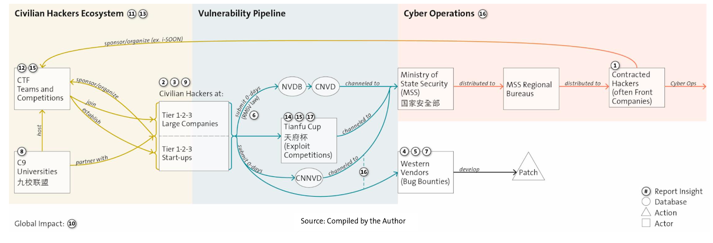

+++
title = "China's Cyber Ecosystem and Hacking Scene"
date = 2024-06-13
[taxonomies]
tags = ["China", "state-sponsored", "underground"]
+++

[How China’s Cyber Ecosystem Feeds Off Its Superstar Hackers](https://news.risky.biz/how-chinas-cyber-ecosystem-feeds-off-its-superstar-hackers)

> The report pulls together information made public over the past several years to comprehensively summarise evidence the PRC funnels vulnerability research into state-sponsored espionage efforts.

> The report says companies linked to Chinese state-sponsored cyber operations sponsor hacking competitions. Security firm Topsec, which has been linked to the 2015 breach of US insurance giant Anthem, sponsors the Tianfu Cup. And the i-SOON cyber espionage contracting firm created the 'Anxun Cup' hacking competition to attract talent. 

> The Chinese government also has regulations which mandate that vulnerability disclosure information be passed through official agencies that have links to the Ministry of State Security (see diagram below).

> We've heard directly from individual Chinese security researchers that they are motivated to improve global security and not by nationalistic fervour. But it is not clear what elite hackers in general think about working for Chinese national security purposes.  

> These elite hackers really matter. The report analysed the contribution Chinese researchers made to Google, Microsoft and Apple bug bounty programs, and found that a handful of individuals made an outsized contribution.

> An interesting observation in the report is that the hacking targets at the 2023 Tianfu Cup shifted away from Western products towards Chinese ones. The Chinese government is trying to reduce the country's dependency on foreign software and hardware (known colloquially as 'Delete America'), so a focus on domestic software makes sense to improve its resilience.  

> It is worth remembering that the two examples we have where vulnerabilities were exploited shortly after disclosure at a conference or hacking contest have targeted two of the Chinese Communist Party's 'Five Poisons'—Hong Kong pro-democracy groups and Uyghur Muslims. (Tibetans, Taiwanese and the Falun Gong are the other three). 

Great insight into how motivated state-sponsored actors are working behind the scenes. It's not that it wasn't known back in 2018 when the Chinese teams didn't want to participate in US CTFs, we all saw this one coming when trade wars were heated between the two countries. Fast forward to today, as a result, we observed how the state-sponsored cyber attacks has progressed rapidly with sophistication and stock piles of N/0-days ready to be weaponized and deployed. The sad reality of all this is technology being used against oppressed minorities and certain human rights groups to further push forward the nation's unified agenda.

Over the past decade of reading and peering into the Chinese patriotic hacking scene, there are a lot commercially driven groups and individuals willing to accept funds for farmed out operations. Some will be sloppy and others can be great but I don't think the state is concerned about opsec for farmed out operations. The outsourcing of work to lower tier groups/individuals are about gathering intelligence and recon of data. Not only does this not directly link to the Chinese government but acts as a proxy and there are tons of them around. This creates a thriving underground ecosystem that is able to recruit the talented into state-sponsored espionage missions. This all sounds like a spy movie but it's real.. and with real stakes involved.